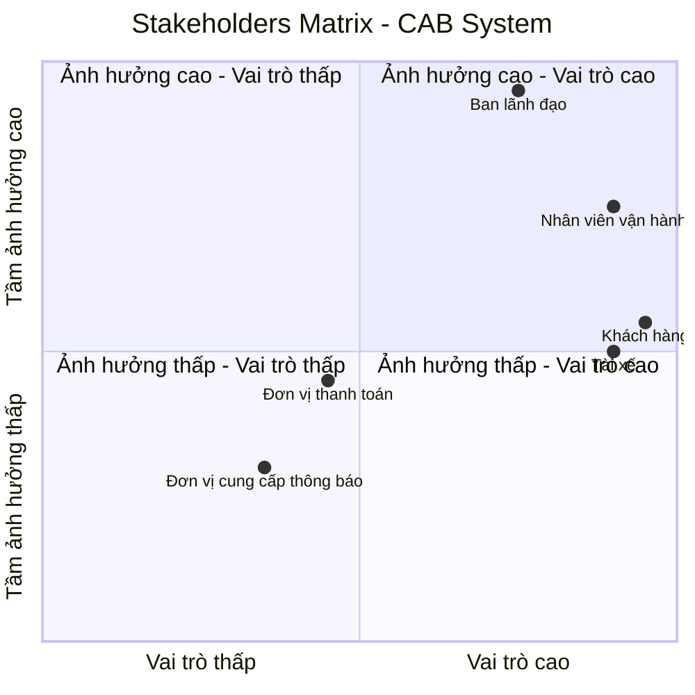
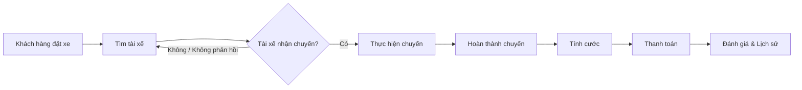

# 1. Đọc và phân tích yêu cầu của KH ở giai đoạn sơ khởi của Khách Hàng ở giai đoạn 1: Hiểu được Business Context, Business Problem,... 

## 1.1. Business Context – Bối cảnh kinh doanh

Công ty ABC là doanh nghiệp cung cấp dịch vụ đặt xe trực tuyến. Hiện tại, khách hàng có thể đặt xe thông qua tổng đài hoặc một ứng dụng đơn giản. Tuy nhiên, quy trình vận hành còn phụ thuộc nhiều vào thao tác thủ công, đặc biệt là việc phân công tài xế.

Khi quy mô khách hàng và tài xế tăng, hệ thống hiện tại gặp khó khăn trong việc quản lý chuyến đi, theo dõi trạng thái, xử lý thanh toán và hỗ trợ hoạt động vận hành. Do đó, ban lãnh đạo mong muốn xây dựng một **CAB System – nền tảng đặt xe mới** có khả năng phục vụ số lượng lớn người dùng, tự động hóa các quy trình chính và có khả năng mở rộng trong tương lai.

Dự án dự kiến được xây dựng và triển khai trong **7 tuần**.

## 1.2. Business Problem – Vấn đề kinh doanh

Qua phân tích yêu cầu của khách hàng, các vấn đề kinh doanh chính được xác định như sau:

* Việc tìm kiếm và phân công tài xế hiện chủ yếu được thực hiện thủ công, gây tốn thời gian và khó mở rộng khi số lượng chuyến tăng.
* Khách hàng khó theo dõi trạng thái chuyến đi và thông tin về tài xế.
* Thông tin thanh toán chưa được quản lý tập trung, gây khó khăn trong việc kiểm soát và xử lý giao dịch.
* Khi tài xế từ chối hoặc không phản hồi yêu cầu, quy trình tìm tài xế thay thế chưa được tự động hóa.
* Bộ phận vận hành gặp khó khăn trong việc theo dõi chuyến đi, quản lý tài xế và xử lý các trường hợp phát sinh.
* Hệ thống hiện tại khó mở rộng khi số lượng khách hàng, tài xế và giao dịch tăng.
* Doanh nghiệp chưa có đầy đủ dữ liệu tập trung để theo dõi doanh thu, số lượng chuyến, tỷ lệ hoàn thành, tỷ lệ hủy và hiệu quả hoạt động của tài xế.

## 1.3. Business Need – Nhu cầu kinh doanh

Công ty ABC cần xây dựng một nền tảng CAB System mới nhằm **tự động hóa và quản lý tập trung toàn bộ quy trình đặt xe**, từ khi khách hàng tạo yêu cầu, tìm và phân công tài xế, thực hiện chuyến, tính cước, thanh toán, gửi thông báo đến đánh giá sau chuyến.

Hệ thống đồng thời phải hỗ trợ bộ phận vận hành trong việc quản lý và giám sát hoạt động, đảm bảo an toàn dữ liệu và có khả năng mở rộng để đáp ứng các nhu cầu kinh doanh trong tương lai.

## 1.4. Business Constraints – Ràng buộc kinh doanh

* Thời gian xây dựng và triển khai hệ thống là **7 tuần**.
* Hệ thống phải phục vụ được số lượng lớn khách hàng và tài xế.
* Thông tin nhạy cảm của thẻ hoặc tài khoản thanh toán không được lưu trực tiếp trên hệ thống CAB.
* Các chức năng quản trị phải được kiểm soát bằng cơ chế phân quyền.
* Lỗi tại một thành phần như thanh toán hoặc thông báo không được làm toàn bộ hệ thống đặt xe ngừng hoạt động.
* Hệ thống cần có khả năng mở rộng và triển khai thêm chức năng mà hạn chế ảnh hưởng đến các chức năng đang hoạt động.

# 2. Xác định stakeholders (Các bên liên quan của hệ thống):
## - Lập 1 bảng 2 cột: Tên - Vai trò 
## - Vẽ 1 Ma trận tên: Stakeholders Matrix cho biết tầm ảnh hưởng và vai trò của Stakeholders trong hệ thống

## 2.1. Key Stakeholders – Các bên liên quan chính

| Stakeholder | Vai trò |
|---|---|
| **Ban lãnh đạo** | Định hướng mục tiêu kinh doanh, phê duyệt các yêu cầu quan trọng, theo dõi doanh thu, hiệu quả hoạt động và khả năng mở rộng của hệ thống. |
| **Khách hàng** | Sử dụng hệ thống để đăng ký, đặt xe, theo dõi chuyến đi, thanh toán, xem lịch sử chuyến và đánh giá tài xế. |
| **Tài xế** | Sử dụng hệ thống để quản lý hồ sơ và phương tiện, cập nhật trạng thái hoạt động, nhận hoặc từ chối chuyến, cập nhật trạng thái chuyến và hoàn thành chuyến. |
| **Nhân viên vận hành** | Quản lý và giám sát khách hàng, tài xế, phương tiện và chuyến đi; theo dõi các chuyến đang diễn ra và xử lý các trường hợp phát sinh. |
| **Đơn vị thanh toán** | Cung cấp dịch vụ xử lý và xác nhận các giao dịch thanh toán điện tử giữa khách hàng và hệ thống CAB. |
| **Đơn vị cung cấp thông báo** | Cung cấp các dịch vụ gửi thông báo đến khách hàng và tài xế về trạng thái đặt xe, chuyến đi và thanh toán. |

## 2.2. Stakeholders Matrix

Ma trận Stakeholders được sử dụng để thể hiện **tầm ảnh hưởng** và **vai trò** của các bên liên quan đối với hệ thống CAB.

# 3. Xác định Business Goals - Thiết kế các mục tiêu mình thấy 
## - VD: BG01: Tự động tìm tài xế - Mục đích: Hệ thống này phải có khả năng tự động tìm tài xế 
## - VD: BG02: Hỗ trợ thanh toán - Mục đích: Hỗ trợ tiền mặt và trực tuyến

Dựa trên yêu cầu và kỳ vọng của khách hàng, các mục tiêu kinh doanh của hệ thống CAB System được xác định như sau:

| ID       | Business Goal                                              | Mục đích                                                                                                                                                                                                                |
| -------- | ---------------------------------------------------------- | ----------------------------------------------------------------------------------------------------------------------------------------------------------------------------------------------------------------------- |
| **BG01** | **Tự động tìm và phân công tài xế**                        | Hệ thống phải có khả năng tự động xác định và tìm tài xế phù hợp dựa trên vị trí, trạng thái sẵn sàng và các tiêu chí vận hành; đồng thời tiếp tục tìm tài xế khác nếu tài xế được đề xuất không phản hồi hoặc từ chối. |
| **BG02** | **Hỗ trợ đặt và quản lý chuyến xe**                        | Hệ thống phải hỗ trợ khách hàng tạo yêu cầu đặt xe, lựa chọn loại xe, theo dõi trạng thái và quản lý toàn bộ quá trình thực hiện chuyến đi.                                                                             |
| **BG03** | **Hỗ trợ theo dõi chuyến đi**                              | Hệ thống phải cung cấp thông tin về tài xế, thời gian dự kiến đến và trạng thái hiện tại của chuyến để khách hàng có thể theo dõi chuyến đi.                                                                            |
| **BG04** | **Hỗ trợ thanh toán**                                      | Hệ thống phải hỗ trợ thanh toán bằng tiền mặt và phương thức thanh toán điện tử thông qua nhà cung cấp thanh toán bên ngoài.                                                                                            |
| **BG05** | **Quản lý và gửi thông báo**                               | Hệ thống phải gửi thông báo cho khách hàng và tài xế về các sự kiện quan trọng như tiếp nhận yêu cầu, nhận chuyến, tài xế đến điểm đón, hoàn thành chuyến và kết quả thanh toán.                                        |
| **BG06** | **Hỗ trợ quản lý và giám sát vận hành**                    | Hệ thống phải cung cấp giao diện quản trị để nhân viên vận hành quản lý khách hàng, tài xế, phương tiện, chuyến đi và hỗ trợ xử lý các trường hợp phát sinh.                                                            |
| **BG07** | **Cung cấp dữ liệu và báo cáo hoạt động**                  | Hệ thống phải cung cấp dữ liệu và báo cáo về số lượng chuyến, doanh thu, tỷ lệ hoàn thành, tỷ lệ hủy và hiệu quả hoạt động của tài xế để hỗ trợ quản lý.                                                                |
| **BG08** | **Đảm bảo khả năng mở rộng và phát triển trong tương lai** | Hệ thống phải có kiến trúc linh hoạt, cho phép mở rộng quy mô và bổ sung loại dịch vụ, phương thức thanh toán, nhà cung cấp thông báo hoặc các chức năng mới mà hạn chế ảnh hưởng đến hệ thống hiện tại.                |

# 4. Xác định phạm vi yêu cầu của mình phải làm(Scope) 
## - VD: Quản lý khách hàng, Quản lý tài xế,...
## - Trong bảng MVP phải làm cái gì - Xác định được các module cơ bản dưới góc độ 1 bảng MVP 
## - Mở rộng: Những cái mà ngoài phạm vi tôi không phải làm/Không nên làm trong đây

## 4.1. In Scope – Phạm vi hệ thống

Dựa trên yêu cầu của khách hàng, phạm vi của CAB System bao gồm các module nghiệp vụ chính sau:

| ID      | Module                           | Phạm vi chính                                                                                                                                           |
| ------- | -------------------------------- | ------------------------------------------------------------------------------------------------------------------------------------------------------- |
| **M01** | **Quản lý tài khoản & xác thực** | Đăng ký, đăng nhập, xác thực khách hàng và tài xế, cập nhật thông tin cá nhân và kiểm soát quyền truy cập.                                              |
| **M02** | **Quản lý tài xế & phương tiện** | Quản lý hồ sơ tài xế, thông tin phương tiện, trạng thái hoạt động và thông tin vị trí của tài xế.                                                       |
| **M03** | **Đặt xe**                       | Nhập điểm đón, điểm đến, lựa chọn loại xe và tạo yêu cầu đặt xe.                                                                                        |
| **M04** | **Tìm kiếm & phân công tài xế**  | Xác định tài xế phù hợp, ưu tiên tài xế gần khách hàng, gửi yêu cầu nhận chuyến và xử lý trường hợp tài xế từ chối hoặc không phản hồi.                 |
| **M05** | **Quản lý chuyến đi**            | Theo dõi và cập nhật các trạng thái của chuyến: tìm tài xế, tài xế nhận chuyến, tài xế đến điểm đón, đã đón khách, đang di chuyển và hoàn thành chuyến. |
| **M06** | **Tính cước & thanh toán**       | Tính số tiền phải trả, hỗ trợ thanh toán tiền mặt và thanh toán điện tử thông qua Payment Provider, xử lý kết quả giao dịch và thanh toán thất bại.     |
| **M07** | **Thông báo**                    | Gửi thông báo cho khách hàng và tài xế về các sự kiện liên quan đến đặt xe, tài xế, chuyến đi và thanh toán.                                            |
| **M08** | **Lịch sử & đánh giá**           | Xem lịch sử chuyến đi, số tiền phải trả và đánh giá tài xế sau khi hoàn thành chuyến.                                                                   |
| **M09** | **Quản trị & vận hành**          | Quản lý khách hàng, tài xế, phương tiện và chuyến đi; theo dõi chuyến đang diễn ra, trạng thái tài xế và hỗ trợ xử lý sự cố.                            |
| **M10** | **Báo cáo**                      | Cung cấp báo cáo về số lượng chuyến, doanh thu, tỷ lệ hoàn thành, tỷ lệ hủy và hiệu quả hoạt động của tài xế.                                           |
| **M11** | **Bảo mật & Audit Log**          | Xác thực, phân quyền các thao tác quản trị, bảo vệ dữ liệu cá nhân, phương tiện, vị trí và giao dịch; lưu vết các thao tác quan trọng.                  |
| **M12** | **Tích hợp hệ thống bên ngoài**  | Tích hợp với nhà cung cấp thanh toán và nhà cung cấp dịch vụ thông báo.                                                                                 |

---

## 4.2. MVP – Minimum Viable Product

Do thời gian xây dựng và triển khai sản phẩm chỉ **7 tuần**, MVP tập trung vào quy trình nghiệp vụ cốt lõi từ **đặt xe → tìm tài xế → thực hiện chuyến → tính cước → thanh toán**.

| Priority        | Module                              | MVP cần thực hiện                                                                          |
| --------------- | ----------------------------------- | ------------------------------------------------------------------------------------------ |
| **Must Have**   | **M01 – Tài khoản & xác thực**      | Đăng ký, đăng nhập và xác thực khách hàng/tài xế.                                          |
| **Must Have**   | **M02 – Tài xế & phương tiện**      | Quản lý hồ sơ, phương tiện và trạng thái sẵn sàng của tài xế.                              |
| **Must Have**   | **M03 – Đặt xe**                    | Nhập điểm đón, điểm đến, chọn loại xe và gửi yêu cầu đặt xe.                               |
| **Must Have**   | **M04 – Tìm & phân công tài xế**    | Tìm tài xế phù hợp, gửi yêu cầu, xử lý từ chối/không phản hồi và tiếp tục tìm tài xế khác. |
| **Must Have**   | **M05 – Quản lý chuyến**            | Cập nhật và theo dõi trạng thái chuyến từ lúc đặt xe đến khi hoàn thành.                   |
| **Must Have**   | **M06 – Tính cước & thanh toán**    | Tính cước, thanh toán tiền mặt và tích hợp thanh toán điện tử.                             |
| **Must Have**   | **M07 – Thông báo**                 | Các thông báo thiết yếu cho khách hàng và tài xế.                                          |
| **Must Have**   | **M09 – Quản trị & vận hành**       | Theo dõi chuyến, trạng thái tài xế và xử lý các trường hợp phát sinh cơ bản.               |
| **Must Have**   | **M11 – Bảo mật & Audit Log**       | Xác thực, phân quyền và bảo vệ dữ liệu quan trọng.                                         |
| **Should Have** | **M08 – Lịch sử & đánh giá**        | Xem lịch sử chuyến và đánh giá tài xế sau chuyến.                                          |
| **Should Have** | **M10 – Báo cáo**                   | Các báo cáo cơ bản về chuyến, doanh thu, hoàn thành và hủy chuyến.                         |
| **Should Have** | **M12 – Khả năng mở rộng tích hợp** | Thiết kế khả năng thay đổi/thêm Payment Provider và Notification Provider trong tương lai. |

### MVP Core Flow

---

## 4.3. Out of Scope – Ngoài phạm vi

Các chức năng sau **không được đề cập trong yêu cầu hiện tại** và không đưa vào phạm vi xây dựng MVP:

| ID      | Hạng mục                                                     | Lý do                                                                                        |
| ------- | ------------------------------------------------------------ | -------------------------------------------------------------------------------------------- |
| **O01** | Chương trình tích điểm / Loyalty                             | Không được đề cập trong yêu cầu khách hàng.                                                  |
| **O02** | Mã giảm giá / Voucher / Coupon                               | Không được đề cập trong yêu cầu hiện tại.                                                    |
| **O03** | Gói thành viên / Subscription                                | Không thuộc quy trình đặt xe được mô tả.                                                     |
| **O04** | Đặt xe định kỳ                                               | Không được đề cập trong yêu cầu.                                                             |
| **O05** | Dịch vụ giao hàng                                            | Chưa có yêu cầu về loại dịch vụ này.                                                         |
| **O06** | Quảng cáo hoặc bán dịch vụ bên thứ ba                        | Không thuộc mục tiêu của dự án.                                                              |
| **O07** | Hệ thống thưởng/phạt tài xế nâng cao                         | Transcript chỉ yêu cầu quản lý và đánh giá hiệu quả tài xế, chưa yêu cầu cơ chế thưởng/phạt. |
| **O08** | Phân tích dữ liệu nâng cao / AI dự đoán                      | Không được yêu cầu trong phạm vi hiện tại.                                                   |
| **O09** | Ứng dụng riêng cho bộ phận quản trị ngoài giao diện quản trị | Chưa có yêu cầu xây dựng ứng dụng riêng; hệ thống chỉ yêu cầu giao diện quản trị.            |

---

# 5. Chuyển nhu cầu thành Business Requirements - 1 bảng 3 cột: ID - Tên - Diễn giải
## - VD: BR01 - Đặt chuyến - Hệ thống phải cung cấp điểm đến, cung cấp điểm đón

| ID       | Tên                                    | Diễn giải                                                                                                                                                                                            |
| -------- | -------------------------------------- | ---------------------------------------------------------------------------------------------------------------------------------------------------------------------------------------------------- |
| **BR01** | **Quản lý tài khoản**                  | Hệ thống phải cho phép khách hàng và tài xế đăng ký, đăng nhập, xác thực và cập nhật thông tin cá nhân theo quyền của từng đối tượng.                                                                |
| **BR02** | **Quản lý tài xế và phương tiện**      | Hệ thống phải cho phép quản lý hồ sơ tài xế, thông tin phương tiện và trạng thái hoạt động của tài xế.                                                                                               |
| **BR03** | **Đặt chuyến**                         | Hệ thống phải cho phép khách hàng nhập điểm đón, điểm đến, lựa chọn loại xe và gửi yêu cầu đặt chuyến.                                                                                               |
| **BR04** | **Tìm kiếm tài xế**                    | Hệ thống phải có khả năng xác định các tài xế phù hợp dựa trên vị trí, trạng thái sẵn sàng và các tiêu chí vận hành được doanh nghiệp xác định.                                                      |
| **BR05** | **Phân công tài xế**                   | Hệ thống phải hỗ trợ gửi yêu cầu chuyến đến tài xế phù hợp và tiếp tục tìm tài xế khác khi tài xế được đề xuất từ chối hoặc không phản hồi.                                                          |
| **BR06** | **Theo dõi chuyến đi**                 | Hệ thống phải cho phép khách hàng theo dõi tài xế, thời gian dự kiến đến và trạng thái hiện tại của chuyến đi.                                                                                       |
| **BR07** | **Cập nhật trạng thái chuyến**         | Hệ thống phải cho phép tài xế cập nhật trạng thái chuyến từ khi đến điểm đón, đón khách, đang di chuyển đến khi hoàn thành chuyến.                                                                   |
| **BR08** | **Quản lý vị trí tài xế**              | Hệ thống phải lưu và sử dụng thông tin vị trí của tài xế để hỗ trợ tìm tài xế phù hợp và cải thiện khả năng dự kiến thời gian đến.                                                                   |
| **BR09** | **Tính cước**                          | Hệ thống phải xác định số tiền khách hàng phải trả dựa trên loại dịch vụ và thông tin của chuyến đi.                                                                                                 |
| **BR10** | **Thanh toán**                         | Hệ thống phải hỗ trợ thanh toán bằng tiền mặt và phương thức thanh toán điện tử thông qua nhà cung cấp thanh toán bên ngoài.                                                                         |
| **BR11** | **Xử lý thanh toán thất bại**          | Hệ thống phải thông báo cho khách hàng khi thanh toán điện tử thất bại và hỗ trợ xử lý lại theo chính sách của doanh nghiệp.                                                                         |
| **BR12** | **Thông báo**                          | Hệ thống phải gửi thông báo cho khách hàng và tài xế về các sự kiện quan trọng trong quá trình đặt và thực hiện chuyến, bao gồm kết quả thanh toán.                                                  |
| **BR13** | **Lịch sử chuyến đi**                  | Hệ thống phải cho phép khách hàng xem lịch sử các chuyến đi và số tiền phải trả.                                                                                                                     |
| **BR14** | **Đánh giá tài xế**                    | Hệ thống phải cho phép khách hàng đánh giá tài xế sau khi chuyến đi hoàn thành.                                                                                                                      |
| **BR15** | **Quản lý vận hành**                   | Hệ thống phải cung cấp giao diện quản trị để nhân viên vận hành quản lý khách hàng, tài xế, phương tiện và chuyến đi.                                                                                |
| **BR16** | **Giám sát và xử lý sự cố**            | Hệ thống phải cho phép nhân viên vận hành theo dõi các chuyến đang diễn ra, kiểm tra trạng thái tài xế và hỗ trợ xử lý các trường hợp chuyến bị lỗi.                                                 |
| **BR17** | **Phân quyền quản trị**                | Hệ thống phải kiểm soát quyền truy cập đối với các chức năng quản trị, đảm bảo nhân viên thông thường không thể thực hiện các thao tác nhạy cảm.                                                     |
| **BR18** | **Báo cáo hoạt động**                  | Hệ thống phải cung cấp báo cáo về số lượng chuyến, doanh thu, tỷ lệ chuyến hoàn thành, tỷ lệ hủy và hiệu quả hoạt động của tài xế.                                                                   |
| **BR19** | **Bảo vệ dữ liệu**                     | Hệ thống phải bảo vệ thông tin cá nhân, thông tin phương tiện, dữ liệu vị trí và dữ liệu giao dịch; thông tin nhạy cảm của thẻ hoặc tài khoản thanh toán không được lưu trực tiếp trên hệ thống CAB. |
| **BR20** | **Audit Log**                          | Hệ thống phải lưu vết các thao tác quan trọng để phục vụ kiểm tra và xử lý sự cố.                                                                                                                    |
| **BR21** | **Khả năng mở rộng**                   | Hệ thống phải có khả năng mở rộng khi số lượng khách hàng, tài xế và tải hệ thống tăng.                                                                                                              |
| **BR22** | **Khả năng mở rộng dịch vụ**           | Hệ thống phải cho phép bổ sung loại dịch vụ, phương thức thanh toán và nhà cung cấp thông báo mới mà hạn chế ảnh hưởng đến các chức năng đang hoạt động.                                             |
| **BR23** | **Đảm bảo tính liên tục của hệ thống** | Hệ thống phải hạn chế ảnh hưởng của lỗi tại các thành phần như thanh toán hoặc thông báo đến chức năng đặt xe và các chức năng cốt lõi khác.                                                         |

# 6. Xây dựng các Business Process
## - VD: Đặt chuyến: 
###   B1: Tạo chuyến đi 
###   B2: Xác định điểm đến 
###   B3: Hệ thống xác nhận 
###   B4: Tìm tài xế 
###   B5: Đợi tài xế chấp nhận

Dựa trên yêu cầu của khách hàng, các Business Process chính của CAB System được xác định như sau:

## 6.1. Business Process 01 – Đặt chuyến và tìm tài xế

### B1.1: Khách hàng tạo yêu cầu đặt chuyến

Khách hàng nhập điểm đón, điểm đến và lựa chọn loại xe.

### B1.2: Hệ thống tiếp nhận yêu cầu

Hệ thống kiểm tra và ghi nhận yêu cầu đặt chuyến của khách hàng.

### B1.3: Hệ thống xác định tài xế phù hợp

Hệ thống tìm kiếm các tài xế dựa trên vị trí, trạng thái sẵn sàng và các tiêu chí vận hành.

### B1.4: Hệ thống gửi yêu cầu đến tài xế

Hệ thống gửi thông báo yêu cầu nhận chuyến đến tài xế phù hợp.

### B1.5: Tài xế phản hồi yêu cầu

Tài xế có thể chấp nhận hoặc từ chối chuyến.

### B1.6: Xử lý trường hợp tài xế từ chối hoặc không phản hồi

Nếu tài xế từ chối hoặc không phản hồi trong thời gian quy định, hệ thống tiếp tục tìm và đề xuất tài xế khác.

### B1.7: Xác nhận tài xế

Nếu tài xế chấp nhận, hệ thống xác nhận tài xế cho chuyến đi và thông báo cho khách hàng.

### B1.8: Xử lý trường hợp không tìm được tài xế

Nếu không còn tài xế phù hợp, hệ thống thông báo cho khách hàng rằng không thể tìm được tài xế.

---

## 6.2. Business Process 02 – Thực hiện chuyến đi

### B2.1: Tài xế di chuyển đến điểm đón

Tài xế nhận thông tin chuyến và di chuyển đến vị trí đón khách.

### B2.2: Tài xế cập nhật đã đến điểm đón

Tài xế cập nhật trạng thái đã đến điểm đón và hệ thống thông báo cho khách hàng.

### B2.3: Tài xế đón khách

Sau khi đón khách, tài xế cập nhật trạng thái chuyến.

### B2.4: Tài xế thực hiện chuyến

Tài xế di chuyển từ điểm đón đến điểm đến và hệ thống cập nhật trạng thái chuyến.

### B2.5: Tài xế hoàn thành chuyến

Khi đến điểm đến, tài xế cập nhật trạng thái hoàn thành chuyến.

---

## 6.3. Business Process 03 – Tính cước và thanh toán

### B3.1: Hệ thống xác định cước chuyến đi

Sau khi chuyến hoàn thành, hệ thống xác định số tiền khách hàng phải trả dựa trên loại dịch vụ và thông tin chuyến đi.

### B3.2: Khách hàng lựa chọn phương thức thanh toán

Khách hàng thanh toán bằng tiền mặt hoặc phương thức thanh toán điện tử.

### B3.3: Xử lý thanh toán

Đối với thanh toán điện tử, hệ thống gửi yêu cầu đến đơn vị cung cấp dịch vụ thanh toán.

### B3.4: Nhận kết quả thanh toán

Hệ thống nhận kết quả giao dịch từ đơn vị thanh toán và cập nhật trạng thái thanh toán.

### B3.5: Xử lý thanh toán thất bại

Nếu thanh toán điện tử thất bại, hệ thống thông báo cho khách hàng và thực hiện xử lý lại theo chính sách của doanh nghiệp.

---

## 6.4. Business Process 04 – Thông báo

### B4.1: Phát sinh sự kiện

Hệ thống xác định các sự kiện cần thông báo như tiếp nhận yêu cầu, tài xế nhận chuyến, tài xế đến điểm đón, hoàn thành chuyến hoặc kết quả thanh toán.

### B4.2: Xác định người nhận

Hệ thống xác định khách hàng hoặc tài xế cần nhận thông báo.

### B4.3: Gửi thông báo

Hệ thống gửi thông báo thông qua nhà cung cấp dịch vụ thông báo.

### B4.4: Xử lý kết quả gửi

Hệ thống ghi nhận trạng thái gửi thông báo và xử lý trường hợp gửi không thành công theo chính sách của hệ thống.

---

## 6.5. Business Process 05 – Quản lý và giám sát vận hành

### B5.1: Nhân viên vận hành đăng nhập

Nhân viên vận hành xác thực và truy cập giao diện quản trị theo quyền được cấp.

### B5.2: Theo dõi hoạt động

Nhân viên vận hành theo dõi các chuyến đang diễn ra, trạng thái tài xế và thông tin liên quan.

### B5.3: Quản lý dữ liệu

Nhân viên vận hành quản lý thông tin khách hàng, tài xế, phương tiện và chuyến đi theo quyền được cấp.

### B5.4: Xử lý sự cố

Khi phát sinh chuyến bị lỗi hoặc vấn đề trong quá trình vận hành, nhân viên vận hành kiểm tra và hỗ trợ xử lý.

### B5.5: Tra cứu lịch sử

Nhân viên vận hành tra cứu lịch sử chuyến đi và giao dịch để phục vụ kiểm tra và xử lý sự cố.

---

## 6.6. Business Process 06 – Đánh giá và lưu lịch sử chuyến

### B6.1: Hoàn thành chuyến

Hệ thống ghi nhận chuyến đi đã hoàn thành.

### B6.2: Lưu thông tin chuyến

Hệ thống lưu thông tin chuyến đi và số tiền khách hàng phải trả.

### B6.3: Khách hàng xem lịch sử

Khách hàng có thể tra cứu lịch sử các chuyến đi của mình.

### B6.4: Khách hàng đánh giá tài xế

Sau khi chuyến hoàn thành, khách hàng có thể đánh giá tài xế.

---

# 7. Thiết kế Functional Requirements Decisions - FR
## - VD: Với BR Tìm tài xế thì:
##       FR01: Xác định được vị trí của khách hàng
##       FR02: Chọn ra những tài xế online
##       FR03: Chọn loại xe
##       FR04: Ưu tiên tài xế rating cao(Nếu có BR liên quan đến rating)

# 7. Thiết kế Functional Requirements – FR

Các Functional Requirements được phân rã từ các Business Requirements nhằm xác định cụ thể những chức năng mà hệ thống CAB System phải cung cấp.

## 7.1. FR cho BR01 – Quản lý tài khoản

| ID       | Functional Requirement                                                                      |
| -------- | ------------------------------------------------------------------------------------------- |
| **FR01** | Hệ thống phải cho phép khách hàng đăng ký tài khoản.                                        |
| **FR02** | Hệ thống phải cho phép tài xế đăng ký tài khoản hoặc được nhân viên vận hành tạo tài khoản. |
| **FR03** | Hệ thống phải cho phép khách hàng và tài xế đăng nhập.                                      |
| **FR04** | Hệ thống phải xác thực người dùng trước khi sử dụng các chức năng yêu cầu tài khoản.        |
| **FR05** | Hệ thống phải cho phép khách hàng và tài xế cập nhật thông tin cá nhân.                     |

## 7.2. FR cho BR02 – Quản lý tài xế và phương tiện

| ID       | Functional Requirement                                                                         |
| -------- | ---------------------------------------------------------------------------------------------- |
| **FR06** | Hệ thống phải cho phép nhân viên vận hành quản lý thông tin tài xế.                            |
| **FR07** | Hệ thống phải cho phép quản lý thông tin phương tiện của tài xế.                               |
| **FR08** | Hệ thống phải cho phép tài xế cập nhật thông tin hồ sơ và phương tiện theo quyền được cấp.     |
| **FR09** | Hệ thống phải cho phép tài xế chuyển sang trạng thái sẵn sàng hoặc không sẵn sàng nhận chuyến. |
| **FR10** | Hệ thống phải ghi nhận thông tin vị trí hiện tại của tài xế để phục vụ việc tìm kiếm tài xế.   |

## 7.3. FR cho BR03 – Đặt chuyến

| ID       | Functional Requirement                                               |
| -------- | -------------------------------------------------------------------- |
| **FR11** | Hệ thống phải cho phép khách hàng nhập điểm đón.                     |
| **FR12** | Hệ thống phải cho phép khách hàng nhập điểm đến.                     |
| **FR13** | Hệ thống phải cho phép khách hàng lựa chọn loại xe/dịch vụ.          |
| **FR14** | Hệ thống phải cho phép khách hàng gửi yêu cầu đặt chuyến.            |
| **FR15** | Hệ thống phải ghi nhận yêu cầu đặt chuyến và trạng thái của yêu cầu. |

## 7.4. FR cho BR04 – Tìm kiếm tài xế

| ID       | Functional Requirement                                                                     |
| -------- | ------------------------------------------------------------------------------------------ |
| **FR16** | Hệ thống phải xác định vị trí của khách hàng từ thông tin điểm đón.                        |
| **FR17** | Hệ thống phải xác định các tài xế đang ở trạng thái sẵn sàng nhận chuyến.                  |
| **FR18** | Hệ thống phải xác định các tài xế phù hợp với loại xe/dịch vụ được khách hàng lựa chọn.    |
| **FR19** | Hệ thống phải sử dụng vị trí của tài xế để xác định các tài xế phù hợp và gần khách hàng.  |
| **FR20** | Hệ thống phải áp dụng các tiêu chí vận hành được doanh nghiệp xác định để lựa chọn tài xế. |
| **FR21** | Hệ thống phải xác định và ưu tiên tài xế phù hợp theo các tiêu chí đã được cấu hình.       |

> **Lưu ý:** Tiêu chí cụ thể và thứ tự ưu tiên tài xế chưa được khách hàng chốt, vì vậy FR21 cần được làm rõ thêm trước khi triển khai.

## 7.5. FR cho BR05 – Phân công tài xế

| ID       | Functional Requirement                                                            |
| -------- | --------------------------------------------------------------------------------- |
| **FR22** | Hệ thống phải gửi yêu cầu nhận chuyến đến tài xế được lựa chọn.                   |
| **FR23** | Hệ thống phải cho phép tài xế chấp nhận chuyến.                                   |
| **FR24** | Hệ thống phải cho phép tài xế từ chối chuyến.                                     |
| **FR25** | Hệ thống phải ghi nhận phản hồi của tài xế đối với yêu cầu chuyến.                |
| **FR26** | Hệ thống phải xác định trường hợp tài xế không phản hồi trong thời gian quy định. |
| **FR27** | Hệ thống phải tiếp tục tìm tài xế khác khi tài xế từ chối hoặc không phản hồi.    |
| **FR28** | Hệ thống phải xác nhận tài xế cho chuyến khi tài xế chấp nhận.                    |
| **FR29** | Hệ thống phải thông báo cho khách hàng khi tài xế được phân công.                 |
| **FR30** | Hệ thống phải thông báo cho khách hàng khi không tìm được tài xế phù hợp.         |

## 7.6. FR cho BR06 – Theo dõi chuyến đi

| ID       | Functional Requirement                                                 |
| -------- | ---------------------------------------------------------------------- |
| **FR31** | Hệ thống phải hiển thị thông tin tài xế đã nhận chuyến cho khách hàng. |
| **FR32** | Hệ thống phải cung cấp thời gian dự kiến tài xế đến cho khách hàng.    |
| **FR33** | Hệ thống phải hiển thị trạng thái hiện tại của chuyến đi.              |
| **FR34** | Hệ thống phải cập nhật trạng thái chuyến khi có thay đổi.              |

## 7.7. FR cho BR07 – Cập nhật trạng thái chuyến

| ID       | Functional Requirement                                               |
| -------- | -------------------------------------------------------------------- |
| **FR35** | Hệ thống phải cho phép tài xế cập nhật trạng thái đã đến điểm đón.   |
| **FR36** | Hệ thống phải cho phép tài xế cập nhật trạng thái đã đón khách.      |
| **FR37** | Hệ thống phải cho phép tài xế cập nhật trạng thái đang di chuyển.    |
| **FR38** | Hệ thống phải cho phép tài xế cập nhật trạng thái hoàn thành chuyến. |
| **FR39** | Hệ thống phải lưu lại lịch sử thay đổi trạng thái chuyến.            |

## 7.8. FR cho BR08 – Quản lý vị trí tài xế

| ID       | Functional Requirement                                                                  |
| -------- | --------------------------------------------------------------------------------------- |
| **FR40** | Hệ thống phải ghi nhận vị trí của tài xế trong thời gian hoạt động.                     |
| **FR41** | Hệ thống phải sử dụng thông tin vị trí tài xế để hỗ trợ tìm kiếm tài xế.                |
| **FR42** | Hệ thống phải sử dụng thông tin vị trí để hỗ trợ xác định thời gian dự kiến tài xế đến. |

## 7.9. FR cho BR09 – Tính cước

| ID       | Functional Requirement                                                        |
| -------- | ----------------------------------------------------------------------------- |
| **FR43** | Hệ thống phải xác định số tiền khách hàng phải trả sau khi chuyến hoàn thành. |
| **FR44** | Hệ thống phải sử dụng loại dịch vụ và thông tin chuyến đi để tính cước.       |
| **FR45** | Hệ thống phải lưu thông tin số tiền phải trả của chuyến đi.                   |

> **Lưu ý:** Công thức và các quy tắc tính cước chưa được khách hàng xác định nên cần được làm rõ.

## 7.10. FR cho BR10 – Thanh toán

| ID       | Functional Requirement                                                                  |
| -------- | --------------------------------------------------------------------------------------- |
| **FR46** | Hệ thống phải cho phép khách hàng thanh toán bằng tiền mặt.                             |
| **FR47** | Hệ thống phải cho phép khách hàng thanh toán điện tử.                                   |
| **FR48** | Hệ thống phải gửi yêu cầu thanh toán điện tử đến Payment Provider.                      |
| **FR49** | Hệ thống phải tiếp nhận và ghi nhận kết quả giao dịch từ Payment Provider.              |
| **FR50** | Hệ thống không được lưu trực tiếp thông tin nhạy cảm của thẻ hoặc tài khoản thanh toán. |

## 7.11. FR cho BR11 – Xử lý thanh toán thất bại

| ID       | Functional Requirement                                                                |
| -------- | ------------------------------------------------------------------------------------- |
| **FR51** | Hệ thống phải xác định trạng thái thanh toán điện tử thành công hoặc thất bại.        |
| **FR52** | Hệ thống phải thông báo cho khách hàng khi giao dịch thanh toán thất bại.             |
| **FR53** | Hệ thống phải hỗ trợ xử lý lại giao dịch theo chính sách thanh toán của doanh nghiệp. |

## 7.12. FR cho BR12 – Thông báo

| ID       | Functional Requirement                                                                  |
| -------- | --------------------------------------------------------------------------------------- |
| **FR54** | Hệ thống phải thông báo cho khách hàng khi yêu cầu đặt xe được tiếp nhận.               |
| **FR55** | Hệ thống phải thông báo cho khách hàng khi tài xế nhận chuyến.                          |
| **FR56** | Hệ thống phải thông báo cho khách hàng khi tài xế đến điểm đón.                         |
| **FR57** | Hệ thống phải thông báo cho khách hàng khi chuyến hoàn thành.                           |
| **FR58** | Hệ thống phải thông báo cho khách hàng về kết quả thanh toán.                           |
| **FR59** | Hệ thống phải thông báo cho tài xế khi có chuyến mới.                                   |
| **FR60** | Hệ thống phải thông báo cho tài xế khi có thay đổi liên quan đến chuyến đang thực hiện. |
| **FR61** | Hệ thống phải hỗ trợ tích hợp với nhà cung cấp dịch vụ thông báo.                       |

## 7.13. FR cho BR13 – Lịch sử chuyến đi

| ID       | Functional Requirement                                                     |
| -------- | -------------------------------------------------------------------------- |
| **FR62** | Hệ thống phải cho phép khách hàng xem lịch sử chuyến đi.                   |
| **FR63** | Hệ thống phải hiển thị thông tin chuyến và số tiền phải trả trong lịch sử. |

## 7.14. FR cho BR14 – Đánh giá tài xế

| ID       | Functional Requirement                                                       |
| -------- | ---------------------------------------------------------------------------- |
| **FR64** | Hệ thống phải cho phép khách hàng đánh giá tài xế sau khi chuyến hoàn thành. |
| **FR65** | Hệ thống phải lưu kết quả đánh giá của khách hàng.                           |

## 7.15. FR cho BR15 – Quản lý vận hành

| ID       | Functional Requirement                                                   |
| -------- | ------------------------------------------------------------------------ |
| **FR66** | Hệ thống phải cung cấp giao diện quản trị cho nhân viên vận hành.        |
| **FR67** | Hệ thống phải cho phép nhân viên vận hành quản lý khách hàng.            |
| **FR68** | Hệ thống phải cho phép nhân viên vận hành quản lý tài xế.                |
| **FR69** | Hệ thống phải cho phép nhân viên vận hành quản lý phương tiện.           |
| **FR70** | Hệ thống phải cho phép nhân viên vận hành quản lý và theo dõi chuyến đi. |

## 7.16. FR cho BR16 – Giám sát và xử lý sự cố

| ID       | Functional Requirement                                                      |
| -------- | --------------------------------------------------------------------------- |
| **FR71** | Hệ thống phải cho phép nhân viên vận hành xem các chuyến đang diễn ra.      |
| **FR72** | Hệ thống phải cho phép nhân viên vận hành kiểm tra trạng thái tài xế.       |
| **FR73** | Hệ thống phải hỗ trợ nhân viên vận hành xử lý các trường hợp chuyến bị lỗi. |
| **FR74** | Hệ thống phải cho phép nhân viên vận hành tra cứu lịch sử giao dịch.        |

## 7.17. FR cho BR17 – Phân quyền quản trị

| ID       | Functional Requirement                                                       |
| -------- | ---------------------------------------------------------------------------- |
| **FR75** | Hệ thống phải xác định quyền của người dùng quản trị.                        |
| **FR76** | Hệ thống phải giới hạn chức năng theo quyền được cấp.                        |
| **FR77** | Hệ thống phải ngăn nhân viên không có quyền thực hiện các thao tác nhạy cảm. |

## 7.18. FR cho BR18 – Báo cáo

| ID       | Functional Requirement                                           |
| -------- | ---------------------------------------------------------------- |
| **FR78** | Hệ thống phải cung cấp báo cáo về số lượng chuyến.               |
| **FR79** | Hệ thống phải cung cấp báo cáo về doanh thu.                     |
| **FR80** | Hệ thống phải cung cấp báo cáo về tỷ lệ chuyến hoàn thành.       |
| **FR81** | Hệ thống phải cung cấp báo cáo về tỷ lệ hủy chuyến.              |
| **FR82** | Hệ thống phải cung cấp báo cáo về hiệu quả hoạt động của tài xế. |

## 7.19. FR cho BR19 – Bảo vệ dữ liệu

| ID       | Functional Requirement                                                                         |
| -------- | ---------------------------------------------------------------------------------------------- |
| **FR83** | Hệ thống phải xác thực khách hàng và tài xế trước khi sử dụng các chức năng yêu cầu tài khoản. |
| **FR84** | Hệ thống phải bảo vệ thông tin cá nhân của khách hàng và tài xế.                               |
| **FR85** | Hệ thống phải bảo vệ thông tin phương tiện và dữ liệu vị trí của tài xế.                       |
| **FR86** | Hệ thống phải bảo vệ dữ liệu giao dịch.                                                        |
| **FR87** | Hệ thống không được lưu trực tiếp thông tin nhạy cảm của thẻ hoặc tài khoản thanh toán.        |

## 7.20. FR cho BR20 – Audit Log

| ID       | Functional Requirement                                                           |
| -------- | -------------------------------------------------------------------------------- |
| **FR88** | Hệ thống phải ghi nhận các thao tác quản trị quan trọng.                         |
| **FR89** | Hệ thống phải lưu thông tin cần thiết để truy vết các thao tác khi xảy ra sự cố. |
| **FR90** | Hệ thống phải cho phép người có quyền tra cứu các log phục vụ kiểm tra.          |

## 7.21. FR cho BR21 – Khả năng mở rộng

| ID       | Functional Requirement                                                                             |
| -------- | -------------------------------------------------------------------------------------------------- |
| **FR91** | Hệ thống phải hỗ trợ mở rộng khi số lượng khách hàng và tài xế tăng.                               |
| **FR92** | Các thành phần của hệ thống phải có khả năng mở rộng độc lập khi tải tăng.                         |
| **FR93** | Lỗi tại một thành phần như thanh toán hoặc thông báo không được làm dừng toàn bộ chức năng đặt xe. |

## 7.22. FR cho BR22 – Khả năng mở rộng dịch vụ

| ID       | Functional Requirement                                                                                             |
| -------- | ------------------------------------------------------------------------------------------------------------------ |
| **FR94** | Hệ thống phải cho phép bổ sung loại dịch vụ mới mà hạn chế ảnh hưởng đến các chức năng hiện tại.                   |
| **FR95** | Hệ thống phải cho phép tích hợp thêm phương thức thanh toán mới.                                                   |
| **FR96** | Hệ thống phải cho phép tích hợp thêm nhà cung cấp dịch vụ thông báo.                                               |
| **FR97** | Hệ thống phải hỗ trợ triển khai các chức năng mới từng phần mà hạn chế ảnh hưởng đến các chức năng đang hoạt động. |

## 7.23. FR cho BR23 – Đảm bảo tính liên tục của hệ thống

| ID        | Functional Requirement                                                                                |
| --------- | ----------------------------------------------------------------------------------------------------- |
| **FR98**  | Hệ thống phải cô lập ảnh hưởng khi dịch vụ thanh toán gặp lỗi.                                        |
| **FR99**  | Hệ thống phải cô lập ảnh hưởng khi dịch vụ thông báo gặp lỗi.                                         |
| **FR100** | Hệ thống phải duy trì các chức năng cốt lõi của hệ thống đặt xe khi một thành phần phụ trợ gặp sự cố. |
