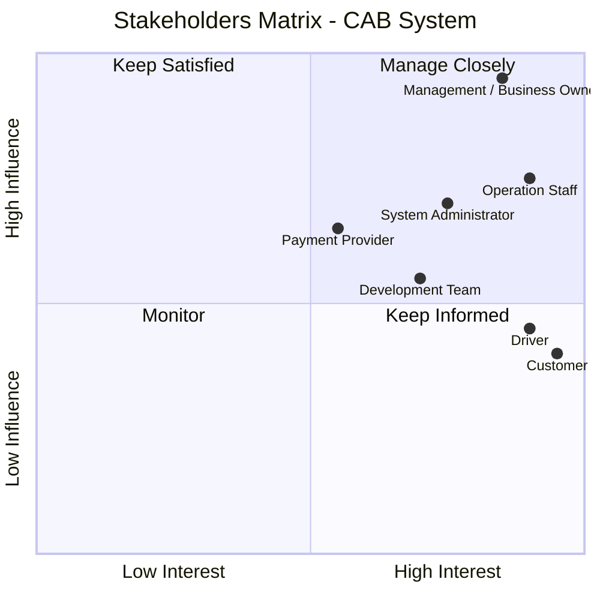
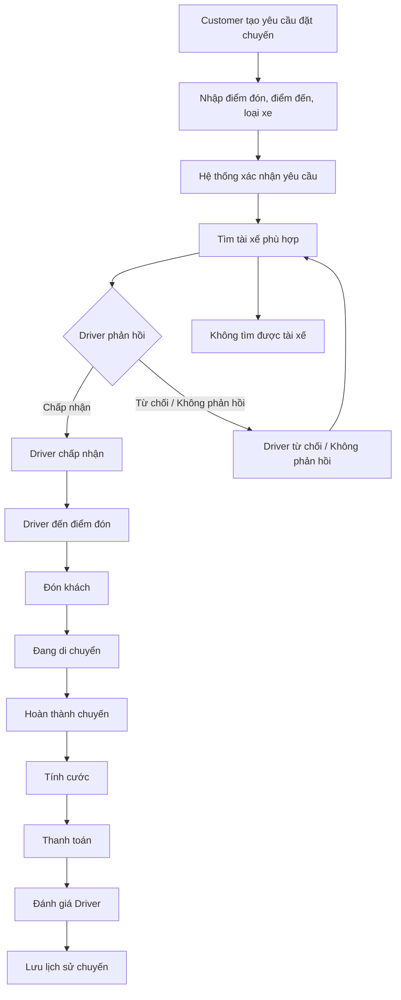
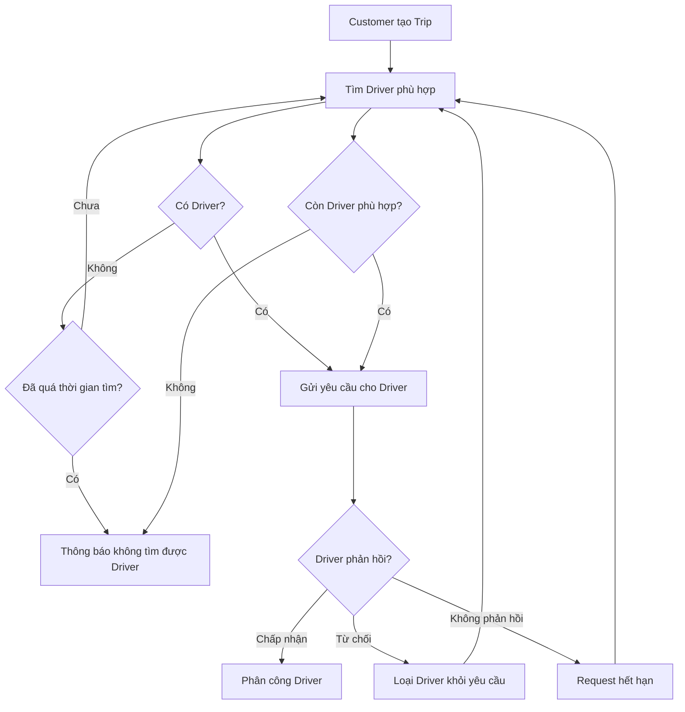
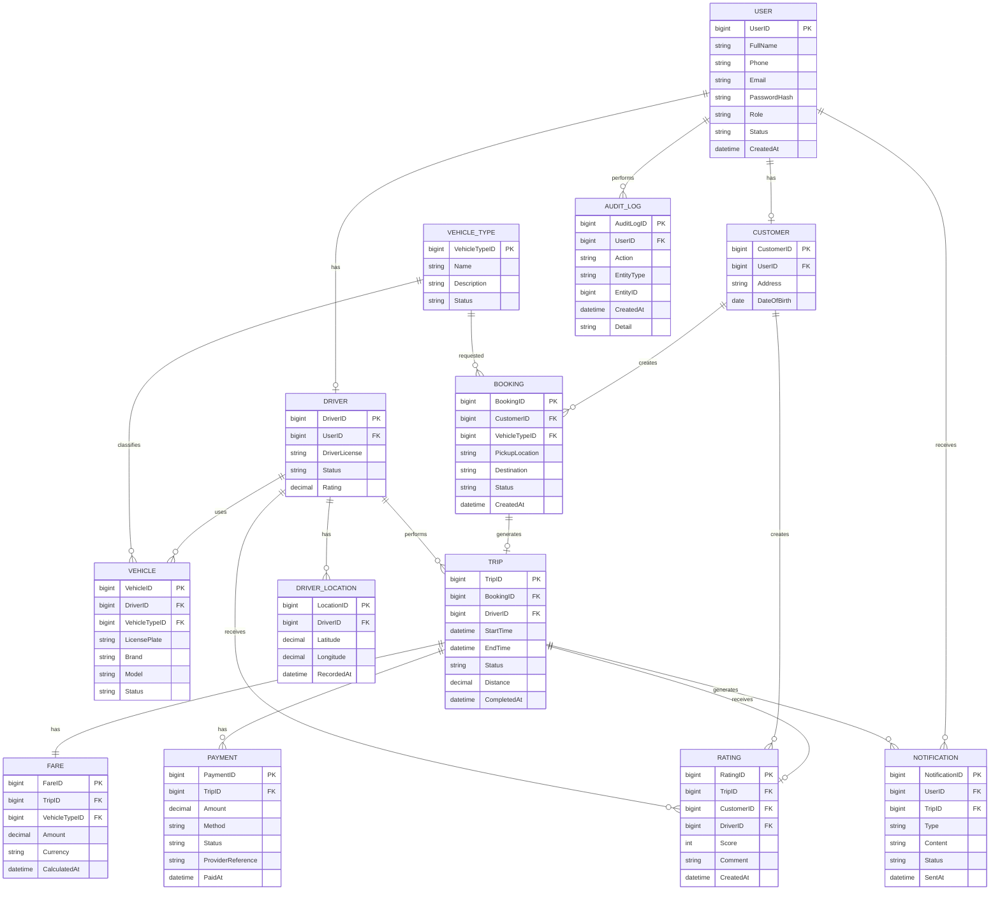
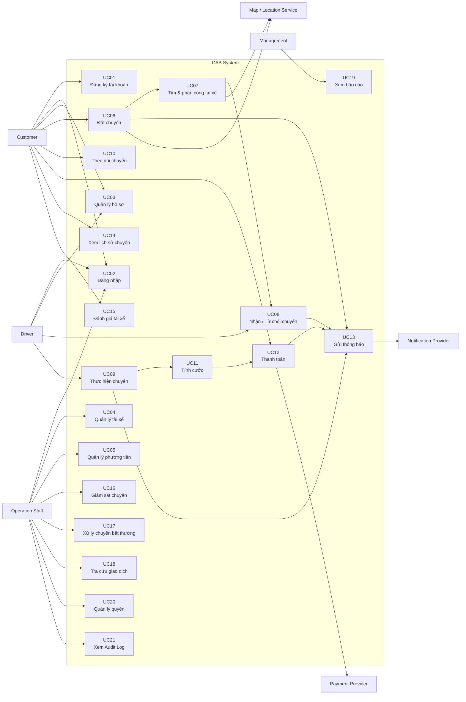

# 1. Đọc và phân tích yêu cầu của KH ở giai đoạn sơ khởi của Khách Hàng ở giai đoạn 1: Hiểu được Business Context, Business Problem,... 

## 1.1. Business Context

Công ty ABC là doanh nghiệp cung cấp dịch vụ đặt xe trực tuyến. Hiện tại, khách hàng có thể yêu cầu xe thông qua tổng đài hoặc một ứng dụng đơn giản.

Khi số lượng khách hàng và tài xế tăng lên, hệ thống hiện tại bắt đầu bộc lộ nhiều hạn chế. Việc phân công tài xế chủ yếu được thực hiện thủ công, khách hàng khó theo dõi trạng thái chuyến đi, thông tin thanh toán chưa được quản lý tập trung và bộ phận vận hành gặp khó khăn khi mở rộng quy mô.

Do đó, Công ty ABC có nhu cầu xây dựng một hệ thống CAB mới, đóng vai trò là nền tảng trung tâm hỗ trợ toàn bộ quy trình từ khi khách hàng tạo yêu cầu đặt xe cho đến khi chuyến đi hoàn thành, thanh toán và đánh giá tài xế.

Hệ thống được định hướng không chỉ giải quyết các vấn đề hiện tại mà còn phải có khả năng mở rộng để hỗ trợ thêm dịch vụ, phương thức thanh toán, kênh thông báo và các thành phần kỹ thuật mới trong tương lai.

---

## 1.2. Business Problem

Qua phân tích yêu cầu của khách hàng, các vấn đề kinh doanh chính được xác định như sau:

| ID | Business Problem | Tác động |
|---|---|---|
| BP-01 | Việc tìm và phân công tài xế chủ yếu được thực hiện thủ công | Tốn thời gian, giảm hiệu quả vận hành và khó mở rộng |
| BP-02 | Khách hàng khó theo dõi trạng thái chuyến đi | Làm giảm trải nghiệm và mức độ minh bạch của dịch vụ |
| BP-03 | Thông tin thanh toán chưa được quản lý tập trung | Khó tra cứu và kiểm soát giao dịch |
| BP-04 | Việc xử lý tài xế từ chối hoặc không phản hồi chưa được tự động hóa đầy đủ | Có thể làm chậm quá trình tìm tài xế |
| BP-05 | Bộ phận vận hành gặp khó khăn khi số lượng khách hàng và tài xế tăng | Hạn chế khả năng mở rộng của doanh nghiệp |
| BP-06 | Các thành phần như thanh toán và thông báo có thể ảnh hưởng đến hệ thống đặt xe khi xảy ra lỗi | Làm giảm tính ổn định và khả dụng của hệ thống |
| BP-07 | Dữ liệu hoạt động chưa được khai thác đầy đủ cho báo cáo | Khó đánh giá hiệu quả kinh doanh và hiệu suất tài xế |
| BP-08 | Việc phân quyền đối với các thao tác quản trị cần được kiểm soát chặt chẽ | Tiềm ẩn rủi ro về bảo mật và thao tác trái quyền |

### Tổng quát Business Problem

Hệ thống đặt xe hiện tại phụ thuộc nhiều vào xử lý thủ công, thiếu khả năng quản lý tập trung và tự động hóa, dẫn đến hạn chế trong hiệu quả vận hành, trải nghiệm khách hàng, khả năng kiểm soát dữ liệu và khả năng mở rộng của doanh nghiệp.

---

## 1.3. Business Need

Công ty ABC cần một nền tảng CAB mới có khả năng:

- Tự động hóa quá trình tìm kiếm và phân công tài xế.
- Cho phép khách hàng tạo và quản lý yêu cầu đặt xe.
- Cho phép khách hàng theo dõi trạng thái chuyến đi.
- Cho phép tài xế quản lý trạng thái hoạt động và thực hiện chuyến.
- Quản lý tập trung thông tin chuyến đi và giao dịch thanh toán.
- Hỗ trợ thanh toán bằng tiền mặt và thanh toán điện tử thông qua nhà cung cấp bên ngoài.
- Cung cấp hệ thống thông báo cho khách hàng và tài xế.
- Cho phép khách hàng đánh giá tài xế sau chuyến đi.
- Cung cấp giao diện quản trị cho nhân viên vận hành.
- Cung cấp báo cáo về hoạt động và doanh thu.
- Đảm bảo bảo mật thông tin người dùng, phương tiện, vị trí và giao dịch.
- Có khả năng mở rộng khi số lượng người dùng và chuyến đi tăng.
- Cho phép bổ sung tính năng và thay đổi thành phần kỹ thuật mà không phải xây dựng lại toàn bộ hệ thống.

---

## 1.4. Business Objectives

Các mục tiêu kinh doanh ban đầu của dự án được xác định như sau:

| ID | Business Objective |
|---|---|
| BO-01 | Xây dựng một nền tảng CAB tập trung phục vụ khách hàng, tài xế và bộ phận vận hành. |
| BO-02 | Tự động hóa quá trình tìm kiếm và phân công tài xế nhằm giảm sự phụ thuộc vào xử lý thủ công. |
| BO-03 | Cải thiện trải nghiệm khách hàng thông qua khả năng theo dõi chuyến đi và nhận thông báo theo trạng thái. |
| BO-04 | Quản lý tập trung thông tin chuyến đi, thanh toán và lịch sử giao dịch. |
| BO-05 | Hỗ trợ bộ phận vận hành giám sát và xử lý các vấn đề phát sinh trong quá trình cung cấp dịch vụ. |
| BO-06 | Cung cấp dữ liệu và báo cáo phục vụ việc theo dõi hiệu quả hoạt động và ra quyết định quản lý. |
| BO-07 | Xây dựng nền tảng có khả năng mở rộng độc lập và hỗ trợ phát triển các tính năng mới trong tương lai. |
| BO-08 | Đảm bảo tính bảo mật, ổn định và khả năng phục hồi của hệ thống trong quá trình vận hành. |

---

---


# 2. Xác định stakeholders (Các bên liên quan của hệ thống):
## - Lập 1 bảng 2 cột: Tên - Vai trò 
## - Vẽ 1 Ma trận tên: Stakeholders Matrix cho biết tầm ảnh hưởng và vai trò của Stakeholders trong hệ thống

# 2. Xác định Stakeholders

## 2.1. Danh sách Stakeholders

| Tên | Vai trò |
|---|---|
| **Customer (Khách hàng)** | Người sử dụng dịch vụ CAB để đăng ký tài khoản, đặt xe, theo dõi chuyến đi, thanh toán và đánh giá tài xế. |
| **Driver (Tài xế)** | Người cung cấp dịch vụ vận chuyển; nhận yêu cầu chuyến, chấp nhận/từ chối chuyến, cập nhật trạng thái và hoàn thành chuyến. |
| **Operation Staff (Nhân viên vận hành)** | Theo dõi và quản lý hoạt động của hệ thống; quản lý khách hàng, tài xế, phương tiện, chuyến đi và hỗ trợ xử lý các trường hợp bất thường. |
| **System Administrator (Quản trị viên hệ thống)** | Quản lý tài khoản, phân quyền, cấu hình và các thao tác quản trị nhạy cảm của hệ thống. |
| **Management / Business Owner (Ban lãnh đạo)** | Theo dõi tình hình kinh doanh thông qua báo cáo về số lượng chuyến, doanh thu, tỷ lệ hoàn thành, tỷ lệ hủy và hiệu quả hoạt động của tài xế. |
| **Payment Provider (Nhà cung cấp thanh toán)** | Hệ thống bên ngoài thực hiện xử lý các giao dịch thanh toán điện tử cho CAB. |
| **Development Team (Nhóm phát triển)** | Phân tích, thiết kế, xây dựng, kiểm thử, triển khai và bảo trì hệ thống CAB theo yêu cầu. |

> **Lưu ý:** `Payment Provider` là External System/External Stakeholder, không phải người dùng trực tiếp của CAB. `Development Team` tham gia vào quá trình xây dựng hệ thống nhưng không phải Actor sử dụng các chức năng nghiệp vụ của hệ thống.

---

## 2.2. Stakeholders Matrix

Ma trận Stakeholders đánh giá các bên liên quan dựa trên hai tiêu chí:

- **Influence (Tầm ảnh hưởng):** Mức độ Stakeholder có khả năng tác động hoặc quyết định đến phạm vi, yêu cầu và kết quả của dự án.
- **Interest (Mức độ quan tâm):** Mức độ Stakeholder quan tâm trực tiếp đến hoạt động và kết quả của hệ thống.



# 3. Xác định Business Goals - Thiết kế các mục tiêu mình thấy 
## - VD: BG01: Tự động tìm tài xế - Mục đích: Hệ thống này phải có khả năng tự động tìm tài xế 
## - VD: BG02: Hỗ trợ thanh toán - Mục đích: Hỗ trợ tiền mặt và trực tuyến

## 3.1 Business Goals

Dựa trên Business Context, Business Problem và kỳ vọng của khách hàng, các Business Goals của hệ thống CAB được xác định như sau:

| ID | Business Goal | Mục đích |
|---|---|---|
| **BG01** | **Tự động tìm và phân công tài xế** | Hệ thống phải có khả năng tự động xác định và đề xuất tài xế phù hợp dựa trên vị trí, trạng thái sẵn sàng và các tiêu chí vận hành. |
| **BG02** | **Hỗ trợ đặt xe trực tuyến** | Hệ thống phải cho phép khách hàng tạo yêu cầu đặt xe trực tuyến một cách thuận tiện và nhanh chóng. |
| **BG03** | **Theo dõi trạng thái chuyến đi** | Hệ thống phải cho phép khách hàng theo dõi trạng thái của yêu cầu đặt xe và chuyến đi từ lúc tạo yêu cầu đến khi hoàn thành. |
| **BG04** | **Quản lý chuyến đi tập trung** | Hệ thống phải quản lý tập trung thông tin và trạng thái của các chuyến đi để khách hàng, tài xế và nhân viên vận hành có thể theo dõi. |
| **BG05** | **Hỗ trợ quản lý tài xế** | Hệ thống phải cho phép quản lý hồ sơ, phương tiện, trạng thái hoạt động và thông tin liên quan của tài xế. |
| **BG06** | **Hỗ trợ thanh toán** | Hệ thống phải hỗ trợ thanh toán bằng tiền mặt và thanh toán điện tử thông qua nhà cung cấp thanh toán bên ngoài. |
| **BG07** | **Quản lý thông báo** | Hệ thống phải cung cấp thông báo kịp thời cho khách hàng và tài xế về các sự kiện quan trọng trong quá trình đặt và thực hiện chuyến đi. |
| **BG08** | **Hỗ trợ đánh giá dịch vụ** | Hệ thống phải cho phép khách hàng đánh giá tài xế sau khi chuyến đi hoàn thành nhằm thu thập phản hồi về chất lượng dịch vụ. |
| **BG09** | **Hỗ trợ vận hành và xử lý sự cố** | Hệ thống phải cung cấp giao diện quản trị để nhân viên vận hành theo dõi chuyến đi, kiểm tra trạng thái tài xế và hỗ trợ xử lý các trường hợp bất thường. |
| **BG10** | **Cung cấp báo cáo và thống kê** | Hệ thống phải cung cấp dữ liệu và báo cáo về số lượng chuyến, doanh thu, tỷ lệ hoàn thành, tỷ lệ hủy và hiệu quả hoạt động của tài xế. |
| **BG11** | **Đảm bảo bảo mật và kiểm soát truy cập** | Hệ thống phải xác thực người dùng, kiểm soát quyền truy cập và bảo vệ thông tin cá nhân, phương tiện, vị trí và giao dịch. |
| **BG12** | **Đảm bảo khả năng mở rộng** | Hệ thống phải có khả năng mở rộng khi số lượng khách hàng, tài xế và chuyến đi tăng mà không ảnh hưởng nghiêm trọng đến hoạt động của hệ thống. |
| **BG13** | **Đảm bảo tính ổn định và độc lập của các thành phần** | Hệ thống phải hạn chế việc lỗi ở một thành phần như thanh toán hoặc thông báo làm ảnh hưởng đến toàn bộ quy trình đặt xe. |
| **BG14** | **Hỗ trợ mở rộng dịch vụ trong tương lai** | Hệ thống phải có khả năng bổ sung các loại dịch vụ mới, phương thức thanh toán mới và các nhà cung cấp dịch vụ bên ngoài mà không phải xây dựng lại toàn bộ hệ thống. |
| **BG15** | **Lưu vết hoạt động hệ thống** | Hệ thống phải ghi nhận các thao tác quan trọng để hỗ trợ kiểm tra, truy vết và xử lý sự cố khi cần thiết. |
| **BG16** | **Nâng cao hiệu quả vận hành** | Hệ thống phải giảm sự phụ thuộc vào các thao tác thủ công và hỗ trợ các bộ phận phối hợp hiệu quả trong quá trình cung cấp dịch vụ đặt xe. |

## 3.2. Business Goals ưu tiên

Dựa trên vấn đề kinh doanh và kỳ vọng của khách hàng, các mục tiêu quan trọng nhất trong giai đoạn đầu là:

1. **BG01 – Tự động tìm và phân công tài xế**
2. **BG02 – Hỗ trợ đặt xe trực tuyến**
3. **BG03 – Theo dõi trạng thái chuyến đi**
4. **BG04 – Quản lý chuyến đi tập trung**
5. **BG06 – Hỗ trợ thanh toán**
6. **BG07 – Quản lý thông báo**
7. **BG09 – Hỗ trợ vận hành và xử lý sự cố**
8. **BG10 – Cung cấp báo cáo và thống kê**
9. **BG12 – Đảm bảo khả năng mở rộng**
10. **BG13 – Đảm bảo tính ổn định và độc lập của các thành phần**

Các mục tiêu còn lại hỗ trợ cho việc đảm bảo tính đầy đủ, bảo mật và khả năng phát triển lâu dài của nền tảng CAB.


# 4. Xác định phạm vi yêu cầu của mình phải làm(Scope) 
## - VD: Quản lý khách hàng, Quản lý tài xế,...
## - Trong bảng MVP phải làm cái gì - Xác định được các module cơ bản dưới góc độ 1 bảng MVP 
## - Mở rộng: Những cái mà ngoài phạm vi tôi không phải làm/Không nên làm trong đây

# 4. Xác định phạm vi yêu cầu (Scope)

## 4.1. In Scope

Phạm vi của hệ thống CAB tập trung vào việc xây dựng nền tảng đặt xe và quản lý toàn bộ quy trình từ khi khách hàng tạo yêu cầu đặt xe đến khi chuyến đi hoàn thành, thanh toán và đánh giá.

Các module chính trong phạm vi hệ thống:

1. **Quản lý tài khoản**
2. **Quản lý khách hàng**
3. **Quản lý tài xế**
4. **Quản lý phương tiện**
5. **Đặt xe**
6. **Tìm kiếm và phân công tài xế**
7. **Quản lý chuyến đi**
8. **Tính cước**
9. **Thanh toán**
10. **Thông báo**
11. **Đánh giá tài xế**
12. **Quản lý vận hành**
13. **Báo cáo và thống kê**
14. **Phân quyền và Audit Log**

---

## 4.2. MVP Scope

Do thời gian xây dựng và triển khai sản phẩm chỉ **7 tuần**, hệ thống cần tập trung vào các chức năng cốt lõi để có thể cung cấp một phiên bản MVP đáp ứng quy trình đặt xe cơ bản.

| ID | Module | Chức năng chính | MVP |
|---|---|---|---|
| **M01** | **Quản lý tài khoản** | Đăng ký, đăng nhập, cập nhật thông tin cá nhân, xác thực người dùng | **Must Have** |
| **M02** | **Quản lý khách hàng** | Xem và quản lý thông tin khách hàng | **Must Have** |
| **M03** | **Quản lý tài xế** | Tài khoản, hồ sơ, trạng thái hoạt động của tài xế | **Must Have** |
| **M04** | **Quản lý phương tiện** | Thông tin xe và liên kết xe với tài xế | **Must Have** |
| **M05** | **Đặt xe** | Nhập điểm đón, điểm đến, chọn loại xe và tạo yêu cầu | **Must Have** |
| **M06** | **Tìm & phân công tài xế** | Tìm tài xế phù hợp, gửi yêu cầu, xử lý từ chối/không phản hồi | **Must Have** |
| **M07** | **Quản lý chuyến đi** | Theo dõi và cập nhật trạng thái chuyến: đến điểm đón, đón khách, đang di chuyển, hoàn thành | **Must Have** |
| **M08** | **Tính cước** | Xác định số tiền phải trả sau khi chuyến hoàn thành | **Must Have** |
| **M09** | **Thanh toán** | Thanh toán tiền mặt và thanh toán điện tử thông qua Payment Provider | **Must Have** |
| **M10** | **Thông báo** | Thông báo các sự kiện quan trọng cho Customer và Driver | **Must Have** |
| **M11** | **Đánh giá** | Customer đánh giá Driver sau chuyến đi | **Should Have** |
| **M12** | **Quản lý vận hành** | Theo dõi chuyến đang diễn ra, trạng thái tài xế và hỗ trợ xử lý sự cố | **Must Have** |
| **M13** | **Báo cáo & thống kê** | Số chuyến, doanh thu, tỷ lệ hoàn thành, tỷ lệ hủy, hiệu quả tài xế | **Should Have** |
| **M14** | **Phân quyền & Audit Log** | Phân quyền thao tác quản trị và lưu vết thao tác quan trọng | **Must Have** |

### 4.2.1. MVP Core Flow

MVP phải đảm bảo hoàn thành được quy trình nghiệp vụ cốt lõi:

```text
Customer
   |
   v
Đăng nhập
   |
   v
Tạo yêu cầu đặt xe
   |
   v
Hệ thống tìm tài xế
   |
   v
Driver nhận chuyến
   |
   v
Driver đến điểm đón
   |
   v
Đón khách
   |
   v
Đang di chuyển
   |
   v
Hoàn thành chuyến
   |
   v
Tính cước
   |
   v
Thanh toán
   |
   v
Đánh giá
```

---

## 4.3. Out of Scope – Ngoài phạm vi

Các chức năng và phạm vi sau **không thuộc phạm vi thực hiện của dự án CAB System trong giai đoạn hiện tại**:

| ID | Out of Scope | Lý do |
|---|---|---|
| OOS-01 | Xây dựng hệ thống thanh toán điện tử riêng | CAB chỉ tích hợp với Payment Provider bên ngoài. |
| OOS-02 | Lưu trữ thông tin thẻ hoặc tài khoản thanh toán nhạy cảm | Khách hàng yêu cầu không lưu trực tiếp dữ liệu thanh toán nhạy cảm trên CAB. |
| OOS-03 | Xây dựng hệ thống bản đồ/GPS riêng | CAB sử dụng dịch vụ bản đồ và vị trí từ hệ thống bên ngoài. |
| OOS-04 | Xây dựng hệ thống thông báo riêng | CAB chỉ cung cấp khả năng tích hợp với các nhà cung cấp thông báo. |
| OOS-05 | Phát triển các loại hình dịch vụ vận tải mới | Chỉ thiết kế hệ thống có khả năng mở rộng để hỗ trợ trong tương lai. |
| OOS-06 | Xây dựng hệ thống CRM | Không thuộc quy trình nghiệp vụ cốt lõi của nền tảng đặt xe. |
| OOS-07 | Quản lý nhân sự và tính lương | Không liên quan trực tiếp đến hoạt động đặt và thực hiện chuyến xe. |
| OOS-08 | Xây dựng hệ thống kế toán doanh nghiệp hoàn chỉnh | CAB chỉ quản lý thông tin thanh toán và cung cấp báo cáo cần thiết. |
| OOS-09 | Phát triển AI/ML nâng cao | Chưa được khách hàng yêu cầu trong phạm vi hiện tại. |
| OOS-10 | Chương trình khách hàng thân thiết và tích điểm | Chưa được đề cập trong yêu cầu của khách hàng. |
| OOS-11 | Marketplace kết nối nhiều doanh nghiệp vận tải | Không thuộc mô hình kinh doanh hiện tại của Công ty ABC. |
| OOS-12 | Phát triển ứng dụng riêng cho các nền tảng hoặc thiết bị chưa được xác định | Chỉ triển khai các nền tảng thuộc phạm vi MVP được thống nhất. |
| OOS-13 | Quản lý bảo trì và sửa chữa phương tiện | Đề bài chỉ yêu cầu quản lý thông tin phương tiện, không yêu cầu quản lý bảo dưỡng. |
| OOS-14 | Quản lý tuyển dụng và đào tạo tài xế | Không thuộc quy trình vận hành đặt xe của hệ thống CAB. |

---

# 5. Chuyển nhu cầu thành Business Requirements - 1 bảng 3 cột: ID - Tên - Diễn giải
## - VD: BR01 - Đặt chuyến - Hệ thống phải cung cấp điểm đến, cung cấp điểm đón

| ID | Tên | Diễn giải |
|---|---|---|
| **BR01** | **Quản lý người dùng** | Hệ thống phải hỗ trợ quản lý tài khoản và thông tin của Customer, Driver và nhân viên vận hành theo quyền được cấp. |
| **BR02** | **Đặt chuyến** | Hệ thống phải cho phép Customer nhập điểm đón, điểm đến, lựa chọn loại xe và gửi yêu cầu đặt chuyến. |
| **BR03** | **Tìm và phân công tài xế** | Hệ thống phải tự động tìm và phân công Driver phù hợp dựa trên vị trí, trạng thái sẵn sàng và các tiêu chí vận hành. |
| **BR04** | **Quản lý chuyến đi** | Hệ thống phải hỗ trợ theo dõi và cập nhật trạng thái chuyến từ khi tạo yêu cầu đến khi hoàn thành. |
| **BR05** | **Quản lý vị trí tài xế** | Hệ thống phải ghi nhận vị trí Driver để hỗ trợ tìm tài xế phù hợp và xác định thời gian dự kiến đến. |
| **BR06** | **Tính cước và thanh toán** | Hệ thống phải xác định cước chuyến đi và hỗ trợ thanh toán bằng tiền mặt hoặc thanh toán điện tử thông qua nhà cung cấp bên ngoài. |
| **BR07** | **Quản lý thông báo** | Hệ thống phải gửi thông báo cho Customer và Driver về các sự kiện quan trọng trong quá trình đặt và thực hiện chuyến. |
| **BR08** | **Đánh giá và lịch sử chuyến** | Hệ thống phải cho phép Customer xem lịch sử chuyến, số tiền phải trả và đánh giá Driver sau khi hoàn thành chuyến. |
| **BR09** | **Quản lý vận hành** | Hệ thống phải cung cấp công cụ cho Operation Staff quản lý Customer, Driver, phương tiện, chuyến đi và xử lý các trường hợp bất thường. |
| **BR10** | **Báo cáo và quản trị** | Hệ thống phải cung cấp báo cáo hoạt động, đồng thời hỗ trợ phân quyền và lưu vết các thao tác quản trị quan trọng. |
| **BR11** | **Bảo mật và ổn định** | Hệ thống phải bảo vệ dữ liệu, kiểm soát truy cập và hạn chế ảnh hưởng dây chuyền khi một thành phần như thanh toán hoặc thông báo gặp lỗi. |
| **BR12** | **Khả năng mở rộng** | Hệ thống phải có khả năng mở rộng quy mô và bổ sung dịch vụ, phương thức thanh toán hoặc nhà cung cấp bên ngoài trong tương lai. |

---

# 6. Xây dựng các Business Process
## - VD: Đặt chuyến: 
###   B1: Tạo chuyến đi 
###   B2: Xác định điểm đến 
###   B3: Hệ thống xác nhận 
###   B4: Tìm tài xế 
###   B5: Đợi tài xế chấp nhận

## 6.1. BP01 – Đặt chuyến

### B1.1: Tạo yêu cầu đặt chuyến

Customer đăng nhập và bắt đầu tạo yêu cầu đặt xe.

### B1.2: Nhập thông tin chuyến đi

Customer cung cấp điểm đón, điểm đến và lựa chọn loại xe/dịch vụ.

### B1.3: Xác nhận yêu cầu

Hệ thống kiểm tra thông tin yêu cầu và xác nhận yêu cầu đặt chuyến.

### B1.4: Tìm tài xế

Hệ thống xác định các Driver phù hợp dựa trên vị trí, trạng thái sẵn sàng và các tiêu chí vận hành.

### B1.5: Chờ tài xế phản hồi

Hệ thống gửi yêu cầu đến Driver phù hợp và chờ Driver chấp nhận hoặc từ chối.

### B1.6: Xử lý kết quả tìm tài xế

- Nếu Driver chấp nhận → Chuyển sang quy trình thực hiện chuyến.
- Nếu Driver từ chối hoặc không phản hồi → Hệ thống tiếp tục tìm Driver khác.
- Nếu không còn Driver phù hợp → Thông báo cho Customer.

---

## 6.2. BP02 – Thực hiện chuyến đi

### B2.1: Tài xế nhận chuyến

Driver chấp nhận yêu cầu và hệ thống ghi nhận Driver được phân công.

### B2.2: Tài xế di chuyển đến điểm đón

Driver di chuyển đến vị trí đón và hệ thống cập nhật trạng thái chuyến.

### B2.3: Tài xế đến điểm đón

Driver xác nhận đã đến điểm đón và hệ thống thông báo cho Customer.

### B2.4: Đón khách

Driver xác nhận đã đón Customer.

### B2.5: Thực hiện chuyến

Driver di chuyển Customer từ điểm đón đến điểm đến.

### B2.6: Hoàn thành chuyến

Driver xác nhận chuyến đi hoàn thành và hệ thống ghi nhận thời điểm hoàn thành.

---

## 6.3. BP03 – Tính cước và thanh toán

### B3.1: Xác định cước chuyến đi

Hệ thống xác định số tiền Customer phải trả dựa trên loại dịch vụ và thông tin chuyến đi.

### B3.2: Hiển thị số tiền phải trả

Hệ thống cung cấp thông tin số tiền cần thanh toán cho Customer.

### B3.3: Lựa chọn phương thức thanh toán

Customer lựa chọn phương thức thanh toán:

- Tiền mặt.
- Thanh toán điện tử.

### B3.4: Xử lý thanh toán

Nếu Customer sử dụng thanh toán điện tử, hệ thống gửi yêu cầu đến Payment Provider bên ngoài.

### B3.5: Ghi nhận kết quả thanh toán

Hệ thống ghi nhận kết quả giao dịch và thông báo cho Customer.

---

## 6.4. BP04 – Đánh giá và kết thúc chuyến

### B4.1: Hiển thị thông tin chuyến hoàn thành

Hệ thống hiển thị thông tin chuyến và số tiền đã thanh toán/phải trả.

### B4.2: Đánh giá tài xế

Customer có thể đánh giá Driver sau khi chuyến hoàn thành.

### B4.3: Lưu lịch sử chuyến

Hệ thống lưu thông tin chuyến đi vào lịch sử của Customer.

### B4.4: Cập nhật dữ liệu vận hành

Hệ thống cập nhật dữ liệu chuyến đi phục vụ báo cáo và quản lý vận hành.

---

## 6.5. BP05 – Quản lý và giám sát vận hành

### B5.1: Theo dõi chuyến đang diễn ra

Operation Staff xem danh sách các chuyến đang diễn ra và trạng thái hiện tại.

### B5.2: Kiểm tra trạng thái tài xế

Operation Staff kiểm tra trạng thái hoạt động và thông tin vị trí của Driver.

### B5.3: Xử lý chuyến bất thường

Operation Staff hỗ trợ xử lý các trường hợp chuyến bị lỗi hoặc phát sinh vấn đề.

### B5.4: Tra cứu lịch sử

Operation Staff có quyền truy cập có thể tra cứu lịch sử chuyến và giao dịch.

### B5.5: Theo dõi báo cáo

Management và các nhân viên có quyền xem các báo cáo về số lượng chuyến, doanh thu, tỷ lệ hoàn thành, tỷ lệ hủy và hiệu quả hoạt động của Driver.

---

## 6.6. Tổng quan Business Process


---

# 7. Thiết kế Functional Requirements Decisions - FR
### - VD: Với BR Tìm tài xế thì:
###   FR01: Xác định được vị trí của khách hàng
###   FR02: Chọn ra những tài xế online
###   FR03: Chọn loại xe
###   FR04: Ưu tiên tài xế rating cao(Nếu có BR liên quan đến rating)

# 7. Functional Requirements (FR)

Functional Requirements được phân rã từ các Business Requirements (BR), mô tả các chức năng cụ thể mà hệ thống CAB phải cung cấp.

## 7.1. BR01 – Quản lý người dùng

| ID | Functional Requirement |
|---|---|
| **FR01.01** | Hệ thống phải cho phép Customer đăng ký tài khoản. |
| **FR01.02** | Hệ thống phải cho phép Driver đăng ký hoặc được Operation Staff tạo tài khoản. |
| **FR01.03** | Hệ thống phải cho phép người dùng đăng nhập và đăng xuất. |
| **FR01.04** | Hệ thống phải xác thực người dùng trước khi sử dụng các chức năng yêu cầu tài khoản. |
| **FR01.05** | Hệ thống phải cho phép người dùng cập nhật thông tin cá nhân. |
| **FR01.06** | Hệ thống phải phân biệt quyền truy cập dựa trên vai trò của người dùng. |

---

## 7.2. BR02 – Đặt chuyến

| ID | Functional Requirement |
|---|---|
| **FR02.01** | Hệ thống phải cho phép Customer nhập điểm đón. |
| **FR02.02** | Hệ thống phải cho phép Customer nhập điểm đến. |
| **FR02.03** | Hệ thống phải cho phép Customer lựa chọn loại xe/dịch vụ. |
| **FR02.04** | Hệ thống phải xác nhận thông tin trước khi tạo yêu cầu đặt chuyến. |
| **FR02.05** | Hệ thống phải tạo mã định danh duy nhất cho mỗi yêu cầu đặt chuyến. |
| **FR02.06** | Hệ thống phải hiển thị trạng thái của yêu cầu đặt chuyến cho Customer. |

---

## 7.3. BR03 – Tìm và phân công tài xế

| ID | Functional Requirement |
|---|---|
| **FR03.01** | Hệ thống phải xác định vị trí hiện tại của Customer hoặc vị trí điểm đón. |
| **FR03.02** | Hệ thống phải xác định các Driver đang ở trạng thái sẵn sàng nhận chuyến. |
| **FR03.03** | Hệ thống phải lọc Driver dựa trên loại xe phù hợp với yêu cầu của Customer. |
| **FR03.04** | Hệ thống phải xác định các Driver phù hợp dựa trên vị trí. |
| **FR03.05** | Hệ thống phải áp dụng các tiêu chí ưu tiên Driver theo quy tắc vận hành được xác định. |
| **FR03.06** | Hệ thống phải gửi thông báo yêu cầu chuyến đến Driver được lựa chọn. |
| **FR03.07** | Hệ thống phải cho phép Driver chấp nhận chuyến. |
| **FR03.08** | Hệ thống phải cho phép Driver từ chối chuyến. |
| **FR03.09** | Hệ thống phải tiếp tục tìm Driver khác khi Driver từ chối hoặc không phản hồi. |
| **FR03.10** | Hệ thống phải thông báo cho Customer khi không tìm được Driver phù hợp. |
| **FR03.11** | Hệ thống phải ghi nhận Driver được phân công cho chuyến đi. |

> **Lưu ý:** Rating của Driver chưa được xác định là tiêu chí ưu tiên trong yêu cầu của khách hàng. Vì vậy, không đưa "ưu tiên tài xế rating cao" thành FR chính thức cho đến khi Business Rule này được khách hàng xác nhận.

---

## 7.4. BR04 – Quản lý chuyến đi

| ID | Functional Requirement |
|---|---|
| **FR04.01** | Hệ thống phải cho phép Driver cập nhật trạng thái đã đến điểm đón. |
| **FR04.02** | Hệ thống phải cho phép Driver cập nhật trạng thái đã đón khách. |
| **FR04.03** | Hệ thống phải cho phép Driver cập nhật trạng thái đang di chuyển. |
| **FR04.04** | Hệ thống phải cho phép Driver cập nhật trạng thái hoàn thành chuyến. |
| **FR04.05** | Hệ thống phải hiển thị trạng thái chuyến đi cho Customer. |
| **FR04.06** | Hệ thống phải lưu lại lịch sử thay đổi trạng thái của chuyến đi. |
| **FR04.07** | Hệ thống phải cho phép Operation Staff theo dõi các chuyến đang diễn ra. |

---

## 7.5. BR05 – Quản lý vị trí tài xế

| ID | Functional Requirement |
|---|---|
| **FR05.01** | Hệ thống phải ghi nhận vị trí hiện tại của Driver khi Driver đang hoạt động. |
| **FR05.02** | Hệ thống phải cập nhật thông tin vị trí của Driver trong quá trình thực hiện chuyến. |
| **FR05.03** | Hệ thống phải sử dụng thông tin vị trí để hỗ trợ tìm Driver phù hợp. |
| **FR05.04** | Hệ thống phải cung cấp thông tin vị trí cần thiết cho việc ước tính thời gian Driver đến điểm đón. |

---

## 7.6. BR06 – Tính cước và thanh toán

| ID | Functional Requirement |
|---|---|
| **FR06.01** | Hệ thống phải xác định số tiền Customer phải trả sau khi chuyến đi hoàn thành. |
| **FR06.02** | Hệ thống phải áp dụng công thức tính cước theo quy tắc kinh doanh được xác nhận. |
| **FR06.03** | Hệ thống phải hiển thị số tiền phải thanh toán cho Customer. |
| **FR06.04** | Hệ thống phải cho phép Customer lựa chọn phương thức thanh toán được hỗ trợ. |
| **FR06.05** | Hệ thống phải ghi nhận kết quả thanh toán bằng tiền mặt. |
| **FR06.06** | Hệ thống phải gửi yêu cầu thanh toán điện tử đến Payment Provider. |
| **FR06.07** | Hệ thống phải nhận và ghi nhận kết quả giao dịch từ Payment Provider. |
| **FR06.08** | Hệ thống phải thông báo cho Customer khi thanh toán thành công hoặc thất bại. |
| **FR06.09** | Hệ thống phải cho phép xử lý lại giao dịch thanh toán thất bại theo chính sách của doanh nghiệp. |
| **FR06.10** | Hệ thống không được lưu trực tiếp thông tin thẻ hoặc thông tin thanh toán nhạy cảm của Customer. |

---

## 7.7. BR07 – Quản lý thông báo

| ID | Functional Requirement |
|---|---|
| **FR07.01** | Hệ thống phải thông báo cho Customer khi yêu cầu đặt xe được tiếp nhận. |
| **FR07.02** | Hệ thống phải thông báo cho Customer khi Driver nhận chuyến. |
| **FR07.03** | Hệ thống phải thông báo cho Customer khi Driver đến điểm đón. |
| **FR07.04** | Hệ thống phải thông báo cho Customer khi chuyến đi hoàn thành. |
| **FR07.05** | Hệ thống phải thông báo kết quả thanh toán cho Customer. |
| **FR07.06** | Hệ thống phải thông báo cho Driver khi có chuyến mới. |
| **FR07.07** | Hệ thống phải thông báo cho Driver khi có thay đổi liên quan đến chuyến đang thực hiện. |
| **FR07.08** | Hệ thống phải hỗ trợ tích hợp thêm các kênh thông báo trong tương lai. |

---

## 7.8. BR08 – Đánh giá và lịch sử chuyến

| ID | Functional Requirement |
|---|---|
| **FR08.01** | Hệ thống phải cho phép Customer xem danh sách lịch sử chuyến đi. |
| **FR08.02** | Hệ thống phải cho phép Customer xem thông tin chi tiết của một chuyến đi. |
| **FR08.03** | Hệ thống phải hiển thị số tiền phải trả của chuyến đi. |
| **FR08.04** | Hệ thống phải cho phép Customer đánh giá Driver sau khi chuyến hoàn thành. |
| **FR08.05** | Hệ thống phải lưu kết quả đánh giá gắn với chuyến đi tương ứng. |

---

## 7.9. BR09 – Quản lý vận hành

| ID | Functional Requirement |
|---|---|
| **FR09.01** | Hệ thống phải cho phép Operation Staff tra cứu thông tin Customer. |
| **FR09.02** | Hệ thống phải cho phép Operation Staff quản lý thông tin Driver. |
| **FR09.03** | Hệ thống phải cho phép Operation Staff quản lý thông tin phương tiện. |
| **FR09.04** | Hệ thống phải cho phép Operation Staff xem các chuyến đang diễn ra. |
| **FR09.05** | Hệ thống phải cho phép Operation Staff kiểm tra trạng thái Driver. |
| **FR09.06** | Hệ thống phải cho phép Operation Staff tra cứu lịch sử chuyến đi. |
| **FR09.07** | Hệ thống phải cho phép Operation Staff hỗ trợ xử lý các chuyến bị lỗi. |
| **FR09.08** | Hệ thống phải cho phép nhân viên có quyền phù hợp tra cứu lịch sử giao dịch. |

---

## 7.10. BR10 – Báo cáo và quản trị

| ID | Functional Requirement |
|---|---|
| **FR10.01** | Hệ thống phải cung cấp báo cáo về số lượng chuyến. |
| **FR10.02** | Hệ thống phải cung cấp báo cáo về doanh thu. |
| **FR10.03** | Hệ thống phải cung cấp báo cáo về tỷ lệ chuyến hoàn thành. |
| **FR10.04** | Hệ thống phải cung cấp báo cáo về tỷ lệ chuyến bị hủy. |
| **FR10.05** | Hệ thống phải cung cấp báo cáo về hiệu quả hoạt động của Driver. |
| **FR10.06** | Hệ thống phải cho phép quản lý người dùng theo vai trò và quyền hạn. |
| **FR10.07** | Hệ thống phải hạn chế các thao tác nhạy cảm đối với nhân viên không có quyền. |
| **FR10.08** | Hệ thống phải ghi nhận các thao tác quản trị quan trọng. |

---

## 7.11. BR11 – Bảo mật và ổn định

| ID | Functional Requirement |
|---|---|
| **FR11.01** | Hệ thống phải yêu cầu xác thực trước khi người dùng truy cập các chức năng yêu cầu tài khoản. |
| **FR11.02** | Hệ thống phải kiểm tra quyền trước khi thực hiện các chức năng quản trị. |
| **FR11.03** | Hệ thống phải bảo vệ thông tin cá nhân, phương tiện, vị trí và giao dịch. |
| **FR11.04** | Hệ thống phải ghi nhận các sự kiện quan trọng phục vụ việc kiểm tra và truy vết. |
| **FR11.05** | Hệ thống phải xử lý lỗi của các dịch vụ bên ngoài mà không làm dừng toàn bộ quy trình đặt xe. |

---

## 7.12. BR12 – Khả năng mở rộng

| ID | Functional Requirement |
|---|---|
| **FR12.01** | Hệ thống phải hỗ trợ mở rộng các thành phần khi số lượng người dùng và chuyến đi tăng. |
| **FR12.02** | Hệ thống phải cho phép bổ sung loại dịch vụ mới mà không ảnh hưởng lớn đến các chức năng hiện có. |
| **FR12.03** | Hệ thống phải cho phép tích hợp thêm phương thức thanh toán trong tương lai. |
| **FR12.04** | Hệ thống phải cho phép tích hợp thêm nhà cung cấp thông báo trong tương lai. |
| **FR12.05** | Hệ thống phải hỗ trợ triển khai chức năng mới từng phần với mức ảnh hưởng tối thiểu đến các chức năng đang hoạt động. |


---
# 8. Xác định Business Rules và Business Exceptional
# - VD Business Rules: Chỉ những tài xế tỏng trạng thái sẵn sàng mới được nhận chuyên
# - VD Business Exceptional: Khi khách hàng tạo chuyến nhưng tìm tài xế quá lâu
# - VD Business Exceptional: Khi tìm được tài xế rồi nhưng quá thời hạn tài xế không bấm thì phải thoát ra và tìm tài xế khác

# 8. Business Rules và Business Exceptions

## 8.1. Business Rules

Business Rules xác định các quy tắc và điều kiện mà hệ thống CAB phải tuân thủ trong quá trình vận hành.

| ID | Business Rule | Diễn giải |
|---|---|---|
| **BRL01** | **Tài xế phải sẵn sàng mới được nhận chuyến** | Chỉ Driver có trạng thái **Available/Ready** mới được hệ thống đưa vào danh sách tìm kiếm và phân công chuyến. |
| **BRL02** | **Tài xế phải phù hợp với loại xe** | Driver chỉ được nhận những chuyến có loại xe phù hợp với phương tiện đã đăng ký. |
| **BRL03** | **Ưu tiên tài xế phù hợp và gần khách hàng** | Hệ thống phải ưu tiên các Driver đáp ứng yêu cầu chuyến và có vị trí phù hợp/gần điểm đón theo tiêu chí vận hành. |
| **BRL04** | **Một chuyến chỉ có một tài xế được phân công** | Tại một thời điểm, một Trip chỉ được gán cho tối đa một Driver. |
| **BRL05** | **Tài xế đang thực hiện chuyến không nhận chuyến mới** | Driver đang thực hiện một Trip không được hệ thống đưa vào danh sách Driver sẵn sàng cho Trip khác. |
| **BRL06** | **Chỉ tài xế được phân công mới được cập nhật chuyến** | Chỉ Driver được gán cho Trip mới có quyền cập nhật trạng thái của Trip đó. |
| **BRL07** | **Chuyến phải tuân thủ trình tự trạng thái** | Trạng thái Trip phải được cập nhật theo trình tự nghiệp vụ hợp lệ, ví dụ: `Assigned → Arrived → Picked Up → In Progress → Completed`. |
| **BRL08** | **Chỉ tính cước khi chuyến hoàn thành** | Hệ thống xác định cước cuối cùng dựa trên thông tin của Trip sau khi chuyến được hoàn thành. |
| **BRL09** | **Không lưu dữ liệu thanh toán nhạy cảm** | CAB không được lưu trực tiếp thông tin thẻ hoặc thông tin tài khoản thanh toán nhạy cảm của Customer. |
| **BRL10** | **Chỉ Customer của chuyến mới được đánh giá Driver** | Customer chỉ được đánh giá Driver đối với Trip mà Customer đó thực sự tham gia và Trip đã hoàn thành. |
| **BRL11** | **Chỉ người có quyền mới được thực hiện thao tác quản trị** | Các chức năng quản trị hoặc thao tác nhạy cảm phải được kiểm soát bằng quyền truy cập. |
| **BRL12** | **Mỗi Trip phải có mã định danh duy nhất** | Hệ thống phải tạo một mã định danh duy nhất cho mỗi yêu cầu/chuyến đi để phục vụ quản lý và tra cứu. |

---

## 8.2. Business Exceptions

Business Exceptions mô tả các tình huống bất thường có thể xảy ra trong quá trình thực hiện nghiệp vụ và cách hệ thống cần phản ứng.

| ID | Business Exception | Xử lý nghiệp vụ |
|---|---|---|
| **BE01** | **Không tìm được tài xế** | Nếu hệ thống không tìm được Driver phù hợp, hệ thống phải thông báo rõ ràng cho Customer và kết thúc yêu cầu tìm tài xế. |
| **BE02** | **Tìm tài xế quá lâu** | Nếu quá thời gian tìm tài xế được doanh nghiệp quy định mà chưa có Driver nhận chuyến, hệ thống phải dừng quá trình tìm và thông báo cho Customer. |
| **BE03** | **Tài xế từ chối chuyến** | Khi Driver từ chối, hệ thống phải loại Driver đó khỏi yêu cầu hiện tại và tiếp tục tìm Driver khác phù hợp. |
| **BE04** | **Tài xế không phản hồi** | Nếu Driver được đề xuất không phản hồi trong thời gian quy định, hệ thống phải xem yêu cầu là hết hạn và tiếp tục tìm Driver khác. |
| **BE05** | **Tài xế đã nhận nhưng mất kết nối** | Nếu Driver mất kết nối sau khi nhận chuyến, hệ thống phải xác định trạng thái của Trip và cho phép Operation Staff hỗ trợ xử lý nếu cần. |
| **BE06** | **Thanh toán điện tử thất bại** | Hệ thống phải thông báo cho Customer về giao dịch thất bại và cho phép thực hiện lại theo chính sách thanh toán của doanh nghiệp. |
| **BE07** | **Payment Provider không phản hồi** | Hệ thống không được coi giao dịch là thành công khi chưa nhận được kết quả xác nhận từ Payment Provider. Giao dịch phải được đánh dấu trạng thái phù hợp để xử lý tiếp. |
| **BE08** | **Mất kết nối trong quá trình đặt chuyến** | Hệ thống phải đảm bảo yêu cầu không bị tạo trùng khi Customer gửi lại yêu cầu sau khi kết nối được khôi phục. |
| **BE09** | **Mất kết nối khi tài xế đang thực hiện chuyến** | Hệ thống phải duy trì trạng thái Trip gần nhất đã được xác nhận và đồng bộ lại dữ liệu khi kết nối được khôi phục. |
| **BE10** | **Chuyến phát sinh lỗi** | Operation Staff phải có khả năng tra cứu Trip và hỗ trợ xử lý theo quy trình vận hành. |
| **BE11** | **Tài xế không đến điểm đón** | Hệ thống phải cho phép ghi nhận tình trạng bất thường để Operation Staff xử lý theo chính sách của doanh nghiệp. |
| **BE12** | **Customer hủy chuyến** | Hệ thống phải xử lý việc hủy Trip theo chính sách hủy chuyến được doanh nghiệp xác nhận. |

---

## 8.3. Quy trình xử lý Exception khi tìm tài xế


---
# 9. Data Modeling - Xây dựng các Data Model - Nhìn vô để xác định được các thực thể và vẽ lên được sơ đồ ERD

## 9.1. Mục tiêu

Data Model được xây dựng nhằm xác định các **thực thể (Entity)** chính của CAB System, các thuộc tính quan trọng và mối quan hệ giữa các thực thể.

Data Model tập trung vào các nghiệp vụ cốt lõi:

> **Customer → Booking → Driver Matching → Trip → Fare → Payment → Rating**

---

## 9.2. Xác định các Entity chính

| ID | Entity | Mô tả |
|---|---|---|
| **E01** | **User** | Thông tin tài khoản dùng để đăng nhập và xác thực hệ thống. |
| **E02** | **Customer** | Thông tin người sử dụng dịch vụ đặt xe. |
| **E03** | **Driver** | Thông tin tài xế sử dụng hệ thống. |
| **E04** | **Vehicle** | Thông tin phương tiện của Driver. |
| **E05** | **VehicleType** | Loại phương tiện/dịch vụ mà Customer lựa chọn. |
| **E06** | **Booking** | Yêu cầu đặt xe do Customer tạo. |
| **E07** | **Trip** | Chuyến đi được thực hiện sau khi Booking được Driver nhận. |
| **E08** | **DriverLocation** | Thông tin vị trí của Driver. |
| **E09** | **Fare** | Thông tin cước phí của Trip. |
| **E10** | **Payment** | Thông tin giao dịch thanh toán của Trip. |
| **E11** | **Rating** | Đánh giá của Customer đối với Driver sau chuyến đi. |
| **E12** | **Notification** | Thông tin các thông báo được gửi đến User. |
| **E13** | **AuditLog** | Lịch sử các thao tác quan trọng trong hệ thống. |

---

## 9.3. Relationships

| Relationship | Cardinality | Diễn giải |
|---|---|---|
| User – Customer | 1 : 0..1 | Một User có thể là một Customer. |
| User – Driver | 1 : 0..1 | Một User có thể là một Driver. |
| Driver – Vehicle | 1 : N | Một Driver có thể quản lý/sử dụng một hoặc nhiều Vehicle theo nghiệp vụ. |
| VehicleType – Vehicle | 1 : N | Một VehicleType có thể áp dụng cho nhiều Vehicle. |
| Customer – Booking | 1 : N | Một Customer có thể tạo nhiều Booking. |
| Booking – Trip | 1 : 0..1 | Một Booking có thể tạo tối đa một Trip. |
| Driver – Trip | 1 : N | Một Driver có thể thực hiện nhiều Trip theo thời gian. |
| Driver – DriverLocation | 1 : N | Một Driver có nhiều bản ghi vị trí theo thời gian. |
| Trip – Fare | 1 : 1 | Một Trip có một thông tin cước cuối cùng. |
| Trip – Payment | 1 : N | Một Trip có thể có nhiều Payment Attempt nếu thanh toán thất bại và thực hiện lại. |
| Trip – Rating | 1 : 0..1 | Một Trip có tối đa một Rating từ Customer. |
| User – Notification | 1 : N | Một User có thể nhận nhiều Notification. |
| Trip – Notification | 1 : N | Một Trip có thể phát sinh nhiều Notification. |
| User – AuditLog | 1 : N | Một User có thể thực hiện nhiều thao tác được lưu Audit Log. |

---

## 9.4. ERD – Entity Relationship Diagram


---
# 10. Thiết kế các Non-Functional Requirements của hệ thống

# 10. Non-Functional Requirements (NFR)

Non-Functional Requirements xác định các tiêu chí về **chất lượng, hiệu năng, bảo mật, khả năng mở rộng và độ ổn định** mà CAB System phải đáp ứng.

## 10.1. NFR – Performance

| ID | Tên | Diễn giải |
|---|---|---|
| **NFR01** | **Thời gian phản hồi** | Hệ thống phải phản hồi các thao tác thông thường của người dùng trong thời gian phù hợp, mục tiêu không quá **3 giây** trong điều kiện tải bình thường. |
| **NFR02** | **Khả năng xử lý đồng thời** | Hệ thống phải hỗ trợ nhiều Customer, Driver và Operation Staff sử dụng đồng thời mà không làm giảm đáng kể hiệu năng. |
| **NFR03** | **Tìm tài xế** | Chức năng tìm và phân công Driver phải có khả năng xử lý nhanh để hạn chế thời gian Customer chờ tài xế. |

> Các giá trị cụ thể về số lượng người dùng đồng thời và TPS cần được xác nhận với khách hàng dựa trên quy mô kinh doanh dự kiến.

---

## 10.2. NFR – Availability & Reliability

| ID | Tên | Diễn giải |
|---|---|---|
| **NFR04** | **Tính sẵn sàng** | Hệ thống phải hoạt động ổn định trong thời gian cung cấp dịch vụ, đặc biệt trong các thời điểm nhu cầu tăng cao. |
| **NFR05** | **Cô lập lỗi** | Lỗi của một thành phần như Payment hoặc Notification không được làm dừng toàn bộ hệ thống đặt xe. |
| **NFR06** | **Khả năng phục hồi** | Hệ thống phải có khả năng phục hồi và tiếp tục xử lý sau khi xảy ra lỗi hoặc gián đoạn tạm thời. |
| **NFR07** | **Không mất dữ liệu quan trọng** | Hệ thống phải hạn chế mất dữ liệu đối với các thông tin quan trọng như Trip, Payment và Audit Log khi xảy ra lỗi. |

---

## 10.3. NFR – Scalability

| ID | Tên | Diễn giải |
|---|---|---|
| **NFR08** | **Mở rộng theo tải** | Hệ thống phải có khả năng mở rộng khi số lượng Customer, Driver và Trip tăng. |
| **NFR09** | **Mở rộng độc lập** | Các thành phần có tải tăng cao phải có khả năng mở rộng độc lập mà không cần mở rộng toàn bộ hệ thống. |
| **NFR10** | **Mở rộng chức năng** | Kiến trúc phải hỗ trợ bổ sung loại dịch vụ, phương thức thanh toán và nhà cung cấp thông báo mới mà không ảnh hưởng lớn đến chức năng hiện tại. |

---

## 10.4. NFR – Security

| ID | Tên | Diễn giải |
|---|---|---|
| **NFR11** | **Authentication** | Customer, Driver và nhân viên phải được xác thực trước khi truy cập các chức năng yêu cầu tài khoản. |
| **NFR12** | **Authorization** | Hệ thống phải kiểm soát quyền truy cập dựa trên vai trò và không cho phép người dùng thực hiện chức năng vượt quá quyền được cấp. |
| **NFR13** | **Bảo vệ dữ liệu cá nhân** | Thông tin cá nhân của Customer, Driver và nhân viên phải được bảo vệ khỏi truy cập trái phép. |
| **NFR14** | **Bảo vệ dữ liệu vị trí** | Dữ liệu vị trí của Driver phải được bảo vệ và chỉ được sử dụng bởi các chức năng/người dùng có quyền phù hợp. |
| **NFR15** | **Bảo vệ dữ liệu giao dịch** | Thông tin giao dịch phải được bảo vệ trong quá trình truyền và lưu trữ. |
| **NFR16** | **Không lưu dữ liệu thanh toán nhạy cảm** | CAB không được trực tiếp lưu thông tin thẻ hoặc thông tin thanh toán nhạy cảm của Customer. |

---

## 10.5. NFR – Audit & Monitoring

| ID | Tên | Diễn giải |
|---|---|---|
| **NFR17** | **Audit Log** | Hệ thống phải lưu vết các thao tác quản trị và các thao tác quan trọng để phục vụ kiểm tra, truy vết sự cố. |
| **NFR18** | **Monitoring** | Hệ thống phải có khả năng theo dõi trạng thái hoạt động của các thành phần quan trọng. |
| **NFR19** | **Error Logging** | Các lỗi quan trọng phải được ghi nhận để hỗ trợ việc phân tích và xử lý sự cố. |

---

## 10.6. NFR – Maintainability

| ID | Tên | Diễn giải |
|---|---|---|
| **NFR20** | **Dễ bảo trì** | Hệ thống phải được thiết kế theo các thành phần có trách nhiệm rõ ràng để thuận tiện cho việc bảo trì và sửa lỗi. |
| **NFR21** | **Khả năng thay thế thành phần** | Có thể thay đổi Payment Provider, Notification Provider hoặc các thành phần bên ngoài mà không phải thay đổi lớn toàn bộ hệ thống. |
| **NFR22** | **Triển khai độc lập** | Các chức năng hoặc thành phần có thể được triển khai từng phần với mức ảnh hưởng tối thiểu đến hệ thống đang hoạt động. |

---

## 10.7. NFR – Usability

| ID | Tên | Diễn giải |
|---|---|---|
| **NFR23** | **Dễ sử dụng** | Giao diện phải đơn giản, rõ ràng và phù hợp với từng nhóm người dùng Customer, Driver và Operation Staff. |
| **NFR24** | **Trạng thái rõ ràng** | Hệ thống phải hiển thị rõ trạng thái Booking, Trip, Driver và Payment để người dùng dễ dàng theo dõi. |
| **NFR25** | **Thông báo lỗi rõ ràng** | Khi xảy ra lỗi, hệ thống phải cung cấp thông báo dễ hiểu và hướng dẫn người dùng thực hiện bước tiếp theo nếu có thể. |

---

## 10.8. NFR – Compatibility

| ID | Tên | Diễn giải |
|---|---|---|
| **NFR26** | **Tương thích nền tảng** | Hệ thống phải hoạt động trên các nền tảng và thiết bị nằm trong phạm vi triển khai được doanh nghiệp xác định. |
| **NFR27** | **Tích hợp hệ thống bên ngoài** | Hệ thống phải có khả năng tích hợp với Payment Provider, Notification Provider và các dịch vụ vị trí/bản đồ cần thiết. |

---

## 10.9. NFR – Data Integrity

| ID | Tên | Diễn giải |
|---|---|---|
| **NFR28** | **Tính toàn vẹn dữ liệu** | Hệ thống phải đảm bảo dữ liệu Customer, Driver, Booking, Trip và Payment được lưu trữ chính xác và nhất quán. |
| **NFR29** | **Chống tạo dữ liệu trùng** | Hệ thống phải hạn chế việc tạo trùng Booking hoặc Payment khi người dùng gửi lại yêu cầu do lỗi mạng hoặc timeout. |
| **NFR30** | **Tính nhất quán trạng thái** | Trạng thái của Booking, Trip và Payment phải được cập nhật nhất quán giữa các thành phần liên quan. |

---

# 11. Xác định và vẽ các Usecase(UC) - Đặc tả Usecase (Specification)

## 11.1. Xác định Actors

| ID | Actor | Vai trò |
|---|---|---|
| **A01** | **Customer** | Người sử dụng dịch vụ đặt xe. |
| **A02** | **Driver** | Tài xế nhận và thực hiện chuyến đi. |
| **A03** | **Operation Staff** | Nhân viên vận hành quản lý và hỗ trợ hoạt động của hệ thống. |
| **A04** | **Management** | Theo dõi báo cáo và hiệu quả hoạt động của hệ thống. |
| **A05** | **Payment Provider** | Hệ thống bên ngoài xử lý thanh toán điện tử. |
| **A06** | **Notification Provider** | Hệ thống bên ngoài cung cấp dịch vụ gửi thông báo. |
| **A07** | **Map / Location Service** | Hệ thống bên ngoài cung cấp thông tin vị trí/bản đồ khi cần. |

---

## 11.2. Danh sách Use Case

| ID | Use Case | Actor chính |
|---|---|---|
| **UC01** | Đăng ký tài khoản | Customer |
| **UC02** | Đăng nhập | Customer, Driver, Operation Staff |
| **UC03** | Quản lý hồ sơ cá nhân | Customer, Driver |
| **UC04** | Quản lý tài xế | Operation Staff |
| **UC05** | Quản lý phương tiện | Operation Staff |
| **UC06** | Đặt chuyến | Customer |
| **UC07** | Tìm và phân công tài xế | System |
| **UC08** | Nhận/Từ chối chuyến | Driver |
| **UC09** | Thực hiện chuyến | Driver |
| **UC10** | Theo dõi chuyến đi | Customer |
| **UC11** | Tính cước | System |
| **UC12** | Thanh toán | Customer, Payment Provider |
| **UC13** | Gửi thông báo | System, Notification Provider |
| **UC14** | Xem lịch sử chuyến | Customer |
| **UC15** | Đánh giá tài xế | Customer |
| **UC16** | Giám sát chuyến đi | Operation Staff |
| **UC17** | Xử lý chuyến bất thường | Operation Staff |
| **UC18** | Tra cứu giao dịch | Operation Staff |
| **UC19** | Xem báo cáo | Management |
| **UC20** | Quản lý quyền truy cập | Operation Staff |
| **UC21** | Xem Audit Log | Operation Staff |

---

# 11.3. Use Case Diagram


---
## 11.4. Use Case Specification – Đặc tả Use Case

## 11.4. Use Case Specification – Đặc tả Use Case

> Chỉ đặc tả chi tiết các Use Case chính và có nghiệp vụ quan trọng.  
> Các Use Case CRUD hoặc chức năng hỗ trợ sẽ được mô tả ở mức tổng quan trong danh sách Use Case.

---

### UC06 – Đặt chuyến

| Thành phần | Nội dung |
|---|---|
| **Use Case ID** | UC06 |
| **Use Case Name** | Đặt chuyến |
| **Primary Actor** | Customer |
| **Description** | Customer tạo yêu cầu đặt xe bằng cách cung cấp điểm đón, điểm đến và loại xe. |
| **Preconditions** | Customer đã đăng nhập. |
| **Trigger** | Customer chọn chức năng Đặt chuyến. |
| **Postconditions** | Yêu cầu đặt chuyến được tạo thành công và chuyển sang quá trình tìm tài xế. |

#### Main Flow

1. Customer chọn chức năng **Đặt chuyến**.
2. Hệ thống yêu cầu nhập điểm đón.
3. Customer nhập điểm đón.
4. Customer nhập điểm đến.
5. Customer lựa chọn loại xe.
6. Hệ thống kiểm tra tính hợp lệ của thông tin.
7. Customer xác nhận đặt chuyến.
8. Hệ thống tạo yêu cầu đặt chuyến.
9. Hệ thống thông báo yêu cầu đã được tiếp nhận.
10. Hệ thống chuyển sang quá trình tìm tài xế.

#### Alternative / Exception Flow

- **A1:** Điểm đón không hợp lệ → Hệ thống yêu cầu Customer nhập lại.
- **A2:** Điểm đến không hợp lệ → Hệ thống yêu cầu Customer nhập lại.
- **A3:** Loại xe không hợp lệ hoặc không còn hỗ trợ → Hệ thống yêu cầu Customer lựa chọn lại.
- **A4:** Lỗi kết nối khi gửi yêu cầu → Hệ thống thông báo lỗi và kiểm tra trạng thái yêu cầu để tránh tạo chuyến trùng.

---

### UC07 – Tìm và phân công tài xế

| Thành phần | Nội dung |
|---|---|
| **Use Case ID** | UC07 |
| **Use Case Name** | Tìm và phân công tài xế |
| **Primary Actor** | System |
| **Description** | Hệ thống tự động tìm tài xế phù hợp dựa trên vị trí, trạng thái và các tiêu chí vận hành. |
| **Preconditions** | Yêu cầu đặt chuyến đã được tạo thành công. |
| **Trigger** | Hệ thống bắt đầu tìm tài xế cho yêu cầu đặt chuyến. |
| **Postconditions** | Một tài xế được phân công hoặc khách hàng được thông báo không tìm được tài xế. |

#### Main Flow

1. Hệ thống lấy thông tin yêu cầu đặt chuyến.
2. Hệ thống xác định vị trí điểm đón.
3. Hệ thống tìm các tài xế đang ở trạng thái **Sẵn sàng**.
4. Hệ thống lọc các tài xế có loại xe phù hợp.
5. Hệ thống áp dụng các tiêu chí ưu tiên tài xế.
6. Hệ thống lựa chọn tài xế phù hợp.
7. Hệ thống gửi yêu cầu nhận chuyến cho tài xế.
8. Hệ thống chờ phản hồi.
9. Tài xế chấp nhận chuyến.
10. Hệ thống phân công tài xế cho chuyến.
11. Hệ thống cập nhật trạng thái chuyến.
12. Hệ thống thông báo cho Customer.

#### Alternative / Exception Flow

- **A1:** Tài xế từ chối → Hệ thống tiếp tục tìm tài xế khác.
- **A2:** Tài xế không phản hồi trong thời gian cho phép → Hệ thống hết hạn yêu cầu và tìm tài xế khác.
- **A3:** Không còn tài xế phù hợp → Hệ thống thông báo Customer không tìm được tài xế.
- **A4:** Quá thời gian tìm kiếm cho phép → Hệ thống dừng tìm kiếm và thông báo Customer.

> **Open Issue:** Thời gian phản hồi của tài xế, thời gian tối đa tìm kiếm và tiêu chí ưu tiên tài xế cần được xác nhận với khách hàng.

---

### UC08 – Nhận / Từ chối chuyến

| Thành phần | Nội dung |
|---|---|
| **Use Case ID** | UC08 |
| **Use Case Name** | Nhận / Từ chối chuyến |
| **Primary Actor** | Driver |
| **Description** | Driver nhận yêu cầu chuyến và quyết định chấp nhận hoặc từ chối. |
| **Preconditions** | Driver đã đăng nhập và đang ở trạng thái Sẵn sàng. |
| **Trigger** | Driver nhận được yêu cầu chuyến từ hệ thống. |
| **Postconditions** | Chuyến được Driver nhận hoặc hệ thống tiếp tục tìm Driver khác. |

#### Main Flow

1. Hệ thống gửi thông báo chuyến mới cho Driver.
2. Driver xem thông tin chuyến.
3. Driver chọn **Chấp nhận**.
4. Hệ thống kiểm tra trạng thái Driver.
5. Hệ thống xác nhận Driver.
6. Hệ thống phân công Driver cho chuyến.
7. Hệ thống cập nhật trạng thái Driver.
8. Hệ thống thông báo cho Customer.

#### Alternative / Exception Flow

- **A1:** Driver chọn **Từ chối** → Hệ thống ghi nhận từ chối và tìm Driver khác.
- **A2:** Driver không phản hồi trong thời gian cho phép → Hệ thống tự động hết hạn yêu cầu.
- **A3:** Driver không còn ở trạng thái Sẵn sàng → Hệ thống không cho phép nhận chuyến và tìm Driver khác.
- **A4:** Chuyến đã được Driver khác nhận → Hệ thống thông báo yêu cầu không còn khả dụng.

> **Open Issue:** Thời gian Driver được phép phản hồi cần được khách hàng xác nhận.

---

### UC09 – Thực hiện chuyến

| Thành phần | Nội dung |
|---|---|
| **Use Case ID** | UC09 |
| **Use Case Name** | Thực hiện chuyến |
| **Primary Actor** | Driver |
| **Description** | Driver thực hiện chuyến và cập nhật trạng thái trong quá trình phục vụ Customer. |
| **Preconditions** | Driver đã được phân công cho chuyến. |
| **Trigger** | Driver bắt đầu thực hiện chuyến. |
| **Postconditions** | Chuyến được hoàn thành hoặc chuyển sang trạng thái xử lý bất thường. |

#### Main Flow

1. Driver bắt đầu di chuyển đến điểm đón.
2. Hệ thống cập nhật vị trí Driver.
3. Driver đến điểm đón.
4. Driver cập nhật trạng thái **Đã đến điểm đón**.
5. Hệ thống thông báo cho Customer.
6. Driver đón Customer.
7. Driver cập nhật trạng thái **Đã đón khách**.
8. Driver bắt đầu di chuyển đến điểm đến.
9. Driver cập nhật trạng thái **Đang di chuyển**.
10. Driver đến điểm đến.
11. Driver cập nhật trạng thái **Hoàn thành chuyến**.
12. Hệ thống cập nhật chuyến thành **Completed**.
13. Hệ thống chuyển sang quá trình tính cước.

#### Alternative / Exception Flow

- **A1:** Driver mất kết nối → Hệ thống duy trì trạng thái gần nhất đã xác nhận.
- **A2:** Không nhận được dữ liệu vị trí → Hệ thống ghi nhận trạng thái vị trí không khả dụng.
- **A3:** Chuyến phát sinh sự cố → Operation Staff tiếp nhận và xử lý.
- **A4:** Chuyến bị hủy → Hệ thống xử lý theo chính sách hủy chuyến.

> **Open Issue:** Chính sách hủy chuyến và cách xử lý mất kết nối cần được khách hàng xác nhận.

---

### UC11 – Tính cước

| Thành phần | Nội dung |
|---|---|
| **Use Case ID** | UC11 |
| **Use Case Name** | Tính cước |
| **Primary Actor** | System |
| **Description** | Hệ thống xác định số tiền Customer phải trả sau khi chuyến hoàn thành. |
| **Preconditions** | Chuyến đã hoàn thành và có đủ dữ liệu cần thiết để tính cước. |
| **Trigger** | Chuyến chuyển sang trạng thái Completed. |
| **Postconditions** | Số tiền phải trả được xác định và lưu vào hệ thống. |

#### Main Flow

1. Hệ thống lấy thông tin chuyến.
2. Hệ thống xác định loại dịch vụ/loại xe.
3. Hệ thống lấy các dữ liệu cần thiết để tính cước.
4. Hệ thống áp dụng quy tắc tính cước.
5. Hệ thống xác định tổng số tiền.
6. Hệ thống lưu thông tin cước.
7. Hệ thống hiển thị số tiền phải trả cho Customer.
8. Hệ thống chuyển sang quá trình thanh toán.

#### Alternative / Exception Flow

- **A1:** Thiếu dữ liệu tính cước → Hệ thống đánh dấu chuyến cần xử lý.
- **A2:** Lỗi tính cước → Hệ thống không ghi nhận kết quả không hợp lệ và thông báo Operation Staff.

> **Open Issue:** Công thức tính cước, đơn giá và các yếu tố ảnh hưởng đến giá chuyến chưa được khách hàng xác nhận.

---

### UC12 – Thanh toán

| Thành phần | Nội dung |
|---|---|
| **Use Case ID** | UC12 |
| **Use Case Name** | Thanh toán |
| **Primary Actor** | Customer |
| **Supporting Actor** | Payment Provider |
| **Description** | Customer thanh toán chi phí chuyến đi bằng tiền mặt hoặc phương thức thanh toán điện tử. |
| **Preconditions** | Chuyến đã hoàn thành và số tiền phải trả đã được xác định. |
| **Trigger** | Customer thực hiện thanh toán. |
| **Postconditions** | Thanh toán được ghi nhận thành công hoặc thất bại. |

#### Main Flow

1. Hệ thống hiển thị số tiền phải thanh toán.
2. Customer lựa chọn phương thức thanh toán.
3. Nếu chọn **tiền mặt**, hệ thống ghi nhận phương thức thanh toán.
4. Nếu chọn **thanh toán điện tử**, hệ thống chuyển yêu cầu đến Payment Provider.
5. Payment Provider xử lý giao dịch.
6. Payment Provider trả kết quả giao dịch.
7. Hệ thống cập nhật trạng thái Payment.
8. Hệ thống thông báo kết quả cho Customer.

#### Alternative / Exception Flow

- **A1:** Thanh toán điện tử thất bại → Hệ thống thông báo Customer.
- **A2:** Payment Provider không phản hồi → Hệ thống ghi nhận giao dịch ở trạng thái phù hợp để xử lý tiếp.
- **A3:** Customer thực hiện thanh toán lại → Hệ thống xử lý lại theo chính sách doanh nghiệp.
- **A4:** Payment Provider từ chối giao dịch → Hệ thống thông báo Customer và không ghi nhận thanh toán thành công.

> **Business Constraint:** Thông tin nhạy cảm của thẻ hoặc tài khoản thanh toán không được lưu trực tiếp trong CAB System.

> **Open Issue:** Chính sách retry khi thanh toán thất bại cần được khách hàng xác nhận.

---

### UC13 – Gửi thông báo

| Thành phần | Nội dung |
|---|---|
| **Use Case ID** | UC13 |
| **Use Case Name** | Gửi thông báo |
| **Primary Actor** | System |
| **Supporting Actor** | Notification Provider |
| **Description** | Hệ thống gửi thông báo cho Customer hoặc Driver khi có sự kiện nghiệp vụ. |
| **Preconditions** | Có sự kiện cần gửi thông báo. |
| **Trigger** | Booking, Trip hoặc Payment thay đổi trạng thái. |
| **Postconditions** | Thông báo được gửi thành công hoặc được ghi nhận trạng thái thất bại. |

#### Main Flow

1. Hệ thống phát hiện sự kiện cần thông báo.
2. Hệ thống xác định đối tượng nhận thông báo.
3. Hệ thống tạo nội dung thông báo.
4. Hệ thống gửi thông báo thông qua Notification Provider.
5. Notification Provider xử lý yêu cầu.
6. Hệ thống nhận kết quả.
7. Hệ thống cập nhật trạng thái thông báo.

#### Alternative / Exception Flow

- **A1:** Notification Provider không hoạt động → Hệ thống ghi nhận lỗi.
- **A2:** Gửi thông báo thất bại → Hệ thống lưu trạng thái Failed.
- **A3:** Có thể retry → Hệ thống thực hiện lại theo chính sách.
- **A4:** Kênh thông báo chính không khả dụng → Có thể chuyển sang kênh dự phòng nếu doanh nghiệp hỗ trợ.

> **Open Issue:** Kênh thông báo, cơ chế retry và kênh dự phòng cần được khách hàng xác nhận.

---

### UC15 – Đánh giá tài xế

| Thành phần | Nội dung |
|---|---|
| **Use Case ID** | UC15 |
| **Use Case Name** | Đánh giá tài xế |
| **Primary Actor** | Customer |
| **Description** | Customer đánh giá Driver sau khi hoàn thành chuyến. |
| **Preconditions** | Chuyến đã hoàn thành và Customer là người thực hiện chuyến. |
| **Trigger** | Customer chọn chức năng đánh giá. |
| **Postconditions** | Đánh giá được lưu thành công. |

#### Main Flow

1. Customer mở chuyến đã hoàn thành.
2. Hệ thống kiểm tra quyền đánh giá.
3. Customer nhập điểm đánh giá.
4. Customer có thể nhập nhận xét.
5. Customer gửi đánh giá.
6. Hệ thống kiểm tra dữ liệu.
7. Hệ thống lưu đánh giá.
8. Hệ thống cập nhật thông tin đánh giá của Driver nếu áp dụng.

#### Alternative / Exception Flow

- **A1:** Điểm đánh giá không hợp lệ → Hệ thống yêu cầu nhập lại.
- **A2:** Chuyến chưa hoàn thành → Hệ thống không cho phép đánh giá.
- **A3:** Customer đã đánh giá chuyến → Hệ thống không cho phép đánh giá lần nữa.

> **Open Issue:** Khoảng điểm đánh giá và cách tính Rating trung bình của Driver cần được xác nhận.

---

### UC17 – Xử lý chuyến bất thường

| Thành phần | Nội dung |
|---|---|
| **Use Case ID** | UC17 |
| **Use Case Name** | Xử lý chuyến bất thường |
| **Primary Actor** | Operation Staff |
| **Description** | Nhân viên vận hành xử lý các chuyến gặp lỗi hoặc tình huống bất thường. |
| **Preconditions** | Trip tồn tại và Operation Staff có quyền xử lý. |
| **Trigger** | Hệ thống hoặc nhân viên phát hiện Trip bất thường. |
| **Postconditions** | Sự cố được xử lý hoặc được ghi nhận để tiếp tục theo dõi. |

#### Main Flow

1. Operation Staff mở danh sách Trip bất thường.
2. Nhân viên chọn Trip cần xử lý.
3. Hệ thống hiển thị thông tin Trip.
4. Nhân viên kiểm tra nguyên nhân và trạng thái.
5. Nhân viên thực hiện thao tác được cấp quyền.
6. Hệ thống cập nhật trạng thái nếu cần.
7. Hệ thống ghi nhận kết quả xử lý.
8. Hệ thống ghi Audit Log đối với thao tác quan trọng.

#### Alternative / Exception Flow

- **A1:** Nhân viên không đủ quyền → Hệ thống từ chối thao tác.
- **A2:** Trip không tồn tại → Hệ thống thông báo lỗi.
- **A3:** Không thể xử lý bằng hệ thống → Nhân viên chuyển sang quy trình xử lý thủ công.
- **A4:** Thao tác xử lý thất bại → Hệ thống giữ trạng thái hiện tại và ghi nhận lỗi.

---

# 12. Xác định các Acceptance Criterias - Những tiêu chí chấp nhận (AC) - Giúp cho người làm phần mềm xác định được khi nào kết thúc và được nghiệm thu


## 12.1. Nguyên tắc xác định Acceptance Criteria

Một chức năng được xem là đạt khi:

- Đáp ứng đúng yêu cầu nghiệp vụ đã xác định.
- Đáp ứng được Main Flow.
- Các Alternative / Exception Flow quan trọng được xử lý đúng.
- Dữ liệu được lưu và cập nhật chính xác.
- Người dùng nhận được thông báo phù hợp.
- Không vi phạm quyền truy cập và các yêu cầu bảo mật.
- Có thể kiểm thử và xác định rõ kết quả Pass/Fail.

---

## 12.2. Acceptance Criteria cho Đặt chuyến

**Use Case:** UC06 – Đặt chuyến

| ID | Acceptance Criteria |
|---|---|
| **AC06.01** | Customer đã đăng nhập có thể nhập điểm đón và điểm đến. |
| **AC06.02** | Customer có thể lựa chọn loại xe được hệ thống hỗ trợ. |
| **AC06.03** | Hệ thống không cho phép tạo chuyến khi thông tin bắt buộc không hợp lệ. |
| **AC06.04** | Khi Customer xác nhận đặt chuyến thành công, hệ thống phải tạo một yêu cầu đặt chuyến duy nhất. |
| **AC06.05** | Sau khi tạo chuyến, hệ thống phải chuyển yêu cầu sang trạng thái tìm tài xế. |
| **AC06.06** | Customer phải nhận được thông báo rằng yêu cầu đặt chuyến đã được tiếp nhận. |

---

## 12.3. Acceptance Criteria cho Tìm và phân công tài xế

**Use Case:** UC07 – Tìm và phân công tài xế

| ID | Acceptance Criteria |
|---|---|
| **AC07.01** | Hệ thống chỉ lựa chọn các Driver đang ở trạng thái sẵn sàng nhận chuyến. |
| **AC07.02** | Driver được lựa chọn phải có loại xe phù hợp với yêu cầu của Customer. |
| **AC07.03** | Hệ thống phải áp dụng các tiêu chí ưu tiên Driver đã được doanh nghiệp xác định. |
| **AC07.04** | Khi Driver từ chối chuyến, hệ thống phải tiếp tục tìm Driver khác mà Customer không cần tạo lại yêu cầu. |
| **AC07.05** | Khi Driver không phản hồi trong thời gian cho phép, hệ thống phải xử lý yêu cầu hết hạn và tiếp tục tìm Driver khác. |
| **AC07.06** | Khi tìm được Driver và Driver chấp nhận, hệ thống phải phân công Driver cho đúng Trip. |
| **AC07.07** | Customer phải được thông báo khi có Driver nhận chuyến. |
| **AC07.08** | Khi không tìm được Driver phù hợp, Customer phải nhận được thông báo rõ ràng. |

---

## 12.4. Acceptance Criteria cho Nhận / Từ chối chuyến

**Use Case:** UC08 – Nhận / Từ chối chuyến

| ID | Acceptance Criteria |
|---|---|
| **AC08.01** | Driver đang ở trạng thái sẵn sàng phải có thể nhận thông báo chuyến mới. |
| **AC08.02** | Driver phải xem được thông tin cần thiết của Trip trước khi quyết định. |
| **AC08.03** | Driver có thể chấp nhận chuyến trong thời gian cho phép. |
| **AC08.04** | Driver có thể từ chối chuyến. |
| **AC08.05** | Khi Driver từ chối, hệ thống phải giải phóng yêu cầu và tiếp tục tìm Driver khác. |
| **AC08.06** | Khi Driver hết thời gian phản hồi, hệ thống không được tiếp tục giữ yêu cầu đó cho Driver. |
| **AC08.07** | Một Trip chỉ được phân công cho một Driver tại một thời điểm. |

---

## 12.5. Acceptance Criteria cho Thực hiện chuyến

**Use Case:** UC09 – Thực hiện chuyến

| ID | Acceptance Criteria |
|---|---|
| **AC09.01** | Driver đã được phân công có thể bắt đầu thực hiện Trip. |
| **AC09.02** | Driver có thể cập nhật trạng thái **Đã đến điểm đón**. |
| **AC09.03** | Driver có thể cập nhật trạng thái **Đã đón khách**. |
| **AC09.04** | Driver có thể cập nhật trạng thái **Đang di chuyển**. |
| **AC09.05** | Driver có thể cập nhật trạng thái **Hoàn thành chuyến**. |
| **AC09.06** | Hệ thống phải lưu lại các thay đổi trạng thái của Trip. |
| **AC09.07** | Customer phải nhận được thông báo đối với các trạng thái quan trọng của Trip. |
| **AC09.08** | Khi Trip hoàn thành, hệ thống phải chuyển Trip sang trạng thái hoàn thành và bắt đầu quy trình tính cước. |

---

## 12.6. Acceptance Criteria cho Tính cước

**Use Case:** UC11 – Tính cước

| ID | Acceptance Criteria |
|---|---|
| **AC11.01** | Hệ thống chỉ thực hiện tính cước khi Trip đã hoàn thành. |
| **AC11.02** | Hệ thống phải sử dụng đúng loại dịch vụ/loại xe của Trip. |
| **AC11.03** | Hệ thống phải sử dụng các dữ liệu cần thiết để tính cước. |
| **AC11.04** | Số tiền phải trả phải được lưu cùng với Trip/Payment tương ứng. |
| **AC11.05** | Customer phải xem được số tiền phải thanh toán. |
| **AC11.06** | Nếu thiếu dữ liệu cần thiết, hệ thống không được tạo kết quả cước không hợp lệ và phải ghi nhận lỗi. |

> **Lưu ý:** Công thức tính cước cụ thể chưa được khách hàng xác nhận. Acceptance Criteria chi tiết về giá trị cước sẽ được cập nhật sau khi Business Rule về tính cước được thống nhất.

---

## 12.7. Acceptance Criteria cho Thanh toán

**Use Case:** UC12 – Thanh toán

| ID | Acceptance Criteria |
|---|---|
| **AC12.01** | Customer có thể lựa chọn thanh toán bằng tiền mặt. |
| **AC12.02** | Customer có thể lựa chọn phương thức thanh toán điện tử được hệ thống hỗ trợ. |
| **AC12.03** | Thanh toán điện tử phải được xử lý thông qua Payment Provider. |
| **AC12.04** | Hệ thống phải cập nhật trạng thái Payment dựa trên kết quả từ Payment Provider. |
| **AC12.05** | Khi thanh toán thành công, Customer phải nhận được thông báo kết quả thành công. |
| **AC12.06** | Khi thanh toán thất bại, Customer phải nhận được thông báo rõ ràng. |
| **AC12.07** | Customer phải có khả năng thực hiện lại thanh toán theo chính sách doanh nghiệp. |
| **AC12.08** | CAB System không được lưu trực tiếp thông tin nhạy cảm của thẻ hoặc tài khoản thanh toán. |

---

## 12.8. Acceptance Criteria cho Thông báo

**Use Case:** UC13 – Gửi thông báo

| ID | Acceptance Criteria |
|---|---|
| **AC13.01** | Customer phải nhận được thông báo khi yêu cầu đặt xe được tiếp nhận. |
| **AC13.02** | Customer phải nhận được thông báo khi Driver nhận chuyến. |
| **AC13.03** | Customer phải nhận được thông báo khi Driver đến điểm đón. |
| **AC13.04** | Customer phải nhận được thông báo khi Trip hoàn thành. |
| **AC13.05** | Customer phải nhận được thông báo khi Payment có kết quả. |
| **AC13.06** | Driver phải nhận được thông báo khi có Trip mới hoặc thay đổi liên quan đến Trip. |
| **AC13.07** | Khi Notification Provider gặp lỗi, lỗi thông báo không được làm cho toàn bộ hệ thống CAB ngừng hoạt động. |
| **AC13.08** | Hệ thống phải có khả năng mở rộng thêm Notification Provider trong tương lai mà không phải thay đổi toàn bộ hệ thống. |

---

## 12.9. Acceptance Criteria cho Đánh giá tài xế

**Use Case:** UC15 – Đánh giá tài xế

| ID | Acceptance Criteria |
|---|---|
| **AC15.01** | Customer chỉ có thể đánh giá Trip đã hoàn thành. |
| **AC15.02** | Customer chỉ có thể đánh giá Driver thuộc Trip đó. |
| **AC15.03** | Hệ thống phải kiểm tra điểm đánh giá trước khi lưu. |
| **AC15.04** | Customer có thể gửi nhận xét nếu chức năng được hỗ trợ. |
| **AC15.05** | Một Trip không được tạo nhiều đánh giá của cùng một Customer. |
| **AC15.06** | Đánh giá được lưu thành công phải gắn với đúng Customer, Driver và Trip. |

---

## 12.10. Acceptance Criteria cho Xử lý chuyến bất thường

**Use Case:** UC17 – Xử lý chuyến bất thường

| ID | Acceptance Criteria |
|---|---|
| **AC17.01** | Operation Staff có quyền phải có thể tra cứu Trip bất thường. |
| **AC17.02** | Hệ thống phải hiển thị thông tin cần thiết để nhân viên xác định tình trạng Trip. |
| **AC17.03** | Nhân viên không có quyền không được thực hiện thao tác nhạy cảm. |
| **AC17.04** | Các thao tác xử lý quan trọng phải được ghi vào Audit Log. |
| **AC17.05** | Khi xử lý thành công, hệ thống phải cập nhật trạng thái Trip phù hợp. |
| **AC17.06** | Khi xử lý thất bại, hệ thống phải giữ lại thông tin để tiếp tục xử lý và không làm mất dữ liệu Trip. |

---

# 13. Truy xuất nguồn gốc yêu cầu - Requirements Traceability 
# - Tạo bảng ma trận truy xuất yêu cầu - Requirements Traceability Matrix - RTM - Các cột: BG - BR - FR - UC - AC - TC(Test Case)

## 13.1. Requirements Traceability Matrix (RTM)

| BG | BR | FR | UC | AC | TC |
|---|---|---|---|---|---|
| **BG01 – Tự động tìm tài xế** | **BR02 – Tìm tài xế** | **FR07 – Xác định vị trí Customer** | **UC07 – Tìm và phân công tài xế** | **AC07.01** – Chỉ lựa chọn Driver sẵn sàng | **TC07.01** – Kiểm tra lọc Driver theo trạng thái |
| **BG01 – Tự động tìm tài xế** | **BR02 – Tìm tài xế** | **FR08 – Lọc Driver theo loại xe** | **UC07** | **AC07.02** – Driver phải có loại xe phù hợp | **TC07.02** – Kiểm tra lọc theo loại xe |
| **BG01 – Tự động tìm tài xế** | **BR02 – Tìm tài xế** | **FR09 – Ưu tiên Driver phù hợp** | **UC07** | **AC07.03** – Áp dụng tiêu chí ưu tiên | **TC07.03** – Kiểm tra thứ tự ưu tiên Driver |
| **BG01 – Tự động tìm tài xế** | **BR02 – Tìm tài xế** | **FR10 – Tìm Driver thay thế** | **UC07** | **AC07.04** – Tìm Driver khác khi bị từ chối | **TC07.04** – Kiểm tra chuyển sang Driver tiếp theo |
| **BG01 – Tự động tìm tài xế** | **BR02 – Tìm tài xế** | **FR11 – Xử lý Driver không phản hồi** | **UC07 / UC08** | **AC07.05 / AC08.06** | **TC07.05** – Kiểm tra timeout phản hồi |
| **BG01 – Tự động tìm tài xế** | **BR02 – Tìm tài xế** | **FR12 – Thông báo không tìm được Driver** | **UC07** | **AC07.08** – Thông báo Customer | **TC07.06** – Kiểm tra trường hợp không có Driver |

| **BG02 – Hỗ trợ đặt chuyến** | **BR01 – Đặt chuyến** | **FR01 – Nhập điểm đón** | **UC06 – Đặt chuyến** | **AC06.01** – Nhập điểm đón | **TC06.01** – Kiểm tra nhập điểm đón |
| **BG02 – Hỗ trợ đặt chuyến** | **BR01 – Đặt chuyến** | **FR02 – Nhập điểm đến** | **UC06** | **AC06.01** – Nhập điểm đến | **TC06.02** – Kiểm tra nhập điểm đến |
| **BG02 – Hỗ trợ đặt chuyến** | **BR01 – Đặt chuyến** | **FR03 – Chọn loại xe** | **UC06** | **AC06.02** – Chọn loại xe | **TC06.03** – Kiểm tra lựa chọn loại xe |
| **BG02 – Hỗ trợ đặt chuyến** | **BR01 – Đặt chuyến** | **FR04 – Xác nhận đặt chuyến** | **UC06** | **AC06.04** – Tạo yêu cầu duy nhất | **TC06.04** – Kiểm tra tạo Trip |
| **BG02 – Hỗ trợ đặt chuyến** | **BR01 – Đặt chuyến** | **FR05 – Kiểm tra dữ liệu đặt chuyến** | **UC06** | **AC06.03** – Không cho tạo khi dữ liệu không hợp lệ | **TC06.05** – Kiểm tra dữ liệu không hợp lệ |
| **BG02 – Hỗ trợ đặt chuyến** | **BR01 – Đặt chuyến** | **FR06 – Thông báo tiếp nhận yêu cầu** | **UC06 / UC13** | **AC06.06 / AC13.01** | **TC06.06** – Kiểm tra thông báo tiếp nhận |

| **BG03 – Quản lý quá trình thực hiện chuyến** | **BR03 – Theo dõi chuyến** | **FR13 – Cập nhật trạng thái chuyến** | **UC09 – Thực hiện chuyến** | **AC09.02 – AC09.05** | **TC09.01** – Kiểm tra cập nhật trạng thái |
| **BG03 – Quản lý quá trình thực hiện chuyến** | **BR03 – Theo dõi chuyến** | **FR14 – Theo dõi vị trí Driver** | **UC09** | **AC09.06** | **TC09.02** – Kiểm tra lưu vị trí Driver |
| **BG03 – Quản lý quá trình thực hiện chuyến** | **BR03 – Theo dõi chuyến** | **FR15 – Thông báo thay đổi trạng thái** | **UC09 / UC13** | **AC09.07** | **TC09.03** – Kiểm tra thông báo trạng thái |

| **BG04 – Hỗ trợ thanh toán** | **BR04 – Thanh toán** | **FR16 – Thanh toán tiền mặt** | **UC12 – Thanh toán** | **AC12.01** | **TC12.01** – Kiểm tra thanh toán tiền mặt |
| **BG04 – Hỗ trợ thanh toán** | **BR04 – Thanh toán** | **FR17 – Thanh toán điện tử** | **UC12** | **AC12.02 / AC12.03** | **TC12.02** – Kiểm tra thanh toán điện tử |
| **BG04 – Hỗ trợ thanh toán** | **BR04 – Thanh toán** | **FR18 – Cập nhật kết quả thanh toán** | **UC12** | **AC12.04** | **TC12.03** – Kiểm tra cập nhật trạng thái Payment |
| **BG04 – Hỗ trợ thanh toán** | **BR04 – Thanh toán** | **FR19 – Xử lý thanh toán thất bại** | **UC12** | **AC12.06 / AC12.07** | **TC12.04** – Kiểm tra thanh toán thất bại |
| **BG04 – Hỗ trợ thanh toán** | **BR04 – Thanh toán** | **FR20 – Bảo vệ thông tin thanh toán** | **UC12** | **AC12.08** | **TC12.05** – Kiểm tra không lưu dữ liệu nhạy cảm |

| **BG05 – Quản lý thông báo** | **BR05 – Gửi thông báo** | **FR21 – Thông báo cho Customer** | **UC13 – Gửi thông báo** | **AC13.01 – AC13.05** | **TC13.01** – Kiểm tra thông báo Customer |
| **BG05 – Quản lý thông báo** | **BR05 – Gửi thông báo** | **FR22 – Thông báo cho Driver** | **UC13** | **AC13.06** | **TC13.02** – Kiểm tra thông báo Driver |
| **BG05 – Quản lý thông báo** | **BR05 – Gửi thông báo** | **FR23 – Xử lý lỗi Notification Provider** | **UC13** | **AC13.07** | **TC13.03** – Kiểm tra Notification Provider lỗi |

| **BG06 – Quản lý tài xế và phương tiện** | **BR06 – Quản lý Driver** | **FR24 – Quản lý hồ sơ Driver** | **UC04 – Quản lý tài xế** | — | **TC14.01** – Kiểm tra quản lý hồ sơ Driver |
| **BG06 – Quản lý tài xế và phương tiện** | **BR06 – Quản lý Driver** | **FR25 – Quản lý trạng thái Driver** | **UC04 / UC08** | **AC08.01** | **TC14.02** – Kiểm tra trạng thái Driver |
| **BG06 – Quản lý tài xế và phương tiện** | **BR07 – Quản lý phương tiện** | **FR26 – Quản lý thông tin phương tiện** | **UC05 – Quản lý phương tiện** | **AC07.02** | **TC14.03** – Kiểm tra quản lý phương tiện |

| **BG07 – Quản lý vận hành** | **BR08 – Xử lý chuyến bất thường** | **FR27 – Giám sát Trip** | **UC16 – Giám sát chuyến** | **AC17.01 / AC17.02** | **TC17.01** – Kiểm tra giám sát Trip |
| **BG07 – Quản lý vận hành** | **BR08 – Xử lý chuyến bất thường** | **FR28 – Xử lý Trip lỗi** | **UC17 – Xử lý chuyến bất thường** | **AC17.03 – AC17.06** | **TC17.02** – Kiểm tra xử lý Trip bất thường |
| **BG07 – Quản lý vận hành** | **BR09 – Tra cứu giao dịch** | **FR29 – Tra cứu lịch sử giao dịch** | **UC18 – Tra cứu giao dịch** | — | **TC18.01** – Kiểm tra tra cứu giao dịch |
| **BG07 – Quản lý vận hành** | **BR10 – Báo cáo** | **FR30 – Báo cáo hoạt động** | **UC19 – Xem báo cáo** | — | **TC19.01** – Kiểm tra báo cáo hoạt động |

| **BG08 – Tính cước chính xác** | **BR11 – Tính cước** | **FR31 – Tính số tiền chuyến đi** | **UC11 – Tính cước** | **AC11.01 – AC11.05** | **TC11.01** – Kiểm tra tính cước |
| **BG08 – Tính cước chính xác** | **BR11 – Tính cước** | **FR32 – Xử lý lỗi tính cước** | **UC11** | **AC11.06** | **TC11.02** – Kiểm tra lỗi tính cước |

| **BG09 – Quản lý đánh giá** | **BR12 – Đánh giá Driver** | **FR33 – Đánh giá sau chuyến** | **UC15 – Đánh giá tài xế** | **AC15.01 – AC15.06** | **TC15.01** – Kiểm tra đánh giá Driver |
| **BG09 – Quản lý đánh giá** | **BR12 – Đánh giá Driver** | **FR34 – Ngăn đánh giá trùng** | **UC15** | **AC15.05** | **TC15.02** – Kiểm tra đánh giá trùng |

| **BG10 – Bảo mật và kiểm soát hệ thống** | **BR13 – Xác thực và phân quyền** | **FR35 – Xác thực người dùng** | **UC02 – Đăng nhập** | **AC-G01** | **TC20.01** – Kiểm tra xác thực |
| **BG10 – Bảo mật và kiểm soát hệ thống** | **BR13 – Xác thực và phân quyền** | **FR36 – Phân quyền người dùng** | **UC20 – Quản lý quyền** | **AC-G02** | **TC20.02** – Kiểm tra phân quyền |
| **BG10 – Bảo mật và kiểm soát hệ thống** | **BR14 – Audit Log** | **FR37 – Ghi nhận thao tác quan trọng** | **UC21 – Xem Audit Log** | **AC-G04 / AC17.04** | **TC20.03** – Kiểm tra Audit Log |

---

## 13.2. Ma trận bao phủ yêu cầu

RTM phải đảm bảo các yêu cầu quan trọng đều có khả năng truy xuất theo chuỗi:

```text
Business Goal
     ↓
Business Requirement
     ↓
Functional Requirement
     ↓
Use Case
     ↓
Acceptance Criteria
     ↓
Test Case
```