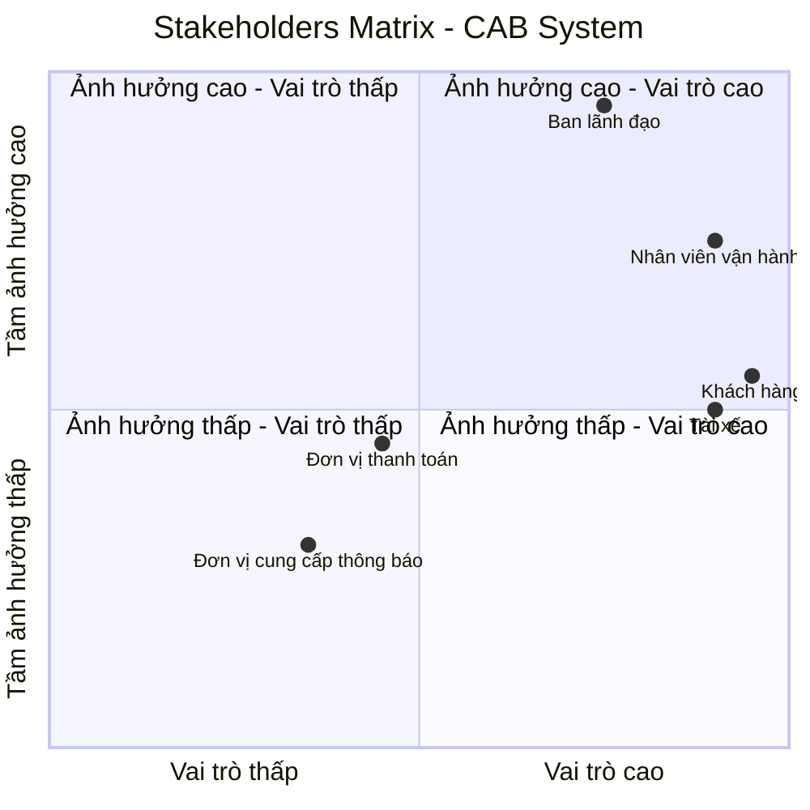

# 1. Đọc và phân tích yêu cầu của KH ở giai đoạn sơ khởi của Khách Hàng ở giai đoạn 1: Hiểu được Business Context, Business Problem,... 

## 1.1. Business Context – Bối cảnh kinh doanh

Công ty ABC là doanh nghiệp cung cấp dịch vụ đặt xe trực tuyến. Hiện tại, khách hàng có thể đặt xe thông qua tổng đài hoặc một ứng dụng đơn giản. Tuy nhiên, quy trình vận hành còn phụ thuộc nhiều vào thao tác thủ công, đặc biệt là việc phân công tài xế.

Khi quy mô khách hàng và tài xế tăng, hệ thống hiện tại gặp khó khăn trong việc quản lý chuyến đi, theo dõi trạng thái, xử lý thanh toán và hỗ trợ hoạt động vận hành. Do đó, ban lãnh đạo mong muốn xây dựng một **CAB System – nền tảng đặt xe mới** có khả năng phục vụ số lượng lớn người dùng, tự động hóa các quy trình chính và có khả năng mở rộng trong tương lai.

Dự án dự kiến được xây dựng và triển khai trong **7 tuần**.

## 1.2. Business Problem – Vấn đề kinh doanh

Qua phân tích yêu cầu của khách hàng, các vấn đề kinh doanh chính được xác định như sau:

* Việc tìm kiếm và phân công tài xế hiện chủ yếu được thực hiện thủ công, gây tốn thời gian và khó mở rộng khi số lượng chuyến tăng.
* Khách hàng khó theo dõi trạng thái chuyến đi và thông tin về tài xế.
* Thông tin thanh toán chưa được quản lý tập trung, gây khó khăn trong việc kiểm soát và xử lý giao dịch.
* Khi tài xế từ chối hoặc không phản hồi yêu cầu, quy trình tìm tài xế thay thế chưa được tự động hóa.
* Bộ phận vận hành gặp khó khăn trong việc theo dõi chuyến đi, quản lý tài xế và xử lý các trường hợp phát sinh.
* Hệ thống hiện tại khó mở rộng khi số lượng khách hàng, tài xế và giao dịch tăng.
* Doanh nghiệp chưa có đầy đủ dữ liệu tập trung để theo dõi doanh thu, số lượng chuyến, tỷ lệ hoàn thành, tỷ lệ hủy và hiệu quả hoạt động của tài xế.

## 1.3. Business Need – Nhu cầu kinh doanh

Công ty ABC cần xây dựng một nền tảng CAB System mới nhằm **tự động hóa và quản lý tập trung toàn bộ quy trình đặt xe**, từ khi khách hàng tạo yêu cầu, tìm và phân công tài xế, thực hiện chuyến, tính cước, thanh toán, gửi thông báo đến đánh giá sau chuyến.

Hệ thống đồng thời phải hỗ trợ bộ phận vận hành trong việc quản lý và giám sát hoạt động, đảm bảo an toàn dữ liệu và có khả năng mở rộng để đáp ứng các nhu cầu kinh doanh trong tương lai.

## 1.4. Business Goals – Mục tiêu kinh doanh

Hệ thống CAB mới hướng đến các mục tiêu:

1. Tự động hóa quy trình tìm kiếm và phân công tài xế.
2. Cải thiện trải nghiệm khách hàng thông qua khả năng theo dõi trạng thái chuyến đi.
3. Quản lý tập trung và an toàn thông tin thanh toán.
4. Nâng cao hiệu quả vận hành và khả năng xử lý sự cố.
5. Cung cấp dữ liệu và báo cáo phục vụ việc quản lý, đánh giá hoạt động kinh doanh.
6. Đảm bảo hệ thống có khả năng mở rộng khi số lượng người dùng và giao dịch tăng.
7. Tạo nền tảng linh hoạt để có thể bổ sung dịch vụ, phương thức thanh toán và các kênh thông báo mới trong tương lai.

## 1.5. Business Constraints – Ràng buộc kinh doanh

* Thời gian xây dựng và triển khai hệ thống là **7 tuần**.
* Hệ thống phải phục vụ được số lượng lớn khách hàng và tài xế.
* Thông tin nhạy cảm của thẻ hoặc tài khoản thanh toán không được lưu trực tiếp trên hệ thống CAB.
* Các chức năng quản trị phải được kiểm soát bằng cơ chế phân quyền.
* Lỗi tại một thành phần như thanh toán hoặc thông báo không được làm toàn bộ hệ thống đặt xe ngừng hoạt động.
* Hệ thống cần có khả năng mở rộng và triển khai thêm chức năng mà hạn chế ảnh hưởng đến các chức năng đang hoạt động.

# 2. Xác định stakeholders (Các bên liên quan của hệ thống) - Lập 1 bảng 2 cột: Tên - Vai trò - Vẽ 1 Ma trận tên: Stakeholders Matrix cho biết tầm ảnh hưởng và vai trò của Stakeholders trong hệ thống

## 2.1. Key Stakeholders – Các bên liên quan chính

| Stakeholder | Vai trò |
|---|---|
| **Ban lãnh đạo** | Định hướng mục tiêu kinh doanh, phê duyệt các yêu cầu quan trọng, theo dõi doanh thu, hiệu quả hoạt động và khả năng mở rộng của hệ thống. |
| **Khách hàng** | Sử dụng hệ thống để đăng ký, đặt xe, theo dõi chuyến đi, thanh toán, xem lịch sử chuyến và đánh giá tài xế. |
| **Tài xế** | Sử dụng hệ thống để quản lý hồ sơ và phương tiện, cập nhật trạng thái hoạt động, nhận hoặc từ chối chuyến, cập nhật trạng thái chuyến và hoàn thành chuyến. |
| **Nhân viên vận hành** | Quản lý và giám sát khách hàng, tài xế, phương tiện và chuyến đi; theo dõi các chuyến đang diễn ra và xử lý các trường hợp phát sinh. |
| **Đơn vị thanh toán** | Cung cấp dịch vụ xử lý và xác nhận các giao dịch thanh toán điện tử giữa khách hàng và hệ thống CAB. |
| **Đơn vị cung cấp thông báo** | Cung cấp các dịch vụ gửi thông báo đến khách hàng và tài xế về trạng thái đặt xe, chuyến đi và thanh toán. |

## 2.2. Stakeholders Matrix

Ma trận Stakeholders được sử dụng để thể hiện **tầm ảnh hưởng** và **vai trò** của các bên liên quan đối với hệ thống CAB.

