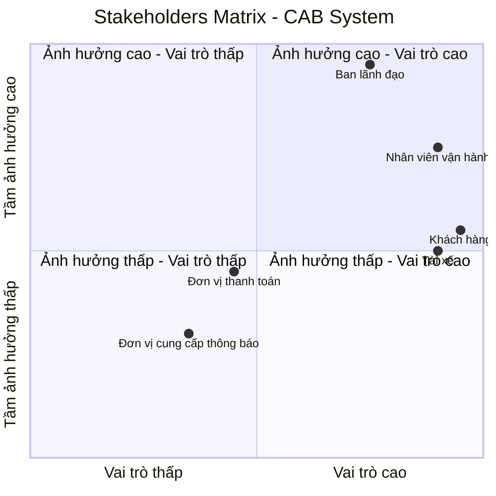
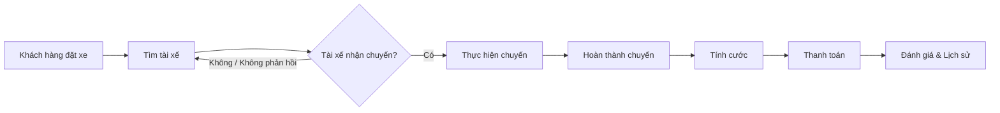

# 1. Đọc và phân tích yêu cầu của KH ở giai đoạn sơ khởi của Khách Hàng ở giai đoạn 1: Hiểu được Business Context, Business Problem,... 

## 1.1. Business Context – Bối cảnh kinh doanh

Công ty ABC là doanh nghiệp cung cấp dịch vụ đặt xe trực tuyến. Hiện tại, khách hàng có thể đặt xe thông qua tổng đài hoặc một ứng dụng đơn giản. Tuy nhiên, quy trình vận hành còn phụ thuộc nhiều vào thao tác thủ công, đặc biệt là việc phân công tài xế.

Khi quy mô khách hàng và tài xế tăng, hệ thống hiện tại gặp khó khăn trong việc quản lý chuyến đi, theo dõi trạng thái, xử lý thanh toán và hỗ trợ hoạt động vận hành. Do đó, ban lãnh đạo mong muốn xây dựng một **CAB System – nền tảng đặt xe mới** có khả năng phục vụ số lượng lớn người dùng, tự động hóa các quy trình chính và có khả năng mở rộng trong tương lai.

Dự án dự kiến được xây dựng và triển khai trong **7 tuần**.

## 1.2. Business Problem – Vấn đề kinh doanh

Qua phân tích yêu cầu của khách hàng, các vấn đề kinh doanh chính được xác định như sau:

* Việc tìm kiếm và phân công tài xế hiện chủ yếu được thực hiện thủ công, gây tốn thời gian và khó mở rộng khi số lượng chuyến tăng.
* Khách hàng khó theo dõi trạng thái chuyến đi và thông tin về tài xế.
* Thông tin thanh toán chưa được quản lý tập trung, gây khó khăn trong việc kiểm soát và xử lý giao dịch.
* Khi tài xế từ chối hoặc không phản hồi yêu cầu, quy trình tìm tài xế thay thế chưa được tự động hóa.
* Bộ phận vận hành gặp khó khăn trong việc theo dõi chuyến đi, quản lý tài xế và xử lý các trường hợp phát sinh.
* Hệ thống hiện tại khó mở rộng khi số lượng khách hàng, tài xế và giao dịch tăng.
* Doanh nghiệp chưa có đầy đủ dữ liệu tập trung để theo dõi doanh thu, số lượng chuyến, tỷ lệ hoàn thành, tỷ lệ hủy và hiệu quả hoạt động của tài xế.

## 1.3. Business Need – Nhu cầu kinh doanh

Công ty ABC cần xây dựng một nền tảng CAB System mới nhằm **tự động hóa và quản lý tập trung toàn bộ quy trình đặt xe**, từ khi khách hàng tạo yêu cầu, tìm và phân công tài xế, thực hiện chuyến, tính cước, thanh toán, gửi thông báo đến đánh giá sau chuyến.

Hệ thống đồng thời phải hỗ trợ bộ phận vận hành trong việc quản lý và giám sát hoạt động, đảm bảo an toàn dữ liệu và có khả năng mở rộng để đáp ứng các nhu cầu kinh doanh trong tương lai.

## 1.4. Business Constraints – Ràng buộc kinh doanh

* Thời gian xây dựng và triển khai hệ thống là **7 tuần**.
* Hệ thống phải phục vụ được số lượng lớn khách hàng và tài xế.
* Thông tin nhạy cảm của thẻ hoặc tài khoản thanh toán không được lưu trực tiếp trên hệ thống CAB.
* Các chức năng quản trị phải được kiểm soát bằng cơ chế phân quyền.
* Lỗi tại một thành phần như thanh toán hoặc thông báo không được làm toàn bộ hệ thống đặt xe ngừng hoạt động.
* Hệ thống cần có khả năng mở rộng và triển khai thêm chức năng mà hạn chế ảnh hưởng đến các chức năng đang hoạt động.

# 2. Xác định stakeholders (Các bên liên quan của hệ thống):
## - Lập 1 bảng 2 cột: Tên - Vai trò 
## - Vẽ 1 Ma trận tên: Stakeholders Matrix cho biết tầm ảnh hưởng và vai trò của Stakeholders trong hệ thống

## 2.1. Key Stakeholders – Các bên liên quan chính

| Stakeholder | Vai trò |
|---|---|
| **Ban lãnh đạo** | Định hướng mục tiêu kinh doanh, phê duyệt các yêu cầu quan trọng, theo dõi doanh thu, hiệu quả hoạt động và khả năng mở rộng của hệ thống. |
| **Khách hàng** | Sử dụng hệ thống để đăng ký, đặt xe, theo dõi chuyến đi, thanh toán, xem lịch sử chuyến và đánh giá tài xế. |
| **Tài xế** | Sử dụng hệ thống để quản lý hồ sơ và phương tiện, cập nhật trạng thái hoạt động, nhận hoặc từ chối chuyến, cập nhật trạng thái chuyến và hoàn thành chuyến. |
| **Nhân viên vận hành** | Quản lý và giám sát khách hàng, tài xế, phương tiện và chuyến đi; theo dõi các chuyến đang diễn ra và xử lý các trường hợp phát sinh. |
| **Đơn vị thanh toán** | Cung cấp dịch vụ xử lý và xác nhận các giao dịch thanh toán điện tử giữa khách hàng và hệ thống CAB. |
| **Đơn vị cung cấp thông báo** | Cung cấp các dịch vụ gửi thông báo đến khách hàng và tài xế về trạng thái đặt xe, chuyến đi và thanh toán. |

## 2.2. Stakeholders Matrix

Ma trận Stakeholders được sử dụng để thể hiện **tầm ảnh hưởng** và **vai trò** của các bên liên quan đối với hệ thống CAB.

# 3. Xác định Business Goals - Thiết kế các mục tiêu mình thấy 
## - VD: BG01: Tự động tìm tài xế - Mục đích: Hệ thống này phải có khả năng tự động tìm tài xế 
## - VD: BG02: Hỗ trợ thanh toán - Mục đích: Hỗ trợ tiền mặt và trực tuyến

Dựa trên yêu cầu và kỳ vọng của khách hàng, các mục tiêu kinh doanh của hệ thống CAB System được xác định như sau:

| ID       | Business Goal                                              | Mục đích                                                                                                                                                                                                                |
| -------- | ---------------------------------------------------------- | ----------------------------------------------------------------------------------------------------------------------------------------------------------------------------------------------------------------------- |
| **BG01** | **Tự động tìm và phân công tài xế**                        | Hệ thống phải có khả năng tự động xác định và tìm tài xế phù hợp dựa trên vị trí, trạng thái sẵn sàng và các tiêu chí vận hành; đồng thời tiếp tục tìm tài xế khác nếu tài xế được đề xuất không phản hồi hoặc từ chối. |
| **BG02** | **Hỗ trợ đặt và quản lý chuyến xe**                        | Hệ thống phải hỗ trợ khách hàng tạo yêu cầu đặt xe, lựa chọn loại xe, theo dõi trạng thái và quản lý toàn bộ quá trình thực hiện chuyến đi.                                                                             |
| **BG03** | **Hỗ trợ theo dõi chuyến đi**                              | Hệ thống phải cung cấp thông tin về tài xế, thời gian dự kiến đến và trạng thái hiện tại của chuyến để khách hàng có thể theo dõi chuyến đi.                                                                            |
| **BG04** | **Hỗ trợ thanh toán**                                      | Hệ thống phải hỗ trợ thanh toán bằng tiền mặt và phương thức thanh toán điện tử thông qua nhà cung cấp thanh toán bên ngoài.                                                                                            |
| **BG05** | **Quản lý và gửi thông báo**                               | Hệ thống phải gửi thông báo cho khách hàng và tài xế về các sự kiện quan trọng như tiếp nhận yêu cầu, nhận chuyến, tài xế đến điểm đón, hoàn thành chuyến và kết quả thanh toán.                                        |
| **BG06** | **Hỗ trợ quản lý và giám sát vận hành**                    | Hệ thống phải cung cấp giao diện quản trị để nhân viên vận hành quản lý khách hàng, tài xế, phương tiện, chuyến đi và hỗ trợ xử lý các trường hợp phát sinh.                                                            |
| **BG07** | **Cung cấp dữ liệu và báo cáo hoạt động**                  | Hệ thống phải cung cấp dữ liệu và báo cáo về số lượng chuyến, doanh thu, tỷ lệ hoàn thành, tỷ lệ hủy và hiệu quả hoạt động của tài xế để hỗ trợ quản lý.                                                                |
| **BG08** | **Đảm bảo khả năng mở rộng và phát triển trong tương lai** | Hệ thống phải có kiến trúc linh hoạt, cho phép mở rộng quy mô và bổ sung loại dịch vụ, phương thức thanh toán, nhà cung cấp thông báo hoặc các chức năng mới mà hạn chế ảnh hưởng đến hệ thống hiện tại.                |

# 4. Xác định phạm vi yêu cầu của mình phải làm(Scope) 
## - VD: Quản lý khách hàng, Quản lý tài xế,...
## - Trong bảng MVP phải làm cái gì - Xác định được các module cơ bản dưới góc độ 1 bảng MVP 
## - Mở rộng: Những cái mà ngoài phạm vi tôi không phải làm/Không nên làm trong đây

## 4.1. In Scope – Phạm vi hệ thống

Dựa trên yêu cầu của khách hàng, phạm vi của CAB System bao gồm các module nghiệp vụ chính sau:

| ID      | Module                           | Phạm vi chính                                                                                                                                           |
| ------- | -------------------------------- | ------------------------------------------------------------------------------------------------------------------------------------------------------- |
| **M01** | **Quản lý tài khoản & xác thực** | Đăng ký, đăng nhập, xác thực khách hàng và tài xế, cập nhật thông tin cá nhân và kiểm soát quyền truy cập.                                              |
| **M02** | **Quản lý tài xế & phương tiện** | Quản lý hồ sơ tài xế, thông tin phương tiện, trạng thái hoạt động và thông tin vị trí của tài xế.                                                       |
| **M03** | **Đặt xe**                       | Nhập điểm đón, điểm đến, lựa chọn loại xe và tạo yêu cầu đặt xe.                                                                                        |
| **M04** | **Tìm kiếm & phân công tài xế**  | Xác định tài xế phù hợp, ưu tiên tài xế gần khách hàng, gửi yêu cầu nhận chuyến và xử lý trường hợp tài xế từ chối hoặc không phản hồi.                 |
| **M05** | **Quản lý chuyến đi**            | Theo dõi và cập nhật các trạng thái của chuyến: tìm tài xế, tài xế nhận chuyến, tài xế đến điểm đón, đã đón khách, đang di chuyển và hoàn thành chuyến. |
| **M06** | **Tính cước & thanh toán**       | Tính số tiền phải trả, hỗ trợ thanh toán tiền mặt và thanh toán điện tử thông qua Payment Provider, xử lý kết quả giao dịch và thanh toán thất bại.     |
| **M07** | **Thông báo**                    | Gửi thông báo cho khách hàng và tài xế về các sự kiện liên quan đến đặt xe, tài xế, chuyến đi và thanh toán.                                            |
| **M08** | **Lịch sử & đánh giá**           | Xem lịch sử chuyến đi, số tiền phải trả và đánh giá tài xế sau khi hoàn thành chuyến.                                                                   |
| **M09** | **Quản trị & vận hành**          | Quản lý khách hàng, tài xế, phương tiện và chuyến đi; theo dõi chuyến đang diễn ra, trạng thái tài xế và hỗ trợ xử lý sự cố.                            |
| **M10** | **Báo cáo**                      | Cung cấp báo cáo về số lượng chuyến, doanh thu, tỷ lệ hoàn thành, tỷ lệ hủy và hiệu quả hoạt động của tài xế.                                           |
| **M11** | **Bảo mật & Audit Log**          | Xác thực, phân quyền các thao tác quản trị, bảo vệ dữ liệu cá nhân, phương tiện, vị trí và giao dịch; lưu vết các thao tác quan trọng.                  |
| **M12** | **Tích hợp hệ thống bên ngoài**  | Tích hợp với nhà cung cấp thanh toán và nhà cung cấp dịch vụ thông báo.                                                                                 |

---

## 4.2. MVP – Minimum Viable Product

Do thời gian xây dựng và triển khai sản phẩm chỉ **7 tuần**, MVP tập trung vào quy trình nghiệp vụ cốt lõi từ **đặt xe → tìm tài xế → thực hiện chuyến → tính cước → thanh toán**.

| Priority        | Module                              | MVP cần thực hiện                                                                          |
| --------------- | ----------------------------------- | ------------------------------------------------------------------------------------------ |
| **Must Have**   | **M01 – Tài khoản & xác thực**      | Đăng ký, đăng nhập và xác thực khách hàng/tài xế.                                          |
| **Must Have**   | **M02 – Tài xế & phương tiện**      | Quản lý hồ sơ, phương tiện và trạng thái sẵn sàng của tài xế.                              |
| **Must Have**   | **M03 – Đặt xe**                    | Nhập điểm đón, điểm đến, chọn loại xe và gửi yêu cầu đặt xe.                               |
| **Must Have**   | **M04 – Tìm & phân công tài xế**    | Tìm tài xế phù hợp, gửi yêu cầu, xử lý từ chối/không phản hồi và tiếp tục tìm tài xế khác. |
| **Must Have**   | **M05 – Quản lý chuyến**            | Cập nhật và theo dõi trạng thái chuyến từ lúc đặt xe đến khi hoàn thành.                   |
| **Must Have**   | **M06 – Tính cước & thanh toán**    | Tính cước, thanh toán tiền mặt và tích hợp thanh toán điện tử.                             |
| **Must Have**   | **M07 – Thông báo**                 | Các thông báo thiết yếu cho khách hàng và tài xế.                                          |
| **Must Have**   | **M09 – Quản trị & vận hành**       | Theo dõi chuyến, trạng thái tài xế và xử lý các trường hợp phát sinh cơ bản.               |
| **Must Have**   | **M11 – Bảo mật & Audit Log**       | Xác thực, phân quyền và bảo vệ dữ liệu quan trọng.                                         |
| **Should Have** | **M08 – Lịch sử & đánh giá**        | Xem lịch sử chuyến và đánh giá tài xế sau chuyến.                                          |
| **Should Have** | **M10 – Báo cáo**                   | Các báo cáo cơ bản về chuyến, doanh thu, hoàn thành và hủy chuyến.                         |
| **Should Have** | **M12 – Khả năng mở rộng tích hợp** | Thiết kế khả năng thay đổi/thêm Payment Provider và Notification Provider trong tương lai. |

### MVP Core Flow

---

## 4.3. Out of Scope – Ngoài phạm vi

Các chức năng sau **không được đề cập trong yêu cầu hiện tại** và không đưa vào phạm vi xây dựng MVP:

| ID      | Hạng mục                                                     | Lý do                                                                                        |
| ------- | ------------------------------------------------------------ | -------------------------------------------------------------------------------------------- |
| **O01** | Chương trình tích điểm / Loyalty                             | Không được đề cập trong yêu cầu khách hàng.                                                  |
| **O02** | Mã giảm giá / Voucher / Coupon                               | Không được đề cập trong yêu cầu hiện tại.                                                    |
| **O03** | Gói thành viên / Subscription                                | Không thuộc quy trình đặt xe được mô tả.                                                     |
| **O04** | Đặt xe định kỳ                                               | Không được đề cập trong yêu cầu.                                                             |
| **O05** | Dịch vụ giao hàng                                            | Chưa có yêu cầu về loại dịch vụ này.                                                         |
| **O06** | Quảng cáo hoặc bán dịch vụ bên thứ ba                        | Không thuộc mục tiêu của dự án.                                                              |
| **O07** | Hệ thống thưởng/phạt tài xế nâng cao                         | Transcript chỉ yêu cầu quản lý và đánh giá hiệu quả tài xế, chưa yêu cầu cơ chế thưởng/phạt. |
| **O08** | Phân tích dữ liệu nâng cao / AI dự đoán                      | Không được yêu cầu trong phạm vi hiện tại.                                                   |
| **O09** | Ứng dụng riêng cho bộ phận quản trị ngoài giao diện quản trị | Chưa có yêu cầu xây dựng ứng dụng riêng; hệ thống chỉ yêu cầu giao diện quản trị.            |

> **Lưu ý:** Out of Scope ở đây được xác định dựa trên yêu cầu hiện tại. Các chức năng chưa được đề cập không nên tự động đưa vào phạm vi phát triển. Nếu khách hàng phát sinh yêu cầu mới, BA cần thực hiện đánh giá và quản lý thay đổi phạm vi.

---

# 5. Chuyển nhu cầu thành Business Requirements - 1 bảng 3 cột: ID - Tên - Diễn giải
## - VD: BR01 - Đặt chuyến - Hệ thống phải cung cấp điểm đến, cung cấp điểm đón

| ID       | Tên                                    | Diễn giải                                                                                                                                                                                            |
| -------- | -------------------------------------- | ---------------------------------------------------------------------------------------------------------------------------------------------------------------------------------------------------- |
| **BR01** | **Quản lý tài khoản**                  | Hệ thống phải cho phép khách hàng và tài xế đăng ký, đăng nhập, xác thực và cập nhật thông tin cá nhân theo quyền của từng đối tượng.                                                                |
| **BR02** | **Quản lý tài xế và phương tiện**      | Hệ thống phải cho phép quản lý hồ sơ tài xế, thông tin phương tiện và trạng thái hoạt động của tài xế.                                                                                               |
| **BR03** | **Đặt chuyến**                         | Hệ thống phải cho phép khách hàng nhập điểm đón, điểm đến, lựa chọn loại xe và gửi yêu cầu đặt chuyến.                                                                                               |
| **BR04** | **Tìm kiếm tài xế**                    | Hệ thống phải có khả năng xác định các tài xế phù hợp dựa trên vị trí, trạng thái sẵn sàng và các tiêu chí vận hành được doanh nghiệp xác định.                                                      |
| **BR05** | **Phân công tài xế**                   | Hệ thống phải hỗ trợ gửi yêu cầu chuyến đến tài xế phù hợp và tiếp tục tìm tài xế khác khi tài xế được đề xuất từ chối hoặc không phản hồi.                                                          |
| **BR06** | **Theo dõi chuyến đi**                 | Hệ thống phải cho phép khách hàng theo dõi tài xế, thời gian dự kiến đến và trạng thái hiện tại của chuyến đi.                                                                                       |
| **BR07** | **Cập nhật trạng thái chuyến**         | Hệ thống phải cho phép tài xế cập nhật trạng thái chuyến từ khi đến điểm đón, đón khách, đang di chuyển đến khi hoàn thành chuyến.                                                                   |
| **BR08** | **Quản lý vị trí tài xế**              | Hệ thống phải lưu và sử dụng thông tin vị trí của tài xế để hỗ trợ tìm tài xế phù hợp và cải thiện khả năng dự kiến thời gian đến.                                                                   |
| **BR09** | **Tính cước**                          | Hệ thống phải xác định số tiền khách hàng phải trả dựa trên loại dịch vụ và thông tin của chuyến đi.                                                                                                 |
| **BR10** | **Thanh toán**                         | Hệ thống phải hỗ trợ thanh toán bằng tiền mặt và phương thức thanh toán điện tử thông qua nhà cung cấp thanh toán bên ngoài.                                                                         |
| **BR11** | **Xử lý thanh toán thất bại**          | Hệ thống phải thông báo cho khách hàng khi thanh toán điện tử thất bại và hỗ trợ xử lý lại theo chính sách của doanh nghiệp.                                                                         |
| **BR12** | **Thông báo**                          | Hệ thống phải gửi thông báo cho khách hàng và tài xế về các sự kiện quan trọng trong quá trình đặt và thực hiện chuyến, bao gồm kết quả thanh toán.                                                  |
| **BR13** | **Lịch sử chuyến đi**                  | Hệ thống phải cho phép khách hàng xem lịch sử các chuyến đi và số tiền phải trả.                                                                                                                     |
| **BR14** | **Đánh giá tài xế**                    | Hệ thống phải cho phép khách hàng đánh giá tài xế sau khi chuyến đi hoàn thành.                                                                                                                      |
| **BR15** | **Quản lý vận hành**                   | Hệ thống phải cung cấp giao diện quản trị để nhân viên vận hành quản lý khách hàng, tài xế, phương tiện và chuyến đi.                                                                                |
| **BR16** | **Giám sát và xử lý sự cố**            | Hệ thống phải cho phép nhân viên vận hành theo dõi các chuyến đang diễn ra, kiểm tra trạng thái tài xế và hỗ trợ xử lý các trường hợp chuyến bị lỗi.                                                 |
| **BR17** | **Phân quyền quản trị**                | Hệ thống phải kiểm soát quyền truy cập đối với các chức năng quản trị, đảm bảo nhân viên thông thường không thể thực hiện các thao tác nhạy cảm.                                                     |
| **BR18** | **Báo cáo hoạt động**                  | Hệ thống phải cung cấp báo cáo về số lượng chuyến, doanh thu, tỷ lệ chuyến hoàn thành, tỷ lệ hủy và hiệu quả hoạt động của tài xế.                                                                   |
| **BR19** | **Bảo vệ dữ liệu**                     | Hệ thống phải bảo vệ thông tin cá nhân, thông tin phương tiện, dữ liệu vị trí và dữ liệu giao dịch; thông tin nhạy cảm của thẻ hoặc tài khoản thanh toán không được lưu trực tiếp trên hệ thống CAB. |
| **BR20** | **Audit Log**                          | Hệ thống phải lưu vết các thao tác quan trọng để phục vụ kiểm tra và xử lý sự cố.                                                                                                                    |
| **BR21** | **Khả năng mở rộng**                   | Hệ thống phải có khả năng mở rộng khi số lượng khách hàng, tài xế và tải hệ thống tăng.                                                                                                              |
| **BR22** | **Khả năng mở rộng dịch vụ**           | Hệ thống phải cho phép bổ sung loại dịch vụ, phương thức thanh toán và nhà cung cấp thông báo mới mà hạn chế ảnh hưởng đến các chức năng đang hoạt động.                                             |
| **BR23** | **Đảm bảo tính liên tục của hệ thống** | Hệ thống phải hạn chế ảnh hưởng của lỗi tại các thành phần như thanh toán hoặc thông báo đến chức năng đặt xe và các chức năng cốt lõi khác.                                                         |
