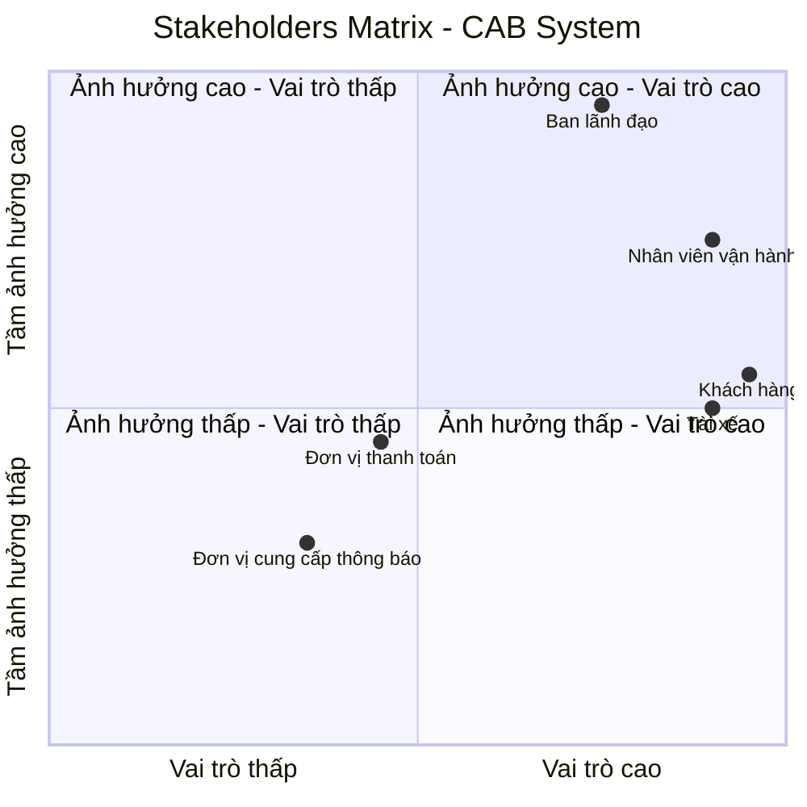
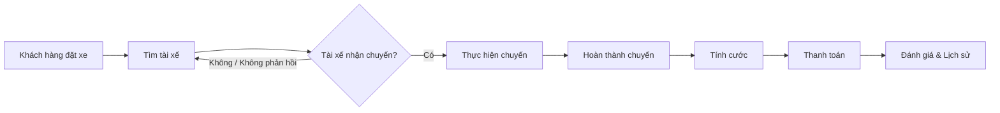
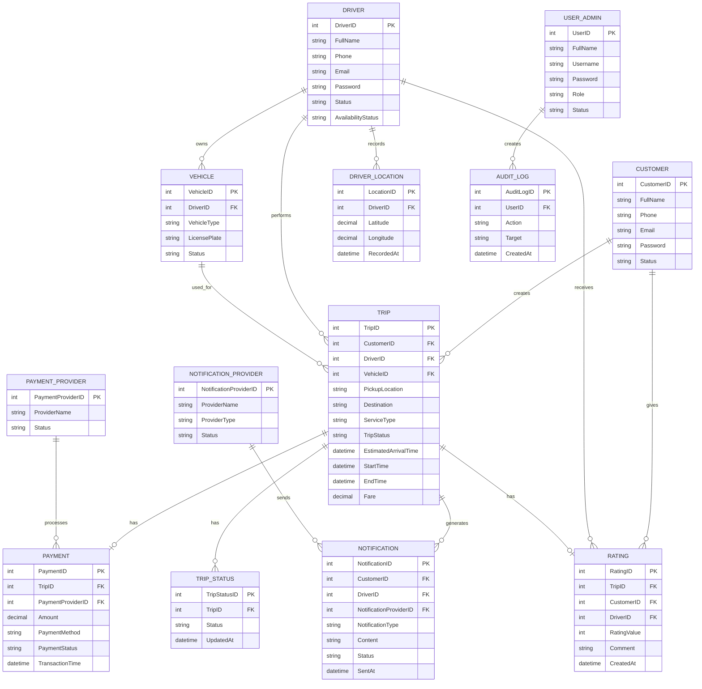
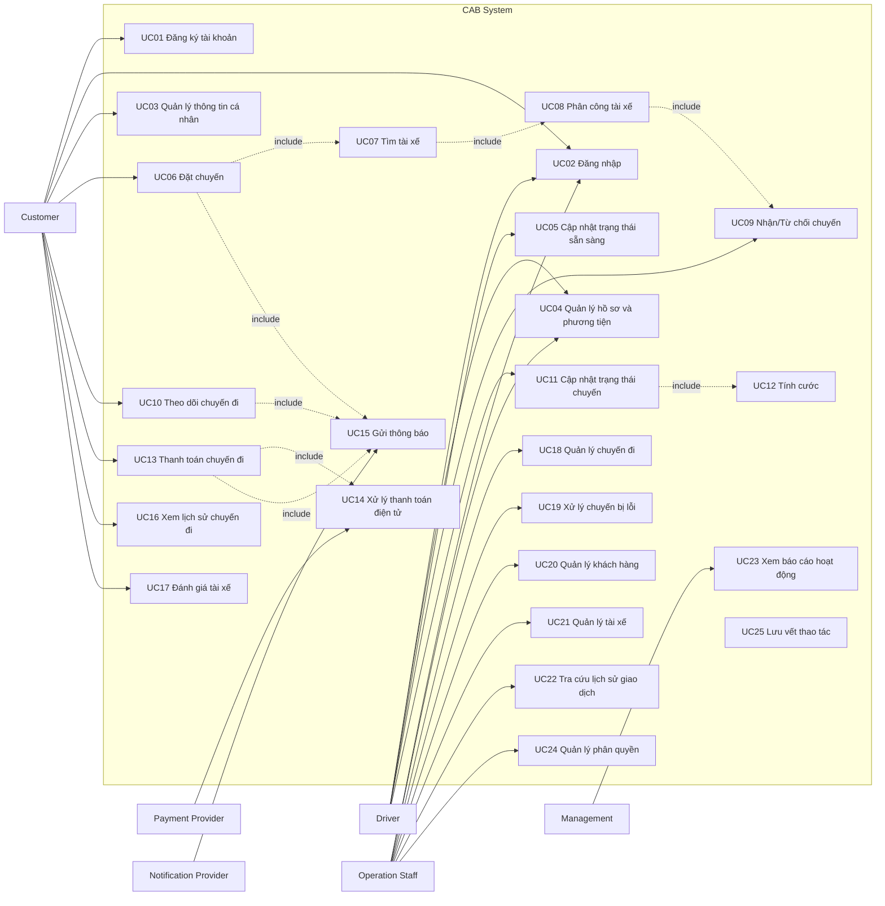
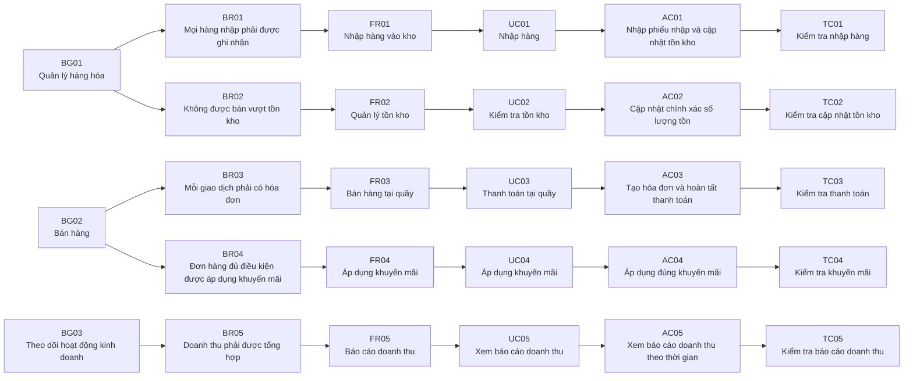

# 1. Đọc và phân tích yêu cầu của KH ở giai đoạn sơ khởi của Khách Hàng ở giai đoạn 1: Hiểu được Business Context, Business Problem,... 

## 1.1. Business Context – Bối cảnh kinh doanh

Công ty ABC là doanh nghiệp cung cấp dịch vụ đặt xe trực tuyến. Hiện tại, khách hàng có thể đặt xe thông qua tổng đài hoặc một ứng dụng đơn giản. Tuy nhiên, quy trình vận hành còn phụ thuộc nhiều vào thao tác thủ công, đặc biệt là việc phân công tài xế.

Khi quy mô khách hàng và tài xế tăng, hệ thống hiện tại gặp khó khăn trong việc quản lý chuyến đi, theo dõi trạng thái, xử lý thanh toán và hỗ trợ hoạt động vận hành. Do đó, ban lãnh đạo mong muốn xây dựng một **CAB System – nền tảng đặt xe mới** có khả năng phục vụ số lượng lớn người dùng, tự động hóa các quy trình chính và có khả năng mở rộng trong tương lai.

Dự án dự kiến được xây dựng và triển khai trong **7 tuần**.

## 1.2. Business Problem – Vấn đề kinh doanh

Qua phân tích yêu cầu của khách hàng, các vấn đề kinh doanh chính được xác định như sau:

* Việc tìm kiếm và phân công tài xế hiện chủ yếu được thực hiện thủ công, gây tốn thời gian và khó mở rộng khi số lượng chuyến tăng.
* Khách hàng khó theo dõi trạng thái chuyến đi và thông tin về tài xế.
* Thông tin thanh toán chưa được quản lý tập trung, gây khó khăn trong việc kiểm soát và xử lý giao dịch.
* Khi tài xế từ chối hoặc không phản hồi yêu cầu, quy trình tìm tài xế thay thế chưa được tự động hóa.
* Bộ phận vận hành gặp khó khăn trong việc theo dõi chuyến đi, quản lý tài xế và xử lý các trường hợp phát sinh.
* Hệ thống hiện tại khó mở rộng khi số lượng khách hàng, tài xế và giao dịch tăng.
* Doanh nghiệp chưa có đầy đủ dữ liệu tập trung để theo dõi doanh thu, số lượng chuyến, tỷ lệ hoàn thành, tỷ lệ hủy và hiệu quả hoạt động của tài xế.

## 1.3. Business Need – Nhu cầu kinh doanh

Công ty ABC cần xây dựng một nền tảng CAB System mới nhằm **tự động hóa và quản lý tập trung toàn bộ quy trình đặt xe**, từ khi khách hàng tạo yêu cầu, tìm và phân công tài xế, thực hiện chuyến, tính cước, thanh toán, gửi thông báo đến đánh giá sau chuyến.

Hệ thống đồng thời phải hỗ trợ bộ phận vận hành trong việc quản lý và giám sát hoạt động, đảm bảo an toàn dữ liệu và có khả năng mở rộng để đáp ứng các nhu cầu kinh doanh trong tương lai.

## 1.4. Business Constraints – Ràng buộc kinh doanh

* Thời gian xây dựng và triển khai hệ thống là **7 tuần**.
* Hệ thống phải phục vụ được số lượng lớn khách hàng và tài xế.
* Thông tin nhạy cảm của thẻ hoặc tài khoản thanh toán không được lưu trực tiếp trên hệ thống CAB.
* Các chức năng quản trị phải được kiểm soát bằng cơ chế phân quyền.
* Lỗi tại một thành phần như thanh toán hoặc thông báo không được làm toàn bộ hệ thống đặt xe ngừng hoạt động.
* Hệ thống cần có khả năng mở rộng và triển khai thêm chức năng mà hạn chế ảnh hưởng đến các chức năng đang hoạt động.

# 2. Xác định stakeholders (Các bên liên quan của hệ thống):
## - Lập 1 bảng 2 cột: Tên - Vai trò 
## - Vẽ 1 Ma trận tên: Stakeholders Matrix cho biết tầm ảnh hưởng và vai trò của Stakeholders trong hệ thống

## 2.1. Key Stakeholders – Các bên liên quan chính

| Stakeholder | Vai trò |
|---|---|
| **Ban lãnh đạo** | Định hướng mục tiêu kinh doanh, phê duyệt các yêu cầu quan trọng, theo dõi doanh thu, hiệu quả hoạt động và khả năng mở rộng của hệ thống. |
| **Khách hàng** | Sử dụng hệ thống để đăng ký, đặt xe, theo dõi chuyến đi, thanh toán, xem lịch sử chuyến và đánh giá tài xế. |
| **Tài xế** | Sử dụng hệ thống để quản lý hồ sơ và phương tiện, cập nhật trạng thái hoạt động, nhận hoặc từ chối chuyến, cập nhật trạng thái chuyến và hoàn thành chuyến. |
| **Nhân viên vận hành** | Quản lý và giám sát khách hàng, tài xế, phương tiện và chuyến đi; theo dõi các chuyến đang diễn ra và xử lý các trường hợp phát sinh. |
| **Đơn vị thanh toán** | Cung cấp dịch vụ xử lý và xác nhận các giao dịch thanh toán điện tử giữa khách hàng và hệ thống CAB. |
| **Đơn vị cung cấp thông báo** | Cung cấp các dịch vụ gửi thông báo đến khách hàng và tài xế về trạng thái đặt xe, chuyến đi và thanh toán. |

## 2.2. Stakeholders Matrix

Ma trận Stakeholders được sử dụng để thể hiện **tầm ảnh hưởng** và **vai trò** của các bên liên quan đối với hệ thống CAB.

# 3. Xác định Business Goals - Thiết kế các mục tiêu mình thấy 
## - VD: BG01: Tự động tìm tài xế - Mục đích: Hệ thống này phải có khả năng tự động tìm tài xế 
## - VD: BG02: Hỗ trợ thanh toán - Mục đích: Hỗ trợ tiền mặt và trực tuyến

Dựa trên yêu cầu và kỳ vọng của khách hàng, các mục tiêu kinh doanh của hệ thống CAB System được xác định như sau:

| ID       | Business Goal                                              | Mục đích                                                                                                                                                                                                                |
| -------- | ---------------------------------------------------------- | ----------------------------------------------------------------------------------------------------------------------------------------------------------------------------------------------------------------------- |
| **BG01** | **Tự động tìm và phân công tài xế**                        | Hệ thống phải có khả năng tự động xác định và tìm tài xế phù hợp dựa trên vị trí, trạng thái sẵn sàng và các tiêu chí vận hành; đồng thời tiếp tục tìm tài xế khác nếu tài xế được đề xuất không phản hồi hoặc từ chối. |
| **BG02** | **Hỗ trợ đặt và quản lý chuyến xe**                        | Hệ thống phải hỗ trợ khách hàng tạo yêu cầu đặt xe, lựa chọn loại xe, theo dõi trạng thái và quản lý toàn bộ quá trình thực hiện chuyến đi.                                                                             |
| **BG03** | **Hỗ trợ theo dõi chuyến đi**                              | Hệ thống phải cung cấp thông tin về tài xế, thời gian dự kiến đến và trạng thái hiện tại của chuyến để khách hàng có thể theo dõi chuyến đi.                                                                            |
| **BG04** | **Hỗ trợ thanh toán**                                      | Hệ thống phải hỗ trợ thanh toán bằng tiền mặt và phương thức thanh toán điện tử thông qua nhà cung cấp thanh toán bên ngoài.                                                                                            |
| **BG05** | **Quản lý và gửi thông báo**                               | Hệ thống phải gửi thông báo cho khách hàng và tài xế về các sự kiện quan trọng như tiếp nhận yêu cầu, nhận chuyến, tài xế đến điểm đón, hoàn thành chuyến và kết quả thanh toán.                                        |
| **BG06** | **Hỗ trợ quản lý và giám sát vận hành**                    | Hệ thống phải cung cấp giao diện quản trị để nhân viên vận hành quản lý khách hàng, tài xế, phương tiện, chuyến đi và hỗ trợ xử lý các trường hợp phát sinh.                                                            |
| **BG07** | **Cung cấp dữ liệu và báo cáo hoạt động**                  | Hệ thống phải cung cấp dữ liệu và báo cáo về số lượng chuyến, doanh thu, tỷ lệ hoàn thành, tỷ lệ hủy và hiệu quả hoạt động của tài xế để hỗ trợ quản lý.                                                                |
| **BG08** | **Đảm bảo khả năng mở rộng và phát triển trong tương lai** | Hệ thống phải có kiến trúc linh hoạt, cho phép mở rộng quy mô và bổ sung loại dịch vụ, phương thức thanh toán, nhà cung cấp thông báo hoặc các chức năng mới mà hạn chế ảnh hưởng đến hệ thống hiện tại.                |

# 4. Xác định phạm vi yêu cầu của mình phải làm(Scope) 
## - VD: Quản lý khách hàng, Quản lý tài xế,...
## - Trong bảng MVP phải làm cái gì - Xác định được các module cơ bản dưới góc độ 1 bảng MVP 
## - Mở rộng: Những cái mà ngoài phạm vi tôi không phải làm/Không nên làm trong đây

## 4.1. In Scope – Phạm vi hệ thống

Dựa trên yêu cầu của khách hàng, phạm vi của CAB System bao gồm các module nghiệp vụ chính sau:

| ID      | Module                           | Phạm vi chính                                                                                                                                           |
| ------- | -------------------------------- | ------------------------------------------------------------------------------------------------------------------------------------------------------- |
| **M01** | **Quản lý tài khoản & xác thực** | Đăng ký, đăng nhập, xác thực khách hàng và tài xế, cập nhật thông tin cá nhân và kiểm soát quyền truy cập.                                              |
| **M02** | **Quản lý tài xế & phương tiện** | Quản lý hồ sơ tài xế, thông tin phương tiện, trạng thái hoạt động và thông tin vị trí của tài xế.                                                       |
| **M03** | **Đặt xe**                       | Nhập điểm đón, điểm đến, lựa chọn loại xe và tạo yêu cầu đặt xe.                                                                                        |
| **M04** | **Tìm kiếm & phân công tài xế**  | Xác định tài xế phù hợp, ưu tiên tài xế gần khách hàng, gửi yêu cầu nhận chuyến và xử lý trường hợp tài xế từ chối hoặc không phản hồi.                 |
| **M05** | **Quản lý chuyến đi**            | Theo dõi và cập nhật các trạng thái của chuyến: tìm tài xế, tài xế nhận chuyến, tài xế đến điểm đón, đã đón khách, đang di chuyển và hoàn thành chuyến. |
| **M06** | **Tính cước & thanh toán**       | Tính số tiền phải trả, hỗ trợ thanh toán tiền mặt và thanh toán điện tử thông qua Payment Provider, xử lý kết quả giao dịch và thanh toán thất bại.     |
| **M07** | **Thông báo**                    | Gửi thông báo cho khách hàng và tài xế về các sự kiện liên quan đến đặt xe, tài xế, chuyến đi và thanh toán.                                            |
| **M08** | **Lịch sử & đánh giá**           | Xem lịch sử chuyến đi, số tiền phải trả và đánh giá tài xế sau khi hoàn thành chuyến.                                                                   |
| **M09** | **Quản trị & vận hành**          | Quản lý khách hàng, tài xế, phương tiện và chuyến đi; theo dõi chuyến đang diễn ra, trạng thái tài xế và hỗ trợ xử lý sự cố.                            |
| **M10** | **Báo cáo**                      | Cung cấp báo cáo về số lượng chuyến, doanh thu, tỷ lệ hoàn thành, tỷ lệ hủy và hiệu quả hoạt động của tài xế.                                           |
| **M11** | **Bảo mật & Audit Log**          | Xác thực, phân quyền các thao tác quản trị, bảo vệ dữ liệu cá nhân, phương tiện, vị trí và giao dịch; lưu vết các thao tác quan trọng.                  |
| **M12** | **Tích hợp hệ thống bên ngoài**  | Tích hợp với nhà cung cấp thanh toán và nhà cung cấp dịch vụ thông báo.                                                                                 |

---

## 4.2. MVP – Minimum Viable Product

Do thời gian xây dựng và triển khai sản phẩm chỉ **7 tuần**, MVP tập trung vào quy trình nghiệp vụ cốt lõi từ **đặt xe → tìm tài xế → thực hiện chuyến → tính cước → thanh toán**.

| Priority        | Module                              | MVP cần thực hiện                                                                          |
| --------------- | ----------------------------------- | ------------------------------------------------------------------------------------------ |
| **Must Have**   | **M01 – Tài khoản & xác thực**      | Đăng ký, đăng nhập và xác thực khách hàng/tài xế.                                          |
| **Must Have**   | **M02 – Tài xế & phương tiện**      | Quản lý hồ sơ, phương tiện và trạng thái sẵn sàng của tài xế.                              |
| **Must Have**   | **M03 – Đặt xe**                    | Nhập điểm đón, điểm đến, chọn loại xe và gửi yêu cầu đặt xe.                               |
| **Must Have**   | **M04 – Tìm & phân công tài xế**    | Tìm tài xế phù hợp, gửi yêu cầu, xử lý từ chối/không phản hồi và tiếp tục tìm tài xế khác. |
| **Must Have**   | **M05 – Quản lý chuyến**            | Cập nhật và theo dõi trạng thái chuyến từ lúc đặt xe đến khi hoàn thành.                   |
| **Must Have**   | **M06 – Tính cước & thanh toán**    | Tính cước, thanh toán tiền mặt và tích hợp thanh toán điện tử.                             |
| **Must Have**   | **M07 – Thông báo**                 | Các thông báo thiết yếu cho khách hàng và tài xế.                                          |
| **Must Have**   | **M09 – Quản trị & vận hành**       | Theo dõi chuyến, trạng thái tài xế và xử lý các trường hợp phát sinh cơ bản.               |
| **Must Have**   | **M11 – Bảo mật & Audit Log**       | Xác thực, phân quyền và bảo vệ dữ liệu quan trọng.                                         |
| **Should Have** | **M08 – Lịch sử & đánh giá**        | Xem lịch sử chuyến và đánh giá tài xế sau chuyến.                                          |
| **Should Have** | **M10 – Báo cáo**                   | Các báo cáo cơ bản về chuyến, doanh thu, hoàn thành và hủy chuyến.                         |
| **Should Have** | **M12 – Khả năng mở rộng tích hợp** | Thiết kế khả năng thay đổi/thêm Payment Provider và Notification Provider trong tương lai. |

### MVP Core Flow

---

## 4.3. Out of Scope – Ngoài phạm vi

Các chức năng sau **không được đề cập trong yêu cầu hiện tại** và không đưa vào phạm vi xây dựng MVP:

| ID      | Hạng mục                                                     | Lý do                                                                                        |
| ------- | ------------------------------------------------------------ | -------------------------------------------------------------------------------------------- |
| **O01** | Chương trình tích điểm / Loyalty                             | Không được đề cập trong yêu cầu khách hàng.                                                  |
| **O02** | Mã giảm giá / Voucher / Coupon                               | Không được đề cập trong yêu cầu hiện tại.                                                    |
| **O03** | Gói thành viên / Subscription                                | Không thuộc quy trình đặt xe được mô tả.                                                     |
| **O04** | Đặt xe định kỳ                                               | Không được đề cập trong yêu cầu.                                                             |
| **O05** | Dịch vụ giao hàng                                            | Chưa có yêu cầu về loại dịch vụ này.                                                         |
| **O06** | Quảng cáo hoặc bán dịch vụ bên thứ ba                        | Không thuộc mục tiêu của dự án.                                                              |
| **O07** | Hệ thống thưởng/phạt tài xế nâng cao                         | Transcript chỉ yêu cầu quản lý và đánh giá hiệu quả tài xế, chưa yêu cầu cơ chế thưởng/phạt. |
| **O08** | Phân tích dữ liệu nâng cao / AI dự đoán                      | Không được yêu cầu trong phạm vi hiện tại.                                                   |
| **O09** | Ứng dụng riêng cho bộ phận quản trị ngoài giao diện quản trị | Chưa có yêu cầu xây dựng ứng dụng riêng; hệ thống chỉ yêu cầu giao diện quản trị.            |

---

# 5. Chuyển nhu cầu thành Business Requirements - 1 bảng 3 cột: ID - Tên - Diễn giải
## - VD: BR01 - Đặt chuyến - Hệ thống phải cung cấp điểm đến, cung cấp điểm đón

| ID       | Tên                                    | Diễn giải                                                                                                                                                                                            |
| -------- | -------------------------------------- | ---------------------------------------------------------------------------------------------------------------------------------------------------------------------------------------------------- |
| **BR01** | **Quản lý tài khoản**                  | Hệ thống phải cho phép khách hàng và tài xế đăng ký, đăng nhập, xác thực và cập nhật thông tin cá nhân theo quyền của từng đối tượng.                                                                |
| **BR02** | **Quản lý tài xế và phương tiện**      | Hệ thống phải cho phép quản lý hồ sơ tài xế, thông tin phương tiện và trạng thái hoạt động của tài xế.                                                                                               |
| **BR03** | **Đặt chuyến**                         | Hệ thống phải cho phép khách hàng nhập điểm đón, điểm đến, lựa chọn loại xe và gửi yêu cầu đặt chuyến.                                                                                               |
| **BR04** | **Tìm kiếm tài xế**                    | Hệ thống phải có khả năng xác định các tài xế phù hợp dựa trên vị trí, trạng thái sẵn sàng và các tiêu chí vận hành được doanh nghiệp xác định.                                                      |
| **BR05** | **Phân công tài xế**                   | Hệ thống phải hỗ trợ gửi yêu cầu chuyến đến tài xế phù hợp và tiếp tục tìm tài xế khác khi tài xế được đề xuất từ chối hoặc không phản hồi.                                                          |
| **BR06** | **Theo dõi chuyến đi**                 | Hệ thống phải cho phép khách hàng theo dõi tài xế, thời gian dự kiến đến và trạng thái hiện tại của chuyến đi.                                                                                       |
| **BR07** | **Cập nhật trạng thái chuyến**         | Hệ thống phải cho phép tài xế cập nhật trạng thái chuyến từ khi đến điểm đón, đón khách, đang di chuyển đến khi hoàn thành chuyến.                                                                   |
| **BR08** | **Quản lý vị trí tài xế**              | Hệ thống phải lưu và sử dụng thông tin vị trí của tài xế để hỗ trợ tìm tài xế phù hợp và cải thiện khả năng dự kiến thời gian đến.                                                                   |
| **BR09** | **Tính cước**                          | Hệ thống phải xác định số tiền khách hàng phải trả dựa trên loại dịch vụ và thông tin của chuyến đi.                                                                                                 |
| **BR10** | **Thanh toán**                         | Hệ thống phải hỗ trợ thanh toán bằng tiền mặt và phương thức thanh toán điện tử thông qua nhà cung cấp thanh toán bên ngoài.                                                                         |
| **BR11** | **Xử lý thanh toán thất bại**          | Hệ thống phải thông báo cho khách hàng khi thanh toán điện tử thất bại và hỗ trợ xử lý lại theo chính sách của doanh nghiệp.                                                                         |
| **BR12** | **Thông báo**                          | Hệ thống phải gửi thông báo cho khách hàng và tài xế về các sự kiện quan trọng trong quá trình đặt và thực hiện chuyến, bao gồm kết quả thanh toán.                                                  |
| **BR13** | **Lịch sử chuyến đi**                  | Hệ thống phải cho phép khách hàng xem lịch sử các chuyến đi và số tiền phải trả.                                                                                                                     |
| **BR14** | **Đánh giá tài xế**                    | Hệ thống phải cho phép khách hàng đánh giá tài xế sau khi chuyến đi hoàn thành.                                                                                                                      |
| **BR15** | **Quản lý vận hành**                   | Hệ thống phải cung cấp giao diện quản trị để nhân viên vận hành quản lý khách hàng, tài xế, phương tiện và chuyến đi.                                                                                |
| **BR16** | **Giám sát và xử lý sự cố**            | Hệ thống phải cho phép nhân viên vận hành theo dõi các chuyến đang diễn ra, kiểm tra trạng thái tài xế và hỗ trợ xử lý các trường hợp chuyến bị lỗi.                                                 |
| **BR17** | **Phân quyền quản trị**                | Hệ thống phải kiểm soát quyền truy cập đối với các chức năng quản trị, đảm bảo nhân viên thông thường không thể thực hiện các thao tác nhạy cảm.                                                     |
| **BR18** | **Báo cáo hoạt động**                  | Hệ thống phải cung cấp báo cáo về số lượng chuyến, doanh thu, tỷ lệ chuyến hoàn thành, tỷ lệ hủy và hiệu quả hoạt động của tài xế.                                                                   |
| **BR19** | **Bảo vệ dữ liệu**                     | Hệ thống phải bảo vệ thông tin cá nhân, thông tin phương tiện, dữ liệu vị trí và dữ liệu giao dịch; thông tin nhạy cảm của thẻ hoặc tài khoản thanh toán không được lưu trực tiếp trên hệ thống CAB. |
| **BR20** | **Audit Log**                          | Hệ thống phải lưu vết các thao tác quan trọng để phục vụ kiểm tra và xử lý sự cố.                                                                                                                    |
| **BR21** | **Khả năng mở rộng**                   | Hệ thống phải có khả năng mở rộng khi số lượng khách hàng, tài xế và tải hệ thống tăng.                                                                                                              |
| **BR22** | **Khả năng mở rộng dịch vụ**           | Hệ thống phải cho phép bổ sung loại dịch vụ, phương thức thanh toán và nhà cung cấp thông báo mới mà hạn chế ảnh hưởng đến các chức năng đang hoạt động.                                             |
| **BR23** | **Đảm bảo tính liên tục của hệ thống** | Hệ thống phải hạn chế ảnh hưởng của lỗi tại các thành phần như thanh toán hoặc thông báo đến chức năng đặt xe và các chức năng cốt lõi khác.                                                         |
---

# 6. Xây dựng các Business Process
## - VD: Đặt chuyến: 
###   B1: Tạo chuyến đi 
###   B2: Xác định điểm đến 
###   B3: Hệ thống xác nhận 
###   B4: Tìm tài xế 
###   B5: Đợi tài xế chấp nhận

Dựa trên yêu cầu của khách hàng, các Business Process chính của CAB System được xác định như sau:

## 6.1. Business Process 01 – Đặt chuyến và tìm tài xế

### B1.1: Khách hàng tạo yêu cầu đặt chuyến

Khách hàng nhập điểm đón, điểm đến và lựa chọn loại xe.

### B1.2: Hệ thống tiếp nhận yêu cầu

Hệ thống kiểm tra và ghi nhận yêu cầu đặt chuyến của khách hàng.

### B1.3: Hệ thống xác định tài xế phù hợp

Hệ thống tìm kiếm các tài xế dựa trên vị trí, trạng thái sẵn sàng và các tiêu chí vận hành.

### B1.4: Hệ thống gửi yêu cầu đến tài xế

Hệ thống gửi thông báo yêu cầu nhận chuyến đến tài xế phù hợp.

### B1.5: Tài xế phản hồi yêu cầu

Tài xế có thể chấp nhận hoặc từ chối chuyến.

### B1.6: Xử lý trường hợp tài xế từ chối hoặc không phản hồi

Nếu tài xế từ chối hoặc không phản hồi trong thời gian quy định, hệ thống tiếp tục tìm và đề xuất tài xế khác.

### B1.7: Xác nhận tài xế

Nếu tài xế chấp nhận, hệ thống xác nhận tài xế cho chuyến đi và thông báo cho khách hàng.

### B1.8: Xử lý trường hợp không tìm được tài xế

Nếu không còn tài xế phù hợp, hệ thống thông báo cho khách hàng rằng không thể tìm được tài xế.

---

## 6.2. Business Process 02 – Thực hiện chuyến đi

### B2.1: Tài xế di chuyển đến điểm đón

Tài xế nhận thông tin chuyến và di chuyển đến vị trí đón khách.

### B2.2: Tài xế cập nhật đã đến điểm đón

Tài xế cập nhật trạng thái đã đến điểm đón và hệ thống thông báo cho khách hàng.

### B2.3: Tài xế đón khách

Sau khi đón khách, tài xế cập nhật trạng thái chuyến.

### B2.4: Tài xế thực hiện chuyến

Tài xế di chuyển từ điểm đón đến điểm đến và hệ thống cập nhật trạng thái chuyến.

### B2.5: Tài xế hoàn thành chuyến

Khi đến điểm đến, tài xế cập nhật trạng thái hoàn thành chuyến.

---

## 6.3. Business Process 03 – Tính cước và thanh toán

### B3.1: Hệ thống xác định cước chuyến đi

Sau khi chuyến hoàn thành, hệ thống xác định số tiền khách hàng phải trả dựa trên loại dịch vụ và thông tin chuyến đi.

### B3.2: Khách hàng lựa chọn phương thức thanh toán

Khách hàng thanh toán bằng tiền mặt hoặc phương thức thanh toán điện tử.

### B3.3: Xử lý thanh toán

Đối với thanh toán điện tử, hệ thống gửi yêu cầu đến đơn vị cung cấp dịch vụ thanh toán.

### B3.4: Nhận kết quả thanh toán

Hệ thống nhận kết quả giao dịch từ đơn vị thanh toán và cập nhật trạng thái thanh toán.

### B3.5: Xử lý thanh toán thất bại

Nếu thanh toán điện tử thất bại, hệ thống thông báo cho khách hàng và thực hiện xử lý lại theo chính sách của doanh nghiệp.

---

## 6.4. Business Process 04 – Thông báo

### B4.1: Phát sinh sự kiện

Hệ thống xác định các sự kiện cần thông báo như tiếp nhận yêu cầu, tài xế nhận chuyến, tài xế đến điểm đón, hoàn thành chuyến hoặc kết quả thanh toán.

### B4.2: Xác định người nhận

Hệ thống xác định khách hàng hoặc tài xế cần nhận thông báo.

### B4.3: Gửi thông báo

Hệ thống gửi thông báo thông qua nhà cung cấp dịch vụ thông báo.

### B4.4: Xử lý kết quả gửi

Hệ thống ghi nhận trạng thái gửi thông báo và xử lý trường hợp gửi không thành công theo chính sách của hệ thống.

---

## 6.5. Business Process 05 – Quản lý và giám sát vận hành

### B5.1: Nhân viên vận hành đăng nhập

Nhân viên vận hành xác thực và truy cập giao diện quản trị theo quyền được cấp.

### B5.2: Theo dõi hoạt động

Nhân viên vận hành theo dõi các chuyến đang diễn ra, trạng thái tài xế và thông tin liên quan.

### B5.3: Quản lý dữ liệu

Nhân viên vận hành quản lý thông tin khách hàng, tài xế, phương tiện và chuyến đi theo quyền được cấp.

### B5.4: Xử lý sự cố

Khi phát sinh chuyến bị lỗi hoặc vấn đề trong quá trình vận hành, nhân viên vận hành kiểm tra và hỗ trợ xử lý.

### B5.5: Tra cứu lịch sử

Nhân viên vận hành tra cứu lịch sử chuyến đi và giao dịch để phục vụ kiểm tra và xử lý sự cố.

---

## 6.6. Business Process 06 – Đánh giá và lưu lịch sử chuyến

### B6.1: Hoàn thành chuyến

Hệ thống ghi nhận chuyến đi đã hoàn thành.

### B6.2: Lưu thông tin chuyến

Hệ thống lưu thông tin chuyến đi và số tiền khách hàng phải trả.

### B6.3: Khách hàng xem lịch sử

Khách hàng có thể tra cứu lịch sử các chuyến đi của mình.

### B6.4: Khách hàng đánh giá tài xế

Sau khi chuyến hoàn thành, khách hàng có thể đánh giá tài xế.

---

# 7. Thiết kế Functional Requirements Decisions - FR
### - VD: Với BR Tìm tài xế thì:
###   FR01: Xác định được vị trí của khách hàng
###   FR02: Chọn ra những tài xế online
###   FR03: Chọn loại xe
###   FR04: Ưu tiên tài xế rating cao(Nếu có BR liên quan đến rating)

## 7.1. FR cho BR01 – Quản lý tài khoản

| ID       | Functional Requirement                                                                      |
| -------- | ------------------------------------------------------------------------------------------- |
| **FR01** | Hệ thống phải cho phép khách hàng đăng ký tài khoản.                                        |
| **FR02** | Hệ thống phải cho phép tài xế đăng ký tài khoản hoặc được nhân viên vận hành tạo tài khoản. |
| **FR03** | Hệ thống phải cho phép khách hàng và tài xế đăng nhập.                                      |
| **FR04** | Hệ thống phải xác thực người dùng trước khi sử dụng các chức năng yêu cầu tài khoản.        |
| **FR05** | Hệ thống phải cho phép khách hàng và tài xế cập nhật thông tin cá nhân.                     |

## 7.2. FR cho BR02 – Quản lý tài xế và phương tiện

| ID       | Functional Requirement                                                                         |
| -------- | ---------------------------------------------------------------------------------------------- |
| **FR06** | Hệ thống phải cho phép nhân viên vận hành quản lý thông tin tài xế.                            |
| **FR07** | Hệ thống phải cho phép quản lý thông tin phương tiện của tài xế.                               |
| **FR08** | Hệ thống phải cho phép tài xế cập nhật thông tin hồ sơ và phương tiện theo quyền được cấp.     |
| **FR09** | Hệ thống phải cho phép tài xế chuyển sang trạng thái sẵn sàng hoặc không sẵn sàng nhận chuyến. |
| **FR10** | Hệ thống phải ghi nhận thông tin vị trí hiện tại của tài xế để phục vụ việc tìm kiếm tài xế.   |

## 7.3. FR cho BR03 – Đặt chuyến

| ID       | Functional Requirement                                               |
| -------- | -------------------------------------------------------------------- |
| **FR11** | Hệ thống phải cho phép khách hàng nhập điểm đón.                     |
| **FR12** | Hệ thống phải cho phép khách hàng nhập điểm đến.                     |
| **FR13** | Hệ thống phải cho phép khách hàng lựa chọn loại xe/dịch vụ.          |
| **FR14** | Hệ thống phải cho phép khách hàng gửi yêu cầu đặt chuyến.            |
| **FR15** | Hệ thống phải ghi nhận yêu cầu đặt chuyến và trạng thái của yêu cầu. |

## 7.4. FR cho BR04 – Tìm kiếm tài xế

| ID       | Functional Requirement                                                                     |
| -------- | ------------------------------------------------------------------------------------------ |
| **FR16** | Hệ thống phải xác định vị trí của khách hàng từ thông tin điểm đón.                        |
| **FR17** | Hệ thống phải xác định các tài xế đang ở trạng thái sẵn sàng nhận chuyến.                  |
| **FR18** | Hệ thống phải xác định các tài xế phù hợp với loại xe/dịch vụ được khách hàng lựa chọn.    |
| **FR19** | Hệ thống phải sử dụng vị trí của tài xế để xác định các tài xế phù hợp và gần khách hàng.  |
| **FR20** | Hệ thống phải áp dụng các tiêu chí vận hành được doanh nghiệp xác định để lựa chọn tài xế. |
| **FR21** | Hệ thống phải xác định và ưu tiên tài xế phù hợp theo các tiêu chí đã được cấu hình.       |

> **Lưu ý:** Tiêu chí cụ thể và thứ tự ưu tiên tài xế chưa được khách hàng chốt, vì vậy FR21 cần được làm rõ thêm trước khi triển khai.

## 7.5. FR cho BR05 – Phân công tài xế

| ID       | Functional Requirement                                                            |
| -------- | --------------------------------------------------------------------------------- |
| **FR22** | Hệ thống phải gửi yêu cầu nhận chuyến đến tài xế được lựa chọn.                   |
| **FR23** | Hệ thống phải cho phép tài xế chấp nhận chuyến.                                   |
| **FR24** | Hệ thống phải cho phép tài xế từ chối chuyến.                                     |
| **FR25** | Hệ thống phải ghi nhận phản hồi của tài xế đối với yêu cầu chuyến.                |
| **FR26** | Hệ thống phải xác định trường hợp tài xế không phản hồi trong thời gian quy định. |
| **FR27** | Hệ thống phải tiếp tục tìm tài xế khác khi tài xế từ chối hoặc không phản hồi.    |
| **FR28** | Hệ thống phải xác nhận tài xế cho chuyến khi tài xế chấp nhận.                    |
| **FR29** | Hệ thống phải thông báo cho khách hàng khi tài xế được phân công.                 |
| **FR30** | Hệ thống phải thông báo cho khách hàng khi không tìm được tài xế phù hợp.         |

## 7.6. FR cho BR06 – Theo dõi chuyến đi

| ID       | Functional Requirement                                                 |
| -------- | ---------------------------------------------------------------------- |
| **FR31** | Hệ thống phải hiển thị thông tin tài xế đã nhận chuyến cho khách hàng. |
| **FR32** | Hệ thống phải cung cấp thời gian dự kiến tài xế đến cho khách hàng.    |
| **FR33** | Hệ thống phải hiển thị trạng thái hiện tại của chuyến đi.              |
| **FR34** | Hệ thống phải cập nhật trạng thái chuyến khi có thay đổi.              |

## 7.7. FR cho BR07 – Cập nhật trạng thái chuyến

| ID       | Functional Requirement                                               |
| -------- | -------------------------------------------------------------------- |
| **FR35** | Hệ thống phải cho phép tài xế cập nhật trạng thái đã đến điểm đón.   |
| **FR36** | Hệ thống phải cho phép tài xế cập nhật trạng thái đã đón khách.      |
| **FR37** | Hệ thống phải cho phép tài xế cập nhật trạng thái đang di chuyển.    |
| **FR38** | Hệ thống phải cho phép tài xế cập nhật trạng thái hoàn thành chuyến. |
| **FR39** | Hệ thống phải lưu lại lịch sử thay đổi trạng thái chuyến.            |

## 7.8. FR cho BR08 – Quản lý vị trí tài xế

| ID       | Functional Requirement                                                                  |
| -------- | --------------------------------------------------------------------------------------- |
| **FR40** | Hệ thống phải ghi nhận vị trí của tài xế trong thời gian hoạt động.                     |
| **FR41** | Hệ thống phải sử dụng thông tin vị trí tài xế để hỗ trợ tìm kiếm tài xế.                |
| **FR42** | Hệ thống phải sử dụng thông tin vị trí để hỗ trợ xác định thời gian dự kiến tài xế đến. |

## 7.9. FR cho BR09 – Tính cước

| ID       | Functional Requirement                                                        |
| -------- | ----------------------------------------------------------------------------- |
| **FR43** | Hệ thống phải xác định số tiền khách hàng phải trả sau khi chuyến hoàn thành. |
| **FR44** | Hệ thống phải sử dụng loại dịch vụ và thông tin chuyến đi để tính cước.       |
| **FR45** | Hệ thống phải lưu thông tin số tiền phải trả của chuyến đi.                   |

> **Lưu ý:** Công thức và các quy tắc tính cước chưa được khách hàng xác định nên cần được làm rõ.

## 7.10. FR cho BR10 – Thanh toán

| ID       | Functional Requirement                                                                  |
| -------- | --------------------------------------------------------------------------------------- |
| **FR46** | Hệ thống phải cho phép khách hàng thanh toán bằng tiền mặt.                             |
| **FR47** | Hệ thống phải cho phép khách hàng thanh toán điện tử.                                   |
| **FR48** | Hệ thống phải gửi yêu cầu thanh toán điện tử đến Payment Provider.                      |
| **FR49** | Hệ thống phải tiếp nhận và ghi nhận kết quả giao dịch từ Payment Provider.              |
| **FR50** | Hệ thống không được lưu trực tiếp thông tin nhạy cảm của thẻ hoặc tài khoản thanh toán. |

## 7.11. FR cho BR11 – Xử lý thanh toán thất bại

| ID       | Functional Requirement                                                                |
| -------- | ------------------------------------------------------------------------------------- |
| **FR51** | Hệ thống phải xác định trạng thái thanh toán điện tử thành công hoặc thất bại.        |
| **FR52** | Hệ thống phải thông báo cho khách hàng khi giao dịch thanh toán thất bại.             |
| **FR53** | Hệ thống phải hỗ trợ xử lý lại giao dịch theo chính sách thanh toán của doanh nghiệp. |

## 7.12. FR cho BR12 – Thông báo

| ID       | Functional Requirement                                                                  |
| -------- | --------------------------------------------------------------------------------------- |
| **FR54** | Hệ thống phải thông báo cho khách hàng khi yêu cầu đặt xe được tiếp nhận.               |
| **FR55** | Hệ thống phải thông báo cho khách hàng khi tài xế nhận chuyến.                          |
| **FR56** | Hệ thống phải thông báo cho khách hàng khi tài xế đến điểm đón.                         |
| **FR57** | Hệ thống phải thông báo cho khách hàng khi chuyến hoàn thành.                           |
| **FR58** | Hệ thống phải thông báo cho khách hàng về kết quả thanh toán.                           |
| **FR59** | Hệ thống phải thông báo cho tài xế khi có chuyến mới.                                   |
| **FR60** | Hệ thống phải thông báo cho tài xế khi có thay đổi liên quan đến chuyến đang thực hiện. |
| **FR61** | Hệ thống phải hỗ trợ tích hợp với nhà cung cấp dịch vụ thông báo.                       |

## 7.13. FR cho BR13 – Lịch sử chuyến đi

| ID       | Functional Requirement                                                     |
| -------- | -------------------------------------------------------------------------- |
| **FR62** | Hệ thống phải cho phép khách hàng xem lịch sử chuyến đi.                   |
| **FR63** | Hệ thống phải hiển thị thông tin chuyến và số tiền phải trả trong lịch sử. |

## 7.14. FR cho BR14 – Đánh giá tài xế

| ID       | Functional Requirement                                                       |
| -------- | ---------------------------------------------------------------------------- |
| **FR64** | Hệ thống phải cho phép khách hàng đánh giá tài xế sau khi chuyến hoàn thành. |
| **FR65** | Hệ thống phải lưu kết quả đánh giá của khách hàng.                           |

## 7.15. FR cho BR15 – Quản lý vận hành

| ID       | Functional Requirement                                                   |
| -------- | ------------------------------------------------------------------------ |
| **FR66** | Hệ thống phải cung cấp giao diện quản trị cho nhân viên vận hành.        |
| **FR67** | Hệ thống phải cho phép nhân viên vận hành quản lý khách hàng.            |
| **FR68** | Hệ thống phải cho phép nhân viên vận hành quản lý tài xế.                |
| **FR69** | Hệ thống phải cho phép nhân viên vận hành quản lý phương tiện.           |
| **FR70** | Hệ thống phải cho phép nhân viên vận hành quản lý và theo dõi chuyến đi. |

## 7.16. FR cho BR16 – Giám sát và xử lý sự cố

| ID       | Functional Requirement                                                      |
| -------- | --------------------------------------------------------------------------- |
| **FR71** | Hệ thống phải cho phép nhân viên vận hành xem các chuyến đang diễn ra.      |
| **FR72** | Hệ thống phải cho phép nhân viên vận hành kiểm tra trạng thái tài xế.       |
| **FR73** | Hệ thống phải hỗ trợ nhân viên vận hành xử lý các trường hợp chuyến bị lỗi. |
| **FR74** | Hệ thống phải cho phép nhân viên vận hành tra cứu lịch sử giao dịch.        |

## 7.17. FR cho BR17 – Phân quyền quản trị

| ID       | Functional Requirement                                                       |
| -------- | ---------------------------------------------------------------------------- |
| **FR75** | Hệ thống phải xác định quyền của người dùng quản trị.                        |
| **FR76** | Hệ thống phải giới hạn chức năng theo quyền được cấp.                        |
| **FR77** | Hệ thống phải ngăn nhân viên không có quyền thực hiện các thao tác nhạy cảm. |

## 7.18. FR cho BR18 – Báo cáo

| ID       | Functional Requirement                                           |
| -------- | ---------------------------------------------------------------- |
| **FR78** | Hệ thống phải cung cấp báo cáo về số lượng chuyến.               |
| **FR79** | Hệ thống phải cung cấp báo cáo về doanh thu.                     |
| **FR80** | Hệ thống phải cung cấp báo cáo về tỷ lệ chuyến hoàn thành.       |
| **FR81** | Hệ thống phải cung cấp báo cáo về tỷ lệ hủy chuyến.              |
| **FR82** | Hệ thống phải cung cấp báo cáo về hiệu quả hoạt động của tài xế. |

## 7.19. FR cho BR19 – Bảo vệ dữ liệu

| ID       | Functional Requirement                                                                         |
| -------- | ---------------------------------------------------------------------------------------------- |
| **FR83** | Hệ thống phải xác thực khách hàng và tài xế trước khi sử dụng các chức năng yêu cầu tài khoản. |
| **FR84** | Hệ thống phải bảo vệ thông tin cá nhân của khách hàng và tài xế.                               |
| **FR85** | Hệ thống phải bảo vệ thông tin phương tiện và dữ liệu vị trí của tài xế.                       |
| **FR86** | Hệ thống phải bảo vệ dữ liệu giao dịch.                                                        |
| **FR87** | Hệ thống không được lưu trực tiếp thông tin nhạy cảm của thẻ hoặc tài khoản thanh toán.        |

## 7.20. FR cho BR20 – Audit Log

| ID       | Functional Requirement                                                           |
| -------- | -------------------------------------------------------------------------------- |
| **FR88** | Hệ thống phải ghi nhận các thao tác quản trị quan trọng.                         |
| **FR89** | Hệ thống phải lưu thông tin cần thiết để truy vết các thao tác khi xảy ra sự cố. |
| **FR90** | Hệ thống phải cho phép người có quyền tra cứu các log phục vụ kiểm tra.          |

## 7.21. FR cho BR21 – Khả năng mở rộng

| ID       | Functional Requirement                                                                             |
| -------- | -------------------------------------------------------------------------------------------------- |
| **FR91** | Hệ thống phải hỗ trợ mở rộng khi số lượng khách hàng và tài xế tăng.                               |
| **FR92** | Các thành phần của hệ thống phải có khả năng mở rộng độc lập khi tải tăng.                         |
| **FR93** | Lỗi tại một thành phần như thanh toán hoặc thông báo không được làm dừng toàn bộ chức năng đặt xe. |

## 7.22. FR cho BR22 – Khả năng mở rộng dịch vụ

| ID       | Functional Requirement                                                                                             |
| -------- | ------------------------------------------------------------------------------------------------------------------ |
| **FR94** | Hệ thống phải cho phép bổ sung loại dịch vụ mới mà hạn chế ảnh hưởng đến các chức năng hiện tại.                   |
| **FR95** | Hệ thống phải cho phép tích hợp thêm phương thức thanh toán mới.                                                   |
| **FR96** | Hệ thống phải cho phép tích hợp thêm nhà cung cấp dịch vụ thông báo.                                               |
| **FR97** | Hệ thống phải hỗ trợ triển khai các chức năng mới từng phần mà hạn chế ảnh hưởng đến các chức năng đang hoạt động. |

## 7.23. FR cho BR23 – Đảm bảo tính liên tục của hệ thống

| ID        | Functional Requirement                                                                                |
| --------- | ----------------------------------------------------------------------------------------------------- |
| **FR98**  | Hệ thống phải cô lập ảnh hưởng khi dịch vụ thanh toán gặp lỗi.                                        |
| **FR99**  | Hệ thống phải cô lập ảnh hưởng khi dịch vụ thông báo gặp lỗi.                                         |
| **FR100** | Hệ thống phải duy trì các chức năng cốt lõi của hệ thống đặt xe khi một thành phần phụ trợ gặp sự cố. |
---
# 8. Xác định Business Rules và Business Exceptional
# - VD Business Rules: Chỉ những tài xế tỏng trạng thái sẵn sàng mới được nhận chuyên
# - VD Business Exceptional: Khi khách hàng tạo chuyến nhưng tìm tài xế quá lâu
# - VD Business Exceptional: Khi tìm được tài xế rồi nhưng quá thời hạn tài xế không bấm thì phải thoát ra và tìm tài xế khác

## 8.1. Business Rules – Quy tắc nghiệp vụ chính

- **BRules01: Chỉ tài xế sẵn sàng mới được nhận chuyến**  
  Chỉ những tài xế đang ở trạng thái sẵn sàng mới được hệ thống xem xét để phân công chuyến.

- **BRules02: Tài xế phải phù hợp với yêu cầu chuyến**  
  Tài xế được đề xuất phải phù hợp với loại xe/dịch vụ mà khách hàng đã lựa chọn.

- **BRules03: Ưu tiên tài xế phù hợp và gần khách hàng**  
  Hệ thống phải ưu tiên các tài xế phù hợp và có vị trí gần khách hàng dựa trên các tiêu chí vận hành của doanh nghiệp.

- **BRules04: Tài xế phải chấp nhận hoặc từ chối chuyến**  
  Khi nhận được yêu cầu, tài xế phải phản hồi để hệ thống xác định có phân công chuyến hay không.

- **BRules05: Chỉ tính cước sau khi chuyến hoàn thành**  
  Hệ thống xác định số tiền khách hàng phải trả dựa trên loại dịch vụ và thông tin chuyến đi sau khi chuyến hoàn thành.

- **BRules06: Hỗ trợ thanh toán tiền mặt và điện tử**  
  Khách hàng có thể thanh toán bằng tiền mặt hoặc phương thức thanh toán điện tử.

- **BRules07: Không lưu thông tin thanh toán nhạy cảm**  
  Thông tin nhạy cảm của thẻ hoặc tài khoản thanh toán không được lưu trực tiếp trên hệ thống CAB.

- **BRules08: Chức năng quản trị phải được phân quyền**  
  Nhân viên vận hành chỉ được thực hiện các thao tác tương ứng với quyền được cấp.

- **BRules09: Khách hàng chỉ được đánh giá sau khi hoàn thành chuyến**  
  Khách hàng có thể đánh giá tài xế sau khi chuyến đi hoàn thành.

- **BRules10: Hệ thống phải gửi thông báo theo các sự kiện chính**  
  Khách hàng và tài xế phải nhận được thông báo khi có các sự kiện liên quan đến đặt xe, chuyến đi và thanh toán.

## 8.2. Business Exceptions – Các trường hợp ngoại lệ

- **BE01: Không tìm được tài xế**  
  Khi hệ thống không tìm được tài xế phù hợp, hệ thống phải thông báo cho khách hàng.

- **BE02: Tài xế từ chối chuyến**  
  Khi tài xế từ chối, hệ thống phải tiếp tục tìm tài xế khác mà không yêu cầu khách hàng tạo lại yêu cầu.

- **BE03: Tài xế không phản hồi**  
  Khi tài xế không phản hồi trong thời gian quy định, hệ thống phải chuyển sang tìm tài xế khác.

- **BE04: Tìm tài xế quá lâu**  
  Khi quá trình tìm tài xế kéo dài nhưng chưa tìm được tài xế phù hợp, hệ thống phải thông báo cho khách hàng theo chính sách của doanh nghiệp.

- **BE05: Thanh toán điện tử thất bại**  
  Khi giao dịch thanh toán điện tử thất bại, hệ thống phải thông báo cho khách hàng và cho phép xử lý lại theo chính sách của doanh nghiệp.

- **BE06: Nhà cung cấp thanh toán gặp sự cố**  
  Khi dịch vụ thanh toán bên ngoài gặp sự cố, lỗi không được làm toàn bộ hệ thống đặt xe ngừng hoạt động.

- **BE07: Nhà cung cấp thông báo gặp sự cố**  
  Khi dịch vụ thông báo gặp sự cố, lỗi không được làm toàn bộ hệ thống đặt xe ngừng hoạt động.

- **BE08: Mất kết nối mạng**  
  Khi khách hàng hoặc tài xế mất kết nối trong quá trình sử dụng hệ thống, hệ thống phải có cơ chế xử lý phù hợp.

---
# 9. Data Modeling - Xây dựng các Data Model - Nhìn vô để xác định được các thực thể và vẽ lên được sơ đồ ERD

Dựa trên các Business Requirements, Functional Requirements và Business Process đã xác định, hệ thống CAB cần quản lý các nhóm dữ liệu chính liên quan đến khách hàng, tài xế, phương tiện, chuyến đi, thanh toán, thông báo và đánh giá.

## 9.1. Xác định các thực thể chính

| ID | Entity | Mô tả |
|---|---|---|
| **E01** | **Customer** | Lưu thông tin tài khoản và thông tin cá nhân của khách hàng. |
| **E02** | **Driver** | Lưu thông tin tài khoản, hồ sơ và trạng thái hoạt động của tài xế. |
| **E03** | **Vehicle** | Lưu thông tin phương tiện được tài xế sử dụng. |
| **E04** | **Trip** | Lưu thông tin yêu cầu và quá trình thực hiện chuyến đi. |
| **E05** | **Trip Status** | Lưu các trạng thái của chuyến đi trong quá trình thực hiện. |
| **E06** | **Driver Location** | Lưu thông tin vị trí của tài xế để phục vụ tìm kiếm và dự kiến thời gian đến. |
| **E07** | **Payment** | Lưu thông tin và trạng thái thanh toán của chuyến đi. |
| **E08** | **Payment Provider** | Lưu thông tin đơn vị cung cấp dịch vụ thanh toán bên ngoài. |
| **E09** | **Notification** | Lưu thông tin các thông báo được gửi đến khách hàng và tài xế. |
| **E10** | **Notification Provider** | Lưu thông tin nhà cung cấp dịch vụ thông báo. |
| **E11** | **Rating** | Lưu đánh giá của khách hàng đối với tài xế sau chuyến đi. |
| **E12** | **Audit Log** | Lưu vết các thao tác quan trọng trong hệ thống để phục vụ kiểm tra và truy vết. |
| **E13** | **User/Admin** | Quản lý thông tin tài khoản nhân viên vận hành và quyền truy cập quản trị. |

## 9.2. ERD – Entity Relationship Diagram

---
# 10. Thiết kế các Non-Functional Requirements của hệ thống

## 10.1. Performance – Hiệu năng

- **NFR01: Khả năng đáp ứng**  
  Hệ thống phải có khả năng phục vụ số lượng lớn khách hàng và tài xế trong cùng thời điểm.

- **NFR02: Khả năng xử lý khi nhu cầu tăng cao**  
  Hệ thống phải hoạt động ổn định trong các thời điểm có lượng yêu cầu đặt xe tăng cao.

## 10.2. Scalability – Khả năng mở rộng

- **NFR03: Khả năng mở rộng hệ thống**  
  Hệ thống phải có khả năng mở rộng khi số lượng khách hàng, tài xế và giao dịch tăng.

- **NFR04: Khả năng mở rộng độc lập**  
  Các thành phần của hệ thống phải có khả năng mở rộng độc lập khi tải tăng.

- **NFR05: Khả năng mở rộng chức năng**  
  Hệ thống phải có kiến trúc linh hoạt để có thể bổ sung loại dịch vụ, phương thức thanh toán và nhà cung cấp thông báo mới trong tương lai.

## 10.3. Availability & Reliability – Tính sẵn sàng và độ tin cậy

- **NFR06: Hệ thống hoạt động ổn định**  
  Hệ thống phải duy trì hoạt động ổn định trong quá trình phục vụ khách hàng và tài xế.

- **NFR07: Không ảnh hưởng toàn hệ thống khi một thành phần gặp lỗi**  
  Lỗi xảy ra tại các thành phần như thanh toán hoặc thông báo không được làm toàn bộ hệ thống đặt xe ngừng hoạt động.

- **NFR08: Khả năng xử lý lỗi**  
  Hệ thống phải có khả năng xử lý các lỗi phát sinh từ các thành phần bên ngoài mà hạn chế ảnh hưởng đến các chức năng chính.

## 10.4. Security – Bảo mật

- **NFR09: Xác thực người dùng**  
  Khách hàng và tài xế phải được xác thực trước khi sử dụng các chức năng yêu cầu tài khoản.

- **NFR10: Phân quyền truy cập**  
  Các chức năng quản trị phải được kiểm soát bằng cơ chế phân quyền.

- **NFR11: Bảo vệ dữ liệu**  
  Thông tin cá nhân, thông tin phương tiện, dữ liệu vị trí và dữ liệu giao dịch phải được bảo vệ.

- **NFR12: Bảo vệ thông tin thanh toán**  
  Thông tin nhạy cảm của thẻ hoặc tài khoản thanh toán không được lưu trực tiếp trên hệ thống CAB.

- **NFR13: Audit Log**  
  Hệ thống phải lưu vết các thao tác quan trọng để phục vụ kiểm tra và truy vết khi xảy ra sự cố.

## 10.5. Maintainability & Extensibility – Khả năng bảo trì và mở rộng

- **NFR14: Triển khai chức năng từng phần**  
  Các chức năng mới phải có khả năng được triển khai từng phần và hạn chế ảnh hưởng đến các chức năng đang hoạt động.

- **NFR15: Thay thế thành phần kỹ thuật**  
  Hệ thống phải có khả năng thay đổi một số thành phần kỹ thuật mà không phải xây dựng lại toàn bộ ứng dụng.

- **NFR16: Mở rộng kênh thông báo**  
  Hệ thống phải cho phép bổ sung thêm các kênh hoặc nhà cung cấp thông báo trong tương lai mà không phải thay đổi toàn bộ hệ thống.

## 10.6. Integration – Khả năng tích hợp

- **NFR17: Tích hợp nhà cung cấp thanh toán**  
  Hệ thống phải có khả năng tích hợp với nhà cung cấp dịch vụ thanh toán bên ngoài.

- **NFR18: Tích hợp nhà cung cấp thông báo**  
  Hệ thống phải có khả năng tích hợp với các nhà cung cấp dịch vụ thông báo và hỗ trợ mở rộng thêm nhà cung cấp trong tương lai.
---

# 11. Xác định và vẽ các Usecase(UC) - Đặc tả Usecase (Specification)

## 11.1. Xác định Actors

| Actor | Vai trò |
|---|---|
| **Customer** | Đăng ký, đăng nhập, đặt xe, theo dõi chuyến, thanh toán, xem lịch sử và đánh giá tài xế. |
| **Driver** | Quản lý hồ sơ và phương tiện, cập nhật trạng thái sẵn sàng, nhận/từ chối chuyến và cập nhật trạng thái chuyến. |
| **Operation Staff** | Quản lý và giám sát khách hàng, tài xế, phương tiện, chuyến đi và xử lý các trường hợp phát sinh. |
| **Management** | Theo dõi báo cáo về số lượng chuyến, doanh thu, tỷ lệ hoàn thành, tỷ lệ hủy và hiệu quả hoạt động của tài xế. |
| **Payment Provider** | Xử lý và trả kết quả giao dịch thanh toán điện tử. |
| **Notification Provider** | Gửi thông báo đến khách hàng và tài xế. |

## 11.2. Danh sách Use Case chính

| ID | Use Case | Actor chính |
|---|---|---|
| **UC01** | Đăng ký tài khoản | Customer |
| **UC02** | Đăng nhập | Customer, Driver, Operation Staff |
| **UC03** | Quản lý thông tin cá nhân | Customer |
| **UC04** | Quản lý hồ sơ và phương tiện | Driver, Operation Staff |
| **UC05** | Cập nhật trạng thái sẵn sàng | Driver |
| **UC06** | Đặt chuyến | Customer |
| **UC07** | Tìm tài xế | System |
| **UC08** | Phân công tài xế | System |
| **UC09** | Nhận/Từ chối chuyến | Driver |
| **UC10** | Theo dõi chuyến đi | Customer |
| **UC11** | Cập nhật trạng thái chuyến | Driver |
| **UC12** | Tính cước | System |
| **UC13** | Thanh toán chuyến đi | Customer |
| **UC14** | Xử lý thanh toán điện tử | Payment Provider |
| **UC15** | Gửi thông báo | Notification Provider |
| **UC16** | Xem lịch sử chuyến đi | Customer |
| **UC17** | Đánh giá tài xế | Customer |
| **UC18** | Quản lý chuyến đi | Operation Staff |
| **UC19** | Xử lý chuyến bị lỗi | Operation Staff |
| **UC20** | Quản lý khách hàng | Operation Staff |
| **UC21** | Quản lý tài xế | Operation Staff |
| **UC22** | Tra cứu lịch sử giao dịch | Operation Staff |
| **UC23** | Xem báo cáo hoạt động | Management |
| **UC24** | Quản lý phân quyền | Operation Staff |
| **UC25** | Lưu vết thao tác | System |

## 11.3. Use Case Diagram

---
## 11.4. Use Case Specification – Đặc tả Use Case

### UC01 – Đăng ký tài khoản

- **Actor:** Customer
- **Mục đích:** Cho phép khách hàng tạo tài khoản để sử dụng các chức năng của hệ thống.
- **Tiền điều kiện:** Khách hàng chưa có tài khoản.
- **Luồng chính:**
  1. Khách hàng chọn chức năng đăng ký.
  2. Khách hàng nhập thông tin đăng ký.
  3. Hệ thống kiểm tra thông tin.
  4. Hệ thống tạo tài khoản.
  5. Hệ thống thông báo đăng ký thành công.
- **Luồng ngoại lệ:**
  - Thông tin đăng ký không hợp lệ → Hệ thống yêu cầu khách hàng nhập lại.
  - Thông tin tài khoản đã tồn tại → Hệ thống thông báo và yêu cầu sử dụng thông tin khác.
- **Hậu điều kiện:** Tài khoản khách hàng được tạo thành công.

---

### UC02 – Đăng nhập

- **Actor:** Customer, Driver, Operation Staff
- **Mục đích:** Cho phép người dùng xác thực và truy cập các chức năng tương ứng với quyền của mình.
- **Tiền điều kiện:** Người dùng đã có tài khoản.
- **Luồng chính:**
  1. Người dùng nhập thông tin đăng nhập.
  2. Hệ thống xác thực thông tin.
  3. Hệ thống xác định quyền của người dùng.
  4. Hệ thống cho phép truy cập.
- **Luồng ngoại lệ:**
  - Thông tin đăng nhập không chính xác → Hệ thống thông báo lỗi.
  - Tài khoản không hợp lệ → Hệ thống từ chối đăng nhập.
- **Hậu điều kiện:** Người dùng đăng nhập thành công.

---

### UC03 – Quản lý thông tin cá nhân

- **Actor:** Customer
- **Mục đích:** Cho phép khách hàng cập nhật thông tin cá nhân.
- **Tiền điều kiện:** Khách hàng đã đăng nhập.
- **Luồng chính:**
  1. Khách hàng truy cập thông tin cá nhân.
  2. Khách hàng chỉnh sửa thông tin.
  3. Khách hàng lưu thay đổi.
  4. Hệ thống kiểm tra và cập nhật thông tin.
- **Luồng ngoại lệ:**
  - Thông tin không hợp lệ → Hệ thống yêu cầu nhập lại.
- **Hậu điều kiện:** Thông tin cá nhân được cập nhật.

---

### UC04 – Quản lý hồ sơ và phương tiện

- **Actor:** Driver, Operation Staff
- **Mục đích:** Quản lý thông tin hồ sơ và phương tiện của tài xế.
- **Tiền điều kiện:** Người dùng đã đăng nhập và có quyền phù hợp.
- **Luồng chính:**
  1. Người dùng truy cập thông tin tài xế.
  2. Người dùng xem hoặc cập nhật hồ sơ.
  3. Người dùng xem hoặc cập nhật thông tin phương tiện.
  4. Hệ thống kiểm tra và lưu thông tin.
- **Luồng ngoại lệ:**
  - Người dùng không có quyền → Hệ thống từ chối thao tác.
  - Thông tin không hợp lệ → Hệ thống yêu cầu nhập lại.
- **Hậu điều kiện:** Thông tin hồ sơ hoặc phương tiện được cập nhật.

---

### UC05 – Cập nhật trạng thái sẵn sàng

- **Actor:** Driver
- **Mục đích:** Cho phép tài xế chuyển sang trạng thái sẵn sàng để nhận chuyến.
- **Tiền điều kiện:** Tài xế đã đăng nhập.
- **Luồng chính:**
  1. Tài xế truy cập trạng thái hoạt động.
  2. Tài xế chuyển sang trạng thái sẵn sàng.
  3. Hệ thống cập nhật trạng thái.
  4. Hệ thống đưa tài xế vào danh sách có thể được xem xét để phân công.
- **Luồng ngoại lệ:**
  - Tài xế không đáp ứng điều kiện hoạt động → Hệ thống không cho phép chuyển sang trạng thái sẵn sàng.
- **Hậu điều kiện:** Trạng thái tài xế được cập nhật.

---

### UC06 – Đặt chuyến

- **Actor:** Customer
- **Mục đích:** Cho phép khách hàng tạo yêu cầu đặt xe.
- **Tiền điều kiện:** Khách hàng đã đăng nhập.
- **Luồng chính:**
  1. Khách hàng chọn chức năng đặt chuyến.
  2. Khách hàng nhập điểm đón.
  3. Khách hàng nhập điểm đến.
  4. Khách hàng lựa chọn loại xe/dịch vụ.
  5. Khách hàng gửi yêu cầu đặt chuyến.
  6. Hệ thống tiếp nhận yêu cầu.
  7. Hệ thống bắt đầu tìm tài xế.
  8. Hệ thống thông báo trạng thái tìm tài xế cho khách hàng.
- **Luồng ngoại lệ:**
  - Thông tin chuyến không hợp lệ → Hệ thống yêu cầu khách hàng nhập lại.
  - Không tìm được tài xế → Hệ thống thông báo cho khách hàng.
  - Tìm tài xế quá lâu → Hệ thống xử lý theo chính sách của doanh nghiệp.
- **Hậu điều kiện:** Yêu cầu đặt chuyến được ghi nhận và chuyển sang quá trình tìm tài xế.

---

### UC07 – Tìm tài xế

- **Actor:** System
- **Mục đích:** Tìm tài xế phù hợp để thực hiện chuyến đi.
- **Tiền điều kiện:** Khách hàng đã tạo yêu cầu đặt chuyến.
- **Luồng chính:**
  1. Hệ thống nhận yêu cầu tìm tài xế.
  2. Hệ thống xác định vị trí khách hàng.
  3. Hệ thống xác định các tài xế đang sẵn sàng.
  4. Hệ thống kiểm tra mức độ phù hợp của tài xế.
  5. Hệ thống ưu tiên tài xế phù hợp và gần khách hàng.
  6. Hệ thống gửi yêu cầu chuyến đến tài xế được lựa chọn.
  7. Hệ thống chờ tài xế phản hồi.
- **Luồng ngoại lệ:**
  - Tài xế từ chối → Hệ thống tiếp tục tìm tài xế khác.
  - Tài xế không phản hồi → Hệ thống tiếp tục tìm tài xế khác.
  - Không còn tài xế phù hợp → Hệ thống thông báo cho khách hàng.
  - Tìm tài xế quá lâu → Hệ thống xử lý theo chính sách của doanh nghiệp.
- **Hậu điều kiện:** Tìm được tài xế phù hợp hoặc thông báo không tìm được tài xế.

---

### UC08 – Phân công tài xế

- **Actor:** System
- **Mục đích:** Xác nhận tài xế phù hợp cho chuyến đi.
- **Tiền điều kiện:** Hệ thống đã tìm được tài xế và tài xế chấp nhận chuyến.
- **Luồng chính:**
  1. Hệ thống nhận phản hồi chấp nhận chuyến.
  2. Hệ thống xác nhận tài xế.
  3. Hệ thống gán tài xế cho chuyến.
  4. Hệ thống cập nhật trạng thái chuyến.
  5. Hệ thống thông báo cho khách hàng.
- **Luồng ngoại lệ:**
  - Tài xế không còn sẵn sàng → Hệ thống tiếp tục tìm tài xế khác.
- **Hậu điều kiện:** Tài xế được phân công cho chuyến.

---

### UC09 – Nhận/Từ chối chuyến

- **Actor:** Driver
- **Mục đích:** Cho phép tài xế phản hồi yêu cầu chuyến.
- **Tiền điều kiện:** Tài xế đang sẵn sàng và nhận được yêu cầu chuyến phù hợp.
- **Luồng chính:**
  1. Hệ thống gửi thông báo chuyến mới.
  2. Tài xế xem thông tin chuyến.
  3. Tài xế chọn chấp nhận hoặc từ chối.
  4. Hệ thống ghi nhận phản hồi.
  5. Nếu chấp nhận, hệ thống phân công chuyến cho tài xế.
- **Luồng ngoại lệ:**
  - Tài xế từ chối → Hệ thống tìm tài xế khác.
  - Tài xế không phản hồi trong thời gian quy định → Hệ thống tìm tài xế khác.
- **Hậu điều kiện:** Chuyến được nhận hoặc chuyển sang quá trình tìm tài xế khác.

---

### UC10 – Theo dõi chuyến đi

- **Actor:** Customer
- **Mục đích:** Cho phép khách hàng theo dõi trạng thái hiện tại của chuyến đi.
- **Tiền điều kiện:** Khách hàng đã có chuyến đang được xử lý.
- **Luồng chính:**
  1. Khách hàng mở thông tin chuyến.
  2. Hệ thống hiển thị trạng thái chuyến.
  3. Hệ thống hiển thị thông tin tài xế đã nhận chuyến.
  4. Hệ thống hiển thị thời gian dự kiến tài xế đến.
  5. Hệ thống cập nhật trạng thái khi chuyến thay đổi.
- **Hậu điều kiện:** Khách hàng nắm được trạng thái hiện tại của chuyến.

---

### UC11 – Cập nhật trạng thái chuyến

- **Actor:** Driver
- **Mục đích:** Cho phép tài xế cập nhật trạng thái trong quá trình thực hiện chuyến.
- **Tiền điều kiện:** Tài xế đã được phân công cho chuyến.
- **Luồng chính:**
  1. Tài xế cập nhật trạng thái "Đã đến điểm đón".
  2. Tài xế đón khách.
  3. Tài xế cập nhật trạng thái "Đã đón khách".
  4. Tài xế bắt đầu di chuyển.
  5. Tài xế cập nhật trạng thái "Đang di chuyển".
  6. Tài xế hoàn thành chuyến.
  7. Tài xế cập nhật trạng thái "Hoàn thành".
  8. Hệ thống cập nhật trạng thái chuyến.
  9. Hệ thống thông báo cho khách hàng.
- **Hậu điều kiện:** Trạng thái chuyến được cập nhật và chuyến được chuyển sang bước tính cước.

---

### UC12 – Tính cước

- **Actor:** System
- **Mục đích:** Xác định số tiền khách hàng phải trả sau khi chuyến hoàn thành.
- **Tiền điều kiện:** Chuyến đi đã hoàn thành.
- **Luồng chính:**
  1. Hệ thống nhận thông tin chuyến hoàn thành.
  2. Hệ thống xác định loại dịch vụ.
  3. Hệ thống lấy thông tin chuyến đi cần thiết để tính cước.
  4. Hệ thống tính số tiền phải trả.
  5. Hệ thống ghi nhận số tiền phải trả.
- **Luồng ngoại lệ:**
  - Thông tin cần thiết để tính cước không đầy đủ → Hệ thống không hoàn tất tính cước và chuyển sang xử lý theo chính sách.
- **Hậu điều kiện:** Số tiền khách hàng phải trả được xác định.

> **Lưu ý:** Công thức tính cước chưa được khách hàng chốt nên chưa xác định chi tiết trong Use Case này.

---

### UC13 – Thanh toán chuyến đi

- **Actor:** Customer
- **Mục đích:** Cho phép khách hàng thanh toán số tiền phải trả.
- **Tiền điều kiện:** Chuyến đi đã hoàn thành và hệ thống đã xác định số tiền phải trả.
- **Luồng chính:**
  1. Hệ thống hiển thị số tiền phải trả.
  2. Khách hàng lựa chọn phương thức thanh toán.
  3. Nếu chọn tiền mặt, hệ thống ghi nhận thanh toán tiền mặt.
  4. Nếu chọn thanh toán điện tử, hệ thống gửi yêu cầu đến Payment Provider.
  5. Hệ thống nhận kết quả giao dịch.
  6. Hệ thống cập nhật trạng thái thanh toán.
  7. Hệ thống thông báo kết quả cho khách hàng.
- **Luồng ngoại lệ:**
  - Thanh toán điện tử thất bại → Hệ thống thông báo cho khách hàng và cho phép xử lý lại theo chính sách doanh nghiệp.
  - Payment Provider gặp sự cố → Hệ thống xử lý lỗi và không làm toàn bộ hệ thống đặt xe ngừng hoạt động.
- **Hậu điều kiện:** Kết quả thanh toán được ghi nhận.

---

### UC14 – Xử lý thanh toán điện tử

- **Actor:** Payment Provider
- **Mục đích:** Xử lý giao dịch thanh toán điện tử.
- **Tiền điều kiện:** Khách hàng lựa chọn phương thức thanh toán điện tử.
- **Luồng chính:**
  1. CAB System gửi yêu cầu thanh toán.
  2. Payment Provider tiếp nhận yêu cầu.
  3. Payment Provider xử lý giao dịch.
  4. Payment Provider trả kết quả giao dịch.
  5. CAB System ghi nhận kết quả.
- **Luồng ngoại lệ:**
  - Giao dịch thất bại → Trả kết quả thất bại cho CAB System.
  - Payment Provider không phản hồi → CAB System xử lý theo cơ chế lỗi.
- **Hậu điều kiện:** CAB System nhận được kết quả giao dịch.

---

### UC15 – Gửi thông báo

- **Actor:** Notification Provider
- **Mục đích:** Gửi thông báo đến khách hàng và tài xế.
- **Tiền điều kiện:** Có sự kiện cần gửi thông báo.
- **Luồng chính:**
  1. CAB System phát sinh sự kiện.
  2. Hệ thống xác định người nhận.
  3. Hệ thống gửi yêu cầu đến Notification Provider.
  4. Notification Provider gửi thông báo.
  5. Hệ thống ghi nhận kết quả gửi.
- **Luồng ngoại lệ:**
  - Notification Provider gặp sự cố → Hệ thống ghi nhận lỗi và không làm chức năng đặt xe chính ngừng hoạt động.
- **Hậu điều kiện:** Thông báo được gửi thành công hoặc được ghi nhận trạng thái gửi thất bại.

---

### UC16 – Xem lịch sử chuyến đi

- **Actor:** Customer
- **Mục đích:** Cho phép khách hàng xem lại các chuyến đã thực hiện.
- **Tiền điều kiện:** Khách hàng đã đăng nhập.
- **Luồng chính:**
  1. Khách hàng chọn lịch sử chuyến đi.
  2. Hệ thống truy xuất dữ liệu lịch sử.
  3. Hệ thống hiển thị danh sách chuyến.
  4. Khách hàng chọn một chuyến để xem chi tiết.
- **Hậu điều kiện:** Thông tin lịch sử chuyến được hiển thị.

---

### UC17 – Đánh giá tài xế

- **Actor:** Customer
- **Mục đích:** Cho phép khách hàng đánh giá tài xế sau chuyến đi.
- **Tiền điều kiện:** Chuyến đi đã hoàn thành.
- **Luồng chính:**
  1. Khách hàng mở thông tin chuyến đã hoàn thành.
  2. Khách hàng chọn chức năng đánh giá.
  3. Khách hàng nhập đánh giá.
  4. Hệ thống kiểm tra thông tin.
  5. Hệ thống lưu đánh giá.
- **Luồng ngoại lệ:**
  - Chuyến chưa hoàn thành → Không cho phép đánh giá.
- **Hậu điều kiện:** Đánh giá tài xế được lưu.

---

### UC18 – Quản lý chuyến đi

- **Actor:** Operation Staff
- **Mục đích:** Cho phép nhân viên vận hành theo dõi và quản lý các chuyến đi.
- **Tiền điều kiện:** Nhân viên đã đăng nhập và có quyền phù hợp.
- **Luồng chính:**
  1. Nhân viên truy cập chức năng quản lý chuyến.
  2. Hệ thống hiển thị danh sách chuyến.
  3. Nhân viên xem thông tin chuyến.
  4. Nhân viên kiểm tra trạng thái chuyến.
  5. Nhân viên theo dõi chuyến đang diễn ra.
  6. Nhân viên thực hiện thao tác được cấp quyền.
- **Luồng ngoại lệ:**
  - Không có quyền → Hệ thống từ chối thao tác.
  - Chuyến phát sinh lỗi → Chuyển sang UC19.
- **Hậu điều kiện:** Thông tin chuyến được theo dõi hoặc xử lý.

---

### UC19 – Xử lý chuyến bị lỗi

- **Actor:** Operation Staff
- **Mục đích:** Hỗ trợ xử lý các trường hợp chuyến đi phát sinh lỗi.
- **Tiền điều kiện:** Nhân viên vận hành đã đăng nhập và có quyền xử lý.
- **Luồng chính:**
  1. Hệ thống hoặc nhân viên phát hiện chuyến bị lỗi.
  2. Nhân viên xem thông tin chuyến.
  3. Nhân viên xác định tình trạng chuyến.
  4. Nhân viên thực hiện thao tác xử lý phù hợp.
  5. Hệ thống ghi nhận thao tác.
- **Luồng ngoại lệ:**
  - Nhân viên không có quyền xử lý → Hệ thống từ chối thao tác.
- **Hậu điều kiện:** Trường hợp chuyến bị lỗi được xử lý hoặc ghi nhận để tiếp tục xử lý.

---

### UC20 – Quản lý khách hàng

- **Actor:** Operation Staff
- **Mục đích:** Cho phép nhân viên vận hành quản lý thông tin khách hàng.
- **Tiền điều kiện:** Nhân viên đã đăng nhập và có quyền phù hợp.
- **Luồng chính:**
  1. Nhân viên truy cập danh sách khách hàng.
  2. Hệ thống hiển thị thông tin khách hàng.
  3. Nhân viên tra cứu thông tin.
  4. Nhân viên thực hiện thao tác được cấp quyền.
  5. Hệ thống ghi nhận thay đổi.
- **Hậu điều kiện:** Thông tin khách hàng được quản lý theo quyền.

---

### UC21 – Quản lý tài xế

- **Actor:** Operation Staff
- **Mục đích:** Cho phép nhân viên vận hành quản lý tài xế.
- **Tiền điều kiện:** Nhân viên đã đăng nhập và có quyền phù hợp.
- **Luồng chính:**
  1. Nhân viên truy cập danh sách tài xế.
  2. Hệ thống hiển thị thông tin tài xế.
  3. Nhân viên tra cứu hồ sơ và trạng thái tài xế.
  4. Nhân viên thực hiện thao tác quản lý được cấp quyền.
  5. Hệ thống ghi nhận thay đổi.
- **Hậu điều kiện:** Thông tin tài xế được quản lý.

---

### UC22 – Tra cứu lịch sử giao dịch

- **Actor:** Operation Staff
- **Mục đích:** Cho phép nhân viên vận hành tra cứu lịch sử giao dịch.
- **Tiền điều kiện:** Nhân viên đã đăng nhập và có quyền phù hợp.
- **Luồng chính:**
  1. Nhân viên truy cập lịch sử giao dịch.
  2. Hệ thống hiển thị danh sách giao dịch.
  3. Nhân viên tra cứu giao dịch.
  4. Nhân viên xem chi tiết giao dịch.
- **Luồng ngoại lệ:**
  - Không có quyền truy cập → Hệ thống từ chối.
- **Hậu điều kiện:** Thông tin giao dịch được hiển thị.

---

### UC23 – Xem báo cáo hoạt động

- **Actor:** Management
- **Mục đích:** Cung cấp dữ liệu phục vụ ban lãnh đạo theo dõi và đánh giá hoạt động kinh doanh.
- **Tiền điều kiện:** Người dùng có quyền xem báo cáo.
- **Luồng chính:**
  1. Ban lãnh đạo truy cập chức năng báo cáo.
  2. Hệ thống tổng hợp dữ liệu.
  3. Hệ thống hiển thị số lượng chuyến.
  4. Hệ thống hiển thị doanh thu.
  5. Hệ thống hiển thị tỷ lệ chuyến hoàn thành.
  6. Hệ thống hiển thị tỷ lệ hủy.
  7. Hệ thống hiển thị hiệu quả hoạt động của tài xế.
- **Hậu điều kiện:** Báo cáo được hiển thị cho người có quyền.

---

### UC24 – Quản lý phân quyền

- **Actor:** Operation Staff
- **Mục đích:** Kiểm soát quyền truy cập các chức năng quản trị.
- **Tiền điều kiện:** Nhân viên có quyền quản lý phân quyền.
- **Luồng chính:**
  1. Nhân viên truy cập chức năng phân quyền.
  2. Hệ thống hiển thị các quyền và người dùng tương ứng.
  3. Nhân viên lựa chọn quyền cần quản lý.
  4. Nhân viên thực hiện thay đổi quyền.
  5. Hệ thống kiểm tra quyền của người thực hiện.
  6. Hệ thống lưu thay đổi.
- **Luồng ngoại lệ:**
  - Người thực hiện không có quyền → Hệ thống từ chối thao tác.
- **Hậu điều kiện:** Quyền truy cập được cập nhật.

---

### UC25 – Lưu vết thao tác

- **Actor:** System
- **Mục đích:** Lưu lại các thao tác quan trọng để phục vụ kiểm tra và truy vết khi có sự cố.
- **Tiền điều kiện:** Có thao tác thuộc nhóm cần lưu vết.
- **Luồng chính:**
  1. Người dùng thực hiện thao tác quan trọng.
  2. Hệ thống xác định thao tác cần lưu vết.
  3. Hệ thống ghi nhận thông tin thao tác.
  4. Dữ liệu được lưu để phục vụ kiểm tra.
- **Hậu điều kiện:** Thao tác được ghi nhận vào nhật ký hệ thống.

# 12. Xác định các Acceptance Criterias - Những tiêu chí chấp nhận (AC) - Giúp cho người làm phần mềm xác định được khi nào kết thúc và được nghiệm thu

## 12.1. Acceptance Criteria cho các chức năng chính

### AC01 – Đăng ký tài khoản

- **Given:** Khách hàng chưa có tài khoản.
- **When:** Khách hàng nhập đầy đủ thông tin hợp lệ và thực hiện đăng ký.
- **Then:** Hệ thống phải tạo tài khoản thành công và thông báo kết quả cho khách hàng.

- **Given:** Thông tin đăng ký không hợp lệ hoặc tài khoản đã tồn tại.
- **When:** Khách hàng thực hiện đăng ký.
- **Then:** Hệ thống phải thông báo lỗi và không tạo tài khoản không hợp lệ.

---

### AC02 – Đăng nhập

- **Given:** Người dùng đã có tài khoản hợp lệ.
- **When:** Người dùng nhập đúng thông tin đăng nhập.
- **Then:** Hệ thống phải xác thực thành công và cho phép người dùng truy cập các chức năng tương ứng với quyền của mình.

- **Given:** Thông tin đăng nhập không chính xác.
- **When:** Người dùng thực hiện đăng nhập.
- **Then:** Hệ thống phải từ chối đăng nhập và thông báo lỗi.

---

### AC03 – Đặt chuyến

- **Given:** Khách hàng đã đăng nhập.
- **When:** Khách hàng nhập điểm đón, điểm đến, lựa chọn loại xe và gửi yêu cầu.
- **Then:** Hệ thống phải ghi nhận yêu cầu đặt chuyến và bắt đầu quá trình tìm tài xế.

- **Given:** Thông tin đặt chuyến không hợp lệ.
- **When:** Khách hàng gửi yêu cầu.
- **Then:** Hệ thống phải thông báo lỗi và yêu cầu khách hàng điều chỉnh thông tin.

---

### AC04 – Tìm tài xế

- **Given:** Một yêu cầu đặt chuyến đã được tạo.
- **When:** Hệ thống bắt đầu tìm tài xế.
- **Then:** Hệ thống phải xác định các tài xế phù hợp dựa trên vị trí, trạng thái sẵn sàng và các tiêu chí vận hành.

- **Given:** Tài xế được đề xuất từ chối chuyến.
- **When:** Hệ thống nhận được phản hồi từ chối.
- **Then:** Hệ thống phải tiếp tục tìm tài xế khác mà không yêu cầu khách hàng tạo lại yêu cầu.

- **Given:** Tài xế không phản hồi.
- **When:** Thời gian phản hồi theo chính sách doanh nghiệp đã hết.
- **Then:** Hệ thống phải chuyển sang tìm tài xế khác.

- **Given:** Không còn tài xế phù hợp.
- **When:** Hệ thống hoàn tất quá trình tìm kiếm.
- **Then:** Hệ thống phải thông báo rõ ràng cho khách hàng rằng không tìm được tài xế.

---

### AC05 – Nhận chuyến

- **Given:** Tài xế đang ở trạng thái sẵn sàng và nhận được yêu cầu phù hợp.
- **When:** Tài xế chấp nhận chuyến.
- **Then:** Hệ thống phải ghi nhận tài xế và phân công tài xế cho chuyến.

- **Given:** Tài xế từ chối chuyến.
- **When:** Tài xế chọn từ chối.
- **Then:** Hệ thống phải tiếp tục quá trình tìm tài xế khác.

---

### AC06 – Theo dõi chuyến đi

- **Given:** Khách hàng có một chuyến đang được xử lý.
- **When:** Trạng thái chuyến hoặc thông tin tài xế thay đổi.
- **Then:** Hệ thống phải cập nhật trạng thái để khách hàng có thể theo dõi.

- **Given:** Một tài xế đã nhận chuyến.
- **When:** Khách hàng xem thông tin chuyến.
- **Then:** Hệ thống phải hiển thị thông tin tài xế và thời gian dự kiến tài xế đến.

---

### AC07 – Cập nhật trạng thái chuyến

- **Given:** Tài xế đã được phân công cho chuyến.
- **When:** Tài xế cập nhật trạng thái.
- **Then:** Hệ thống phải ghi nhận các trạng thái tương ứng:
  - Đã đến điểm đón.
  - Đã đón khách.
  - Đang di chuyển.
  - Hoàn thành chuyến.

- **Given:** Tài xế cập nhật trạng thái chuyến.
- **When:** Hệ thống nhận được cập nhật.
- **Then:** Trạng thái chuyến phải được cập nhật để khách hàng có thể theo dõi.

---

### AC08 – Tính cước

- **Given:** Chuyến đi đã hoàn thành.
- **When:** Hệ thống thực hiện tính cước.
- **Then:** Hệ thống phải xác định số tiền khách hàng phải trả dựa trên loại dịch vụ và thông tin chuyến đi.

> **Lưu ý:** Công thức tính cước chưa được khách hàng chốt, vì vậy tiêu chí chi tiết về cách tính tiền cần được xác nhận trước khi nghiệm thu.

---

### AC09 – Thanh toán

- **Given:** Chuyến đi đã hoàn thành và hệ thống đã xác định số tiền phải trả.
- **When:** Khách hàng lựa chọn thanh toán bằng tiền mặt.
- **Then:** Hệ thống phải ghi nhận phương thức và kết quả thanh toán.

- **Given:** Khách hàng lựa chọn thanh toán điện tử.
- **When:** Payment Provider xử lý giao dịch thành công.
- **Then:** Hệ thống phải ghi nhận giao dịch thành công và thông báo kết quả cho khách hàng.

- **Given:** Thanh toán điện tử thất bại.
- **When:** Payment Provider trả về kết quả thất bại.
- **Then:** Hệ thống phải thông báo cho khách hàng và cho phép xử lý lại theo chính sách của doanh nghiệp.

- **Given:** Payment Provider gặp sự cố.
- **When:** Giao dịch không thể xử lý.
- **Then:** Sự cố thanh toán không được làm toàn bộ hệ thống đặt xe ngừng hoạt động.

---

### AC10 – Gửi thông báo

- **Given:** Một sự kiện cần gửi thông báo xảy ra.
- **When:** Hệ thống xác định người nhận.
- **Then:** Hệ thống phải gửi thông báo đến đúng đối tượng.

Hệ thống phải hỗ trợ thông báo cho các sự kiện chính:

- Yêu cầu đặt xe được tiếp nhận.
- Tài xế nhận chuyến.
- Tài xế đến điểm đón.
- Chuyến đi hoàn thành.
- Thanh toán có kết quả.
- Có chuyến mới hoặc thay đổi liên quan đến chuyến đối với tài xế.

- **Given:** Nhà cung cấp thông báo gặp sự cố.
- **When:** Không thể gửi thông báo.
- **Then:** Sự cố không được làm toàn bộ hệ thống đặt xe ngừng hoạt động.

---

### AC11 – Lịch sử chuyến đi

- **Given:** Khách hàng đã đăng nhập.
- **When:** Khách hàng truy cập lịch sử chuyến đi.
- **Then:** Hệ thống phải hiển thị các chuyến đã thực hiện và thông tin liên quan.

---

### AC12 – Đánh giá tài xế

- **Given:** Chuyến đi đã hoàn thành.
- **When:** Khách hàng thực hiện đánh giá tài xế.
- **Then:** Hệ thống phải ghi nhận đánh giá.

- **Given:** Chuyến đi chưa hoàn thành.
- **When:** Khách hàng cố gắng đánh giá tài xế.
- **Then:** Hệ thống không cho phép đánh giá.

---

### AC13 – Quản lý khách hàng

- **Given:** Nhân viên vận hành đã đăng nhập và có quyền phù hợp.
- **When:** Nhân viên truy cập chức năng quản lý khách hàng.
- **Then:** Hệ thống phải cho phép nhân viên tra cứu và thực hiện các thao tác được cấp quyền.

- **Given:** Nhân viên không có quyền thực hiện thao tác.
- **When:** Nhân viên cố gắng thực hiện thao tác nhạy cảm.
- **Then:** Hệ thống phải từ chối thao tác.

---

### AC14 – Quản lý tài xế và phương tiện

- **Given:** Nhân viên vận hành có quyền phù hợp.
- **When:** Nhân viên truy cập thông tin tài xế.
- **Then:** Hệ thống phải cho phép xem và quản lý thông tin tài xế, hồ sơ và phương tiện theo quyền được cấp.

---

### AC15 – Quản lý chuyến đi

- **Given:** Nhân viên vận hành đã đăng nhập và có quyền phù hợp.
- **When:** Nhân viên truy cập chức năng quản lý chuyến.
- **Then:** Hệ thống phải cho phép nhân viên xem các chuyến đang diễn ra, kiểm tra trạng thái tài xế và hỗ trợ xử lý các trường hợp chuyến bị lỗi.

---

### AC16 – Tra cứu lịch sử giao dịch

- **Given:** Nhân viên vận hành có quyền tra cứu.
- **When:** Nhân viên tìm kiếm lịch sử giao dịch.
- **Then:** Hệ thống phải hiển thị thông tin giao dịch tương ứng.

- **Given:** Nhân viên không có quyền.
- **When:** Nhân viên truy cập dữ liệu giao dịch.
- **Then:** Hệ thống phải từ chối truy cập.

---

### AC17 – Báo cáo hoạt động

- **Given:** Người dùng có quyền xem báo cáo.
- **When:** Người dùng truy cập chức năng báo cáo.
- **Then:** Hệ thống phải cung cấp các thông tin:
  - Số lượng chuyến.
  - Doanh thu.
  - Tỷ lệ chuyến hoàn thành.
  - Tỷ lệ hủy.
  - Hiệu quả hoạt động của tài xế.

---

### AC18 – Bảo mật và phân quyền

- **Given:** Người dùng chưa được xác thực.
- **When:** Người dùng truy cập chức năng yêu cầu tài khoản.
- **Then:** Hệ thống phải yêu cầu xác thực.

- **Given:** Người dùng không có quyền thực hiện một thao tác.
- **When:** Người dùng cố gắng thực hiện thao tác đó.
- **Then:** Hệ thống phải từ chối truy cập.

---

### AC19 – Bảo vệ dữ liệu thanh toán

- **Given:** Khách hàng thực hiện thanh toán điện tử.
- **When:** Giao dịch được xử lý.
- **Then:** Hệ thống CAB không được lưu trực tiếp thông tin nhạy cảm của thẻ hoặc tài khoản thanh toán.

---

### AC20 – Khả năng mở rộng và độc lập thành phần

- **Given:** Một thành phần như Payment Provider hoặc Notification Provider gặp sự cố.
- **When:** Thành phần đó không thể hoạt động.
- **Then:** Các chức năng chính của hệ thống đặt xe không được ngừng hoạt động hoàn toàn.

- **Given:** Doanh nghiệp cần bổ sung loại dịch vụ, phương thức thanh toán hoặc nhà cung cấp thông báo.
- **When:** Thực hiện mở rộng hệ thống.
- **Then:** Kiến trúc hệ thống phải cho phép bổ sung mà hạn chế ảnh hưởng đến các chức năng đang hoạt động.

## 12.2. Các Acceptance Criteria cần xác nhận với khách hàng

Một số tiêu chí chưa thể xác định cụ thể vì khách hàng chưa chốt yêu cầu:

- **AC21:** Thời gian tối đa tài xế phải phản hồi yêu cầu chuyến.
- **AC22:** Thời gian tối đa hệ thống thực hiện tìm tài xế.
- **AC23:** Tiêu chí và thứ tự ưu tiên tài xế.
- **AC24:** Công thức và quy tắc tính cước.
- **AC25:** Chính sách hủy chuyến.
- **AC26:** Chính sách xử lý khi mất kết nối mạng.
- **AC27:** Thời gian lưu trữ dữ liệu.
- **AC28:** Các mức hiệu năng và khả năng chịu tải cụ thể của hệ thống.

# 13. Truy xuất nguồn gốc yêu cầu - Requirements Traceability - Tạo bảng ma trận truy xuất yêu cầu - Requirements Traceability Matrix - RTM - Các cột: BG - BR - FR - UC - AC - TC(Test Case)
# 13. Truy xuất nguồn gốc yêu cầu – Requirements Traceability

## 13.1. Requirements Traceability Matrix (RTM)

Requirements Traceability Matrix (RTM) là ma trận dùng để theo dõi mối quan hệ giữa các yêu cầu từ mục tiêu kinh doanh đến kiểm thử.

Mối quan hệ truy xuất:

**BG → BR → FR → UC → AC → TC**

Trong đó:

- **BG (Business Goal):** Mục tiêu kinh doanh.
- **BR (Business Rule):** Quy tắc nghiệp vụ.
- **FR (Functional Requirement):** Yêu cầu chức năng.
- **UC (Use Case):** Trường hợp sử dụng.
- **AC (Acceptance Criteria):** Tiêu chí chấp nhận.
- **TC (Test Case):** Ca kiểm thử.

## 13.2. Sơ đồ truy xuất yêu cầu

