# CAB SYSTEM – SOFTWARE REQUIREMENTS SPECIFICATION (SRS)

---

# MỤC LỤC

1. Đọc và phân tích yêu cầu
2. Stakeholders
3. Business Goals
4. Scope / MVP
5. Business Requirements
6. Business Process
7. Functional Requirements
8. Business Rules & Exceptions
9. Data Modeling / ERD & Database Ownership
10. Non-Functional Requirements & Architecture Constraints
11. Use Cases
12. Acceptance Criteria
13. Requirements Traceability Matrix
14. Kiến trúc và phạm vi khóa

---

# 1. Đọc và phân tích yêu cầu

## 1.1. Business Context

Công ty ABC cung cấp dịch vụ đặt xe. CAB System hỗ trợ quy trình từ lúc Customer đăng ký/đăng nhập, đặt xe, hệ thống tìm Driver gần điểm đón, Driver nhận chuyến, thực hiện Trip, thanh toán và đánh giá.

Project là **MVP/Demo MSA**, không phải hệ thống production. Thiết kế phải đủ rõ để chứng minh API Gateway, Redis, gRPC, RabbitMQ, database-per-service, Docker Compose, security và các smoke test trong phiếu chấm.

Không sử dụng hệ thống bên ngoài thật. OTP, Location, Payment callback và Notification đều dùng dữ liệu/mock deterministic để demo ổn định và không phụ thuộc Internet/API key.

## 1.2. Business Problems

| ID | Business Problem | Hướng xử lý trong MVP |
|---|---|---|
| BP01 | Phân công Driver thủ công | Booking tự tìm Driver phù hợp/gần nhất |
| BP02 | Customer khó theo dõi trạng thái | Booking/Trip có trạng thái rõ ràng |
| BP03 | Payment lifecycle cần gắn trực tiếp với Booking | Booking tạo `booking.created` → Payment Service khởi tạo Payment PENDING + callback mock |
| BP04 | Hệ thống demo trước đây quá nhiều bước | Request, seed, trạng thái và flow được rút gọn |
| BP05 | Demo phụ thuộc provider ngoài dễ lỗi | Dùng mock/local deterministic |
| BP06 | Cần chứng minh đúng MSA | Gateway + Redis, gRPC, RabbitMQ, DB riêng/service |
| BP07 | Cần bảo mật theo phiếu chấm | JWT/RBAC, encryption, SQLi, XSS, rate limit, idempotency |

## 1.3. Business Need

Hệ thống cần:

- Cho phép Customer đăng ký, đăng nhập và xem hồ sơ.
- Cho phép Driver đăng ký bằng OTP mock, chờ Admin duyệt, bật/tắt nhận chuyến.
- Cho phép Customer đặt xe.
- Tìm Driver gần điểm đón trong bán kính demo 1 km.
- Tạo Offer và cho Driver nhận chuyến.
- Quản lý Trip theo state machine ngắn, có cập nhật vị trí khi đang di chuyển.
- Hủy Trip có lý do và thông báo.
- Tự động khởi tạo một Payment `PENDING` ngay sau khi Booking được tạo; thanh toán online dùng callback mock và chống replay bằng idempotency.
- Đánh giá chuyến đã hoàn thành.
- Thể hiện Gateway, Redis, gRPC, RabbitMQ, Docker Compose và DB ownership.
- Đảm bảo đủ 30 tiêu chí chấm và demo nhanh.

---

# 2. Stakeholders

## 2.1. Danh sách Stakeholders

| Tên | Vai trò |
|---|---|
| Customer | Đăng ký, đăng nhập, đặt xe, xem chuyến, hủy, thanh toán, đánh giá |
| Driver | Đăng ký, nhận kết quả duyệt, Online/Offline, nhận và thực hiện Trip |
| Admin | Duyệt hồ sơ Driver và gọi các API quản trị được bảo vệ |
| Development Team | Xây dựng, seed dữ liệu, cấu hình và chuẩn bị smoke test |
| Mock Payment Component | Mô phỏng callback Payment nội bộ; không phải provider thật |

> OTP, Location, Notification và Payment đều là cơ chế nội bộ/mock trong project, không phải external provider thật.

---

# 3. Business Goals

| ID | Business Goal |
|---|---|
| BG01 | Tự động tìm Driver phù hợp/gần điểm đón |
| BG02 | Hỗ trợ đặt xe trực tuyến |
| BG03 | Theo dõi và cập nhật Trip đúng trình tự |
| BG04 | Quản lý Driver, duyệt hồ sơ và trạng thái nhận chuyến |
| BG05 | Payment được khởi tạo ngay khi Booking được tạo; thanh toán mock ổn định và idempotent |
| BG06 | Gửi/lưu Notification nội bộ qua RabbitMQ |
| BG07 | Cho phép Customer đánh giá Trip hoàn thành |
| BG08 | Kiểm soát xác thực, phân quyền và các security smoke test |
| BG09 | Thể hiện kiến trúc MSA đúng yêu cầu giảng viên |
| BG10 | Đảm bảo toàn bộ demo 30/30 có thể thao tác nhanh, mục tiêu ≤30 giây/mục |

---

# 4. Scope / MVP

## 4.1. In Scope

1. Authentication & Authorization
2. Customer Profile
3. Driver + Vehicle + Approval + Availability + Location
4. Booking + Nearby Matching + Offer
5. Trip + State Machine + Cancel + Location Update
6. Payment tự khởi tạo từ Booking + Callback mock + Idempotency
7. Notification nội bộ
8. Review
9. API Gateway + Redis
10. gRPC synchronous IPC
11. RabbitMQ asynchronous IPC
12. Database per Service
13. Docker Compose + Health/Ready/Service Health
14. Security smoke tests theo phiếu chấm

## 4.2. Runtime Scope

Runtime chính gồm **8 business services + API Gateway**:

| Thành phần | Trách nhiệm trong MVP | Database |
|---|---|---|
| api-gateway | REST entry point, routing, JWT/RBAC, rate limit, health aggregation | Redis chỉ cho Gateway infrastructure |
| auth-service | Account, password hash, JWT, role | PostgreSQL `auth_db` |
| customer-service | Customer Profile | PostgreSQL `customer_db` |
| driver-service | Driver, Vehicle, approval, availability, location, nearby | PostgreSQL `driver_db` |
| booking-service | Booking, Offer, matching, assignment data | PostgreSQL `booking_db` |
| trip-service | Trip, state machine, status/location history, cancel, payment-status projection | PostgreSQL `trip_db` |
| payment-service | Khởi tạo Payment từ `booking.created`, eligibility từ `trip.completed`, callback mock, idempotency | PostgreSQL `payment_db` |
| notification-service | Consume event và lưu notification | MongoDB `notification_db` |
| review-service | Review gắn với Trip | PostgreSQL `review_db` |

Infrastructure local/demo:

- **1 PostgreSQL container** chứa 7 logical databases; mỗi service chỉ có credential/connection tới DB của mình.
- **1 MongoDB container** cho `notification_db`.
- **1 Redis container** dành cho API Gateway.
- **1 RabbitMQ container** cho async events.
- Docker Compose orchestration.

Không có `report-service`. Không có `audit-service`.

## 4.2.1. Sơ đồ kiến trúc tổng quan của MVP

Sơ đồ dưới đây là **kiến trúc mục tiêu chính thức** của CAB System. Sơ đồ chỉ thể hiện các thành phần cần thiết để đáp ứng phiếu chấm và các quyết định đã khóa trong SRS.

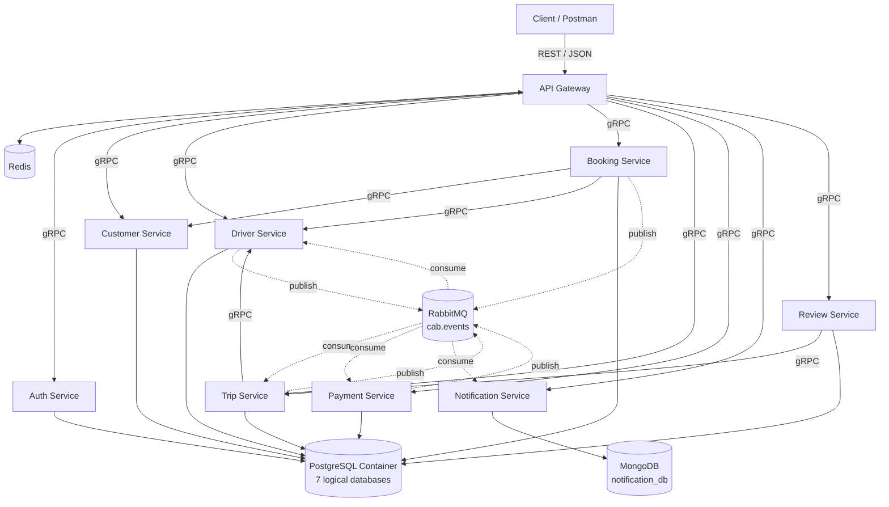

### Cách đọc sơ đồ

- **REST/JSON** chỉ tồn tại ở biên ngoài: `Client → API Gateway`.
- **gRPC** dùng cho synchronous IPC: Gateway gọi service và một số cặp service-to-service đã khóa.
- **RabbitMQ** dùng cho asynchronous business event.
- **Redis** thuộc Gateway, không phải database của business service.
- **PostgreSQL** chạy một container trong demo nhưng chứa 7 logical database tách ownership.
- **MongoDB** chỉ dành cho Notification Service.
- Không có external provider thật.

## 4.2.2. Sơ đồ database ownership

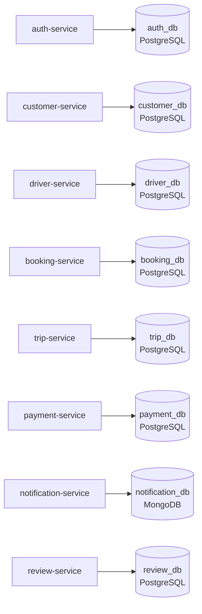

**Quy tắc bắt buộc:** một service không được dùng connection string/credential để đọc trực tiếp database của service khác. ID liên service chỉ là logical reference và được kiểm tra qua gRPC/event khi nghiệp vụ cần.

## 4.2.3. Sơ đồ gRPC topology được khóa

Sơ đồ tham chiếu của giảng viên chỉ được dùng để xác định **cặp service có liên kết**. Tên method, nội dung nghiệp vụ và dữ liệu request/response của các liên kết dưới đây phải do SRS này quyết định.

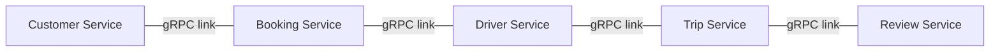

Caller chính khi triển khai:

```text
Booking -> Customer : validate/get Customer cần thiết
Booking -> Driver   : nearby/matching + Driver state cần thiết
Trip    -> Driver   : Driver/location data cần thiết cho Trip
Review  -> Trip     : validate Trip completed + ownership
```

Không tự thêm cặp gRPC khác nếu chưa cập nhật SRS.

## 4.2.4. Sơ đồ RabbitMQ topology tối thiểu

```mermaid
flowchart LR
    B[Booking Service]
    D[Driver Service]
    T[Trip Service]
    P[Payment Service]
    N[Notification Service]
    MQ[(RabbitMQ\nExchange: cab.events)]

    B -. booking.created .-> MQ
    B -. offer.created .-> MQ
    B -. driver.accepted .-> MQ
    D -. driver.approval.changed .-> MQ
    T -. trip.status.changed .-> MQ
    T -. trip.canceled .-> MQ
    T -. trip.completed .-> MQ
    P -. payment.completed .-> MQ

    MQ -. booking.created / trip.completed .-> P
    MQ -. driver.accepted .-> T
    MQ -. trip.canceled / trip.completed .-> D
    MQ -. offer.created / driver.approval.changed / trip.* / payment.completed .-> N
    MQ -. payment.completed .-> T
```

RabbitMQ trong project phải đủ để chứng minh **publish, queue/binding, consume và side effect**; không xây event platform phức tạp hơn phạm vi này.

## 4.3. External Systems

Không tích hợp provider thật.

| Nhu cầu | Cách demo |
|---|---|
| OTP | OTP cố định `123` từ cấu hình ENV |
| Location/Map | Truyền `lat/lng` trực tiếp |
| Payment | Callback mock nội bộ |
| Notification | RabbitMQ → notification-service → MongoDB |
| SMS/Email/Push | Không gọi provider ngoài |

## 4.4. Quy ước Demo ≤30 giây

| Nhóm | Quy ước |
|---|---|
| Base URL | `http://localhost:8080/api/v1` |
| Customer seed | `c@c.com` / `123` |
| Driver seed | `d@d.com` / `123` |
| Admin seed | `a@a.com` / `123` |
| OTP | `123` |
| ID public demo | `uid`, `cid`, `did`, `bid`, `oid`, `tid`, `pid` |
| Password field | `pw` |
| State field | `s` |
| Location | `lat`, `lng` |
| Payment amount | `50000` |
| Idempotency key | `P1` |
| Cancel reason | `x` |
| Review | `star=5`, comment `ok` |

Tên domain/proto/code nội bộ vẫn dùng tên rõ nghĩa; alias ngắn chỉ áp dụng cho public REST contract khi giúp demo nhanh.

## 4.5. Out of Scope

- Payment Provider thật.
- Map/GPS Provider thật.
- SMS/Email/Push Provider thật.
- Pricing Engine, surge price, promotion.
- Refund/void/payment settlement production; Payment PENDING khởi tạo sớm không đồng nghĩa đã charge tiền.
- Report/BI nâng cao.
- Audit Service riêng.
- CRM/HR/Payroll/Fleet Maintenance.
- Multi-region, autoscaling, production HA.
- Matching retry scheduler, offer timeout orchestration phức tạp.
- Các chức năng không truy được về core flow hoặc 30 tiêu chí chấm.

---

# 5. Business Requirements

| ID | Tên | Diễn giải |
|---|---|---|
| BR01 | Quản lý tài khoản | Customer/Driver/Admin đăng nhập; Customer đăng ký; JWT + role |
| BR02 | Quản lý Customer | Xem hồ sơ Customer theo token/quyền |
| BR03 | Quản lý Driver | Driver profile, vehicle, OTP mock, approval, Online/Offline, location |
| BR04 | Booking & Matching | Customer tạo Booking, publish `booking.created`, tìm Driver gần nhất phù hợp và tạo Offer |
| BR05 | Trip | Driver nhận chuyến, Trip được tạo và cập nhật đúng state machine |
| BR06 | Cancel | Customer hủy Trip hợp lệ, có lý do và notification |
| BR07 | Payment | Tự động tạo Payment `PENDING` khi Booking được tạo; `trip.completed` mở eligibility; callback mock, `COMPLETED`, idempotency/replay |
| BR08 | Notification | Nhận business event qua RabbitMQ và lưu notification nội bộ |
| BR09 | Review | Customer đánh giá Trip đã hoàn thành |
| BR10 | Security | Encryption, SQLi, XSS, JWT tampering, RBAC, rate limit |
| BR11 | MSA Platform | Gateway+Redis, gRPC, RabbitMQ, DB/service, Docker Compose, health |
| BR12 | Demoability | Seed/request ngắn, deterministic, mục tiêu ≤30 giây/mục |

---

# 6. Business Process

## 6.1. BP01 – Customer Register/Login

1. Customer gửi thông tin đăng ký qua API Gateway.
2. Gateway gọi Auth Service để tạo Account.
3. Gateway gọi Customer Service để tạo Customer Profile.
4. Customer đăng nhập qua Gateway.
5. Auth Service kiểm tra password hash và cấp Access Token.

> Không cần Auth Service gọi trực tiếp Customer Service; Gateway có thể orchestration hai gRPC call trong flow đăng ký để giữ topology service-to-service tối giản.

## 6.2. BP02 – Driver Onboarding

1. Driver yêu cầu OTP.
2. Hệ thống dùng OTP mock `123`.
3. Driver gửi hồ sơ cá nhân/xe.
4. Hồ sơ được tạo `PENDING_APPROVAL`.
5. Admin duyệt hoặc từ chối.
6. Driver nhận notification kết quả.
7. Driver `APPROVED` mới được bật Online.

## 6.3. BP03 – Booking & Matching

1. Customer đã đăng nhập tạo Booking với pickup/destination.
2. Booking Service xác thực Customer cần thiết qua liên kết gRPC với Customer Service.
3. Booking Service lưu Booking thành công.
4. Ngay sau khi Booking tồn tại, Booking Service publish `booking.created` qua RabbitMQ.
5. Payment Service consume `booking.created` và khởi tạo **một Payment duy nhất** cho Booking với `amount=50000`, `status=PENDING`, `eligible=false`.
6. Booking Service gọi Driver Service qua gRPC để lấy Driver phù hợp/gần nhất.
7. Chỉ Driver `APPROVED + AVAILABLE` và phù hợp loại xe mới được chọn.
8. Booking Service tạo **một Offer** cho Driver được chọn.
9. Booking Service publish `offer.created` qua RabbitMQ.
10. Booking trả trạng thái đang tìm/đã gửi Offer cho Customer.
11. Nếu không có Driver phù hợp, Booking trả `NO_DRIVER_FOUND`; Payment đã khởi tạo vẫn ở `PENDING` và không thể `COMPLETED` khi chưa có `trip.completed`.

> MVP không triển khai loop từ chối/timeout/retry matching tự động. Phiếu chấm chỉ cần tạo Booking → tìm Driver → gửi Offer.

## 6.4. BP04 – Driver nhận chuyến & tạo Trip

1. Driver xem Offer.
2. Driver chọn Accept.
3. Booking Service kiểm tra Offer còn hợp lệ và Driver còn đủ điều kiện.
4. Booking gọi RPC nội bộ `DriverService.MarkBusyForAssignment(context, driver_id)` qua liên kết Booking → Driver. Driver tồn tại và `APPROVED + AVAILABLE` mới được chuyển nguyên tử sang `BUSY`; RPC trả Driver hiện tại, `NOT_FOUND` nếu không tồn tại, `FAILED_PRECONDITION` nếu không đủ điều kiện. Không có REST endpoint cho RPC này.
5. Booking ghi nhận Offer `ACCEPTED`/DriverAssignment, rồi publish `driver.accepted`.
6. Trip Service consume `driver.accepted` và tạo Trip trạng thái `ASSIGNED`. Driver không consume event này; chỉ consume `trip.completed`/`trip.canceled` để giải phóng `BUSY → AVAILABLE` khi phù hợp.
7. Customer có thể xem Driver đã được gán cho chuyến.

## 6.5. BP05 – Thực hiện Trip

State machine bắt buộc:

```text
ASSIGNED → ARRIVED → IN_PROGRESS → COMPLETED
```

Smoke #17 bắt buộc có cập nhật vị trí khi Trip đang di chuyển:

```text
ARRIVED
  ↓
IN_PROGRESS
  ↓
Update lat/lng
  ↓
COMPLETED
```

Trip Service sử dụng liên kết gRPC với Driver Service khi cần dữ liệu Driver/location theo topology đã khóa.

## 6.6. BP06 – Hủy Trip

1. Customer chọn hủy Trip của mình.
2. Gửi lý do ngắn, demo `r="x"`.
3. Trip Service kiểm tra quyền và state cho phép hủy.
4. Trip chuyển `CANCELED`.
5. Trip publish `trip.canceled`.
6. Driver Service cập nhật Driver về `AVAILABLE` nếu phù hợp.
7. Notification Service lưu thông báo cho các bên.

## 6.7. BP07 – Payment

1. Payment đã được khởi tạo tự động ở trạng thái `PENDING` ngay khi Booking được tạo từ event `booking.created`.
2. Trip hoàn thành và Trip Service publish `trip.completed`.
3. Payment Service consume `trip.completed`, tìm Payment hiện có theo `bookingId`, gắn `tripId` và chuyển `eligible=true`.
4. Demo amount giữ cố định `50000`; `trip.completed` **không tạo Payment mới**.
5. Customer/System gửi yêu cầu thanh toán cho Payment đã tồn tại với `Idempotency-Key`, demo `P1`.
6. Payment Service kiểm tra Payment đang `PENDING`, đã `eligible=true` và ghi nhận idempotency key cho payment request.
7. Callback mock hợp lệ cập nhật Payment `COMPLETED`.
8. Payment Service publish `payment.completed`.
9. Trip Service consume để ghi nhận chuyến đã thanh toán.
10. Notification Service consume để lưu kết quả Payment.
11. Replay cùng `Idempotency-Key` trả đúng Payment hiện có/cùng `pid`, không insert Payment mới và không double charge.

`PENDING` chỉ biểu thị Payment đã được khởi tạo nhưng chưa hoàn tất thanh toán; không có Pricing Engine và không gọi Payment Provider thật.

## 6.8. BP08 – Review

1. Customer gửi review cho Trip đã hoàn thành.
2. Review Service dùng liên kết gRPC với Trip Service để xác thực Trip đủ điều kiện.
3. Review được lưu đúng `cid`, `did`, `tid`.
4. Một Trip chỉ có một Review của Customer đó.

---

## 6.9. Business Process tổng thể

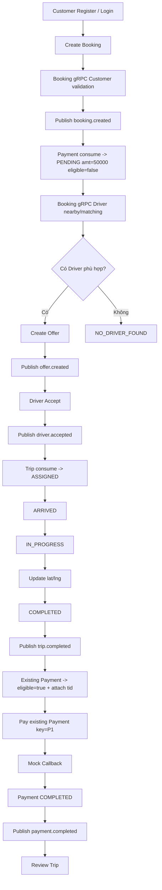

## 6.10. Sequence – Customer Register/Login

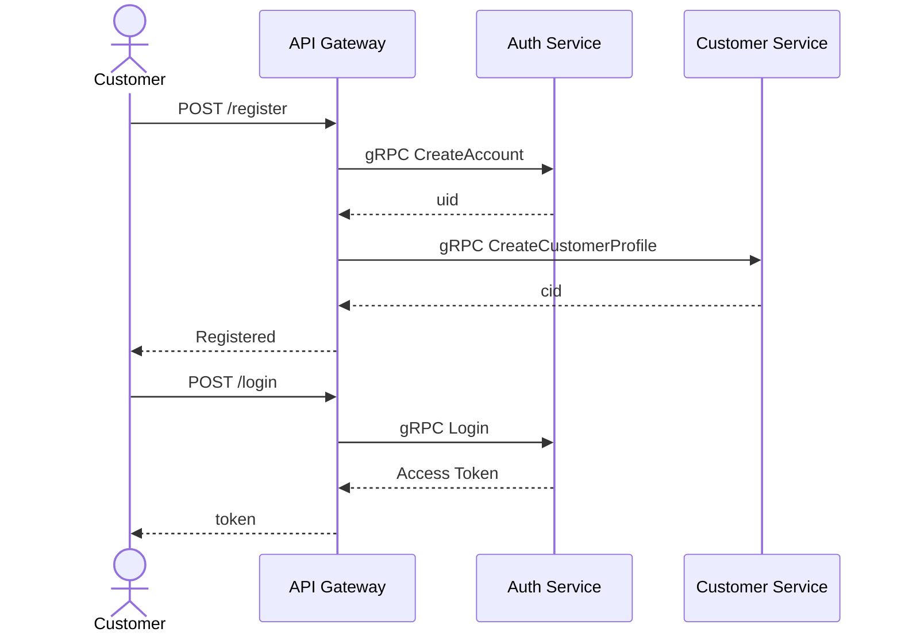

Gateway orchestration ở flow đăng ký **không làm phát sinh service-to-service gRPC Auth–Customer**.

## 6.11. Sequence – Driver Onboarding

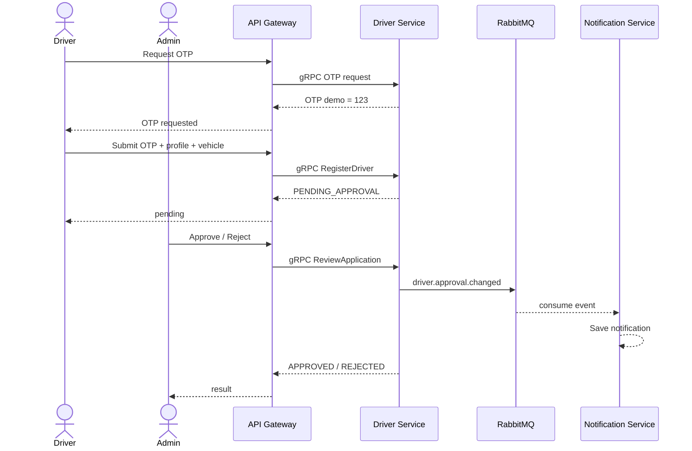

## 6.12. Sequence – Create Booking & Offer

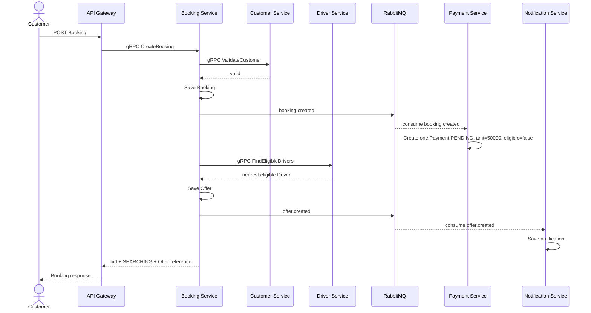

Nếu Driver Service trả danh sách rỗng, Booking trả `NO_DRIVER_FOUND`; không chạy retry scheduler phức tạp.

## 6.13. Sequence – Driver Accept & Trip Creation

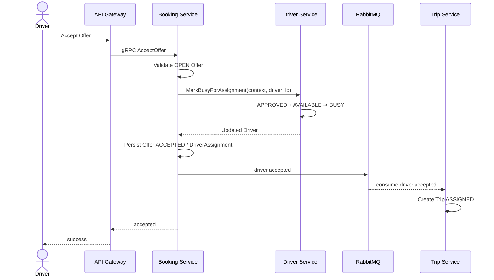

Trip creation là side effect asynchronous để chứng minh rõ RabbitMQ. Demo seed và timing phải được thiết kế để Trip xuất hiện ngay/nhanh đủ cho smoke test.

## 6.14. Sequence – Trip Lifecycle

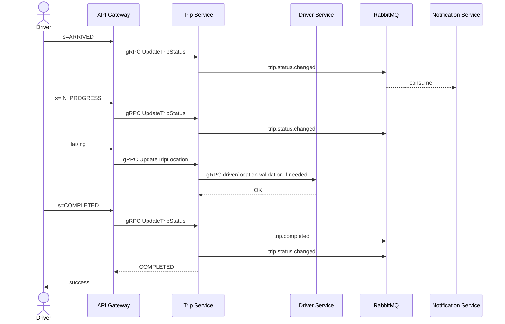

## 6.15. State Diagram – Trip

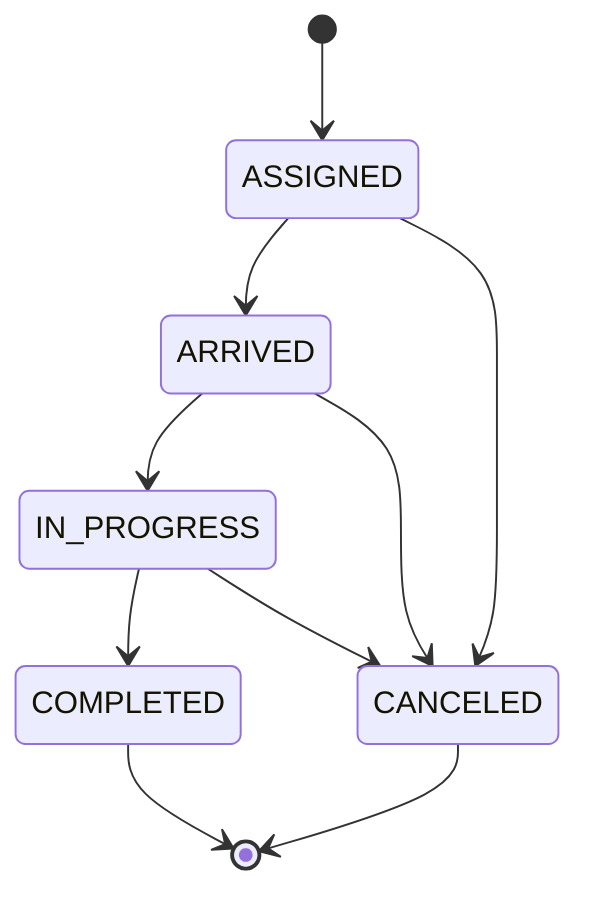

Không có state bổ sung nếu không phục vụ trực tiếp smoke test.

## 6.16. State Diagram – Driver Approval & Availability

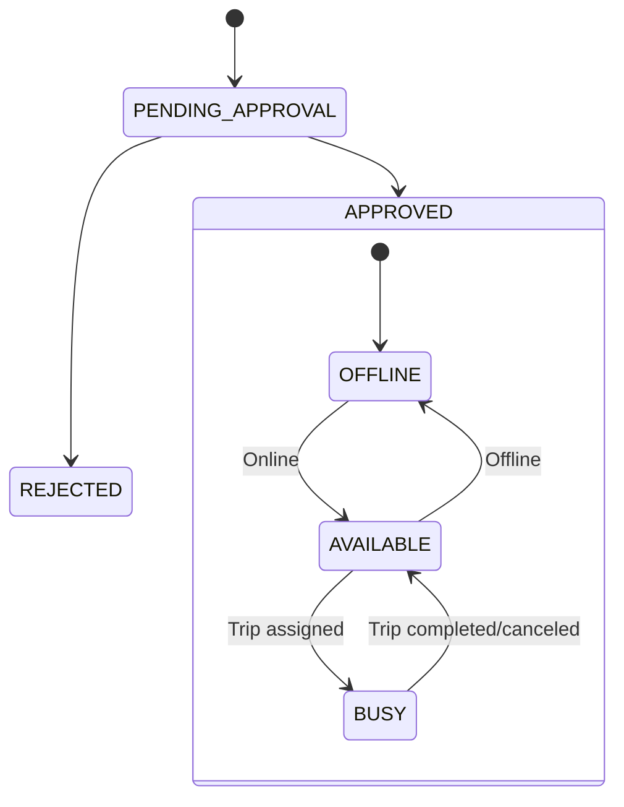

## 6.17. Sequence – Cancel Trip

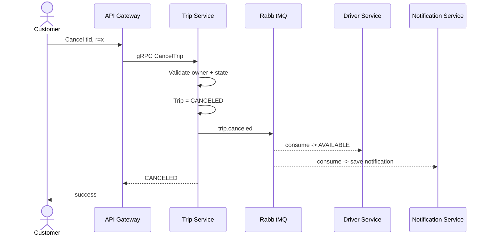

## 6.18. Sequence – Payment Lifecycle + Replay Protection

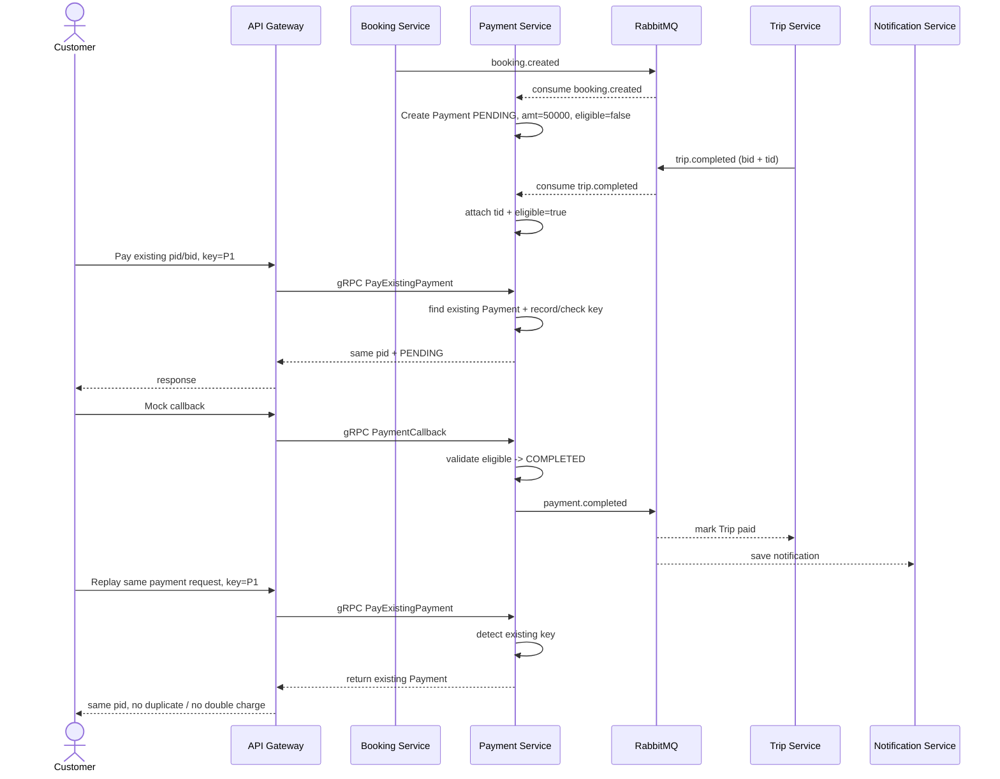

## 6.19. Sequence – Review

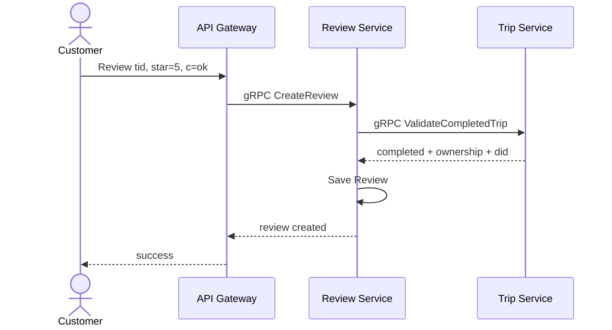

# 7. Functional Requirements

## 7.1. BR01 – Account/Auth

| ID | Functional Requirement |
|---|---|
| FR01.01 | Customer có thể đăng ký tài khoản |
| FR01.02 | User có thể đăng nhập bằng credential hợp lệ |
| FR01.03 | Password phải được lưu dạng hash, không plaintext |
| FR01.04 | Login thành công phải trả Access Token |
| FR01.05 | Token phải chứa định danh/role cần thiết |
| FR01.06 | Protected API phải kiểm tra JWT hợp lệ |

## 7.2. BR02 – Customer

| ID | Functional Requirement |
|---|---|
| FR02.01 | Customer Profile được tạo khi đăng ký Customer thành công |
| FR02.02 | User có quyền phù hợp có thể lấy Customer theo định danh |
| FR02.03 | Customer chỉ xem dữ liệu Customer được phép |

## 7.3. BR03 – Driver

| ID | Functional Requirement |
|---|---|
| FR03.01 | Driver có thể yêu cầu/xác thực OTP mock |
| FR03.02 | OTP hợp lệ cho phép tạo hồ sơ Driver/Vehicle |
| FR03.03 | Hồ sơ mới phải ở `PENDING_APPROVAL` |
| FR03.04 | Admin có thể Approve/Reject hồ sơ |
| FR03.05 | Kết quả duyệt phải được lưu và phát notification event |
| FR03.06 | Driver `APPROVED` có thể chuyển Online/Offline |
| FR03.07 | Driver Online đủ điều kiện có `AvailabilityStatus=AVAILABLE` |
| FR03.08 | Driver Offline/BUSY không được nhận Booking mới |
| FR03.09 | Driver Service lưu vị trí `lat/lng` gần nhất |
| FR03.10 | Nearby query hỗ trợ `lat`, `lng`, radius, `page`, `limit` |
| FR03.11 | Smoke nearby dùng radius `1 km` và seed ít nhất 5 Driver nhiều trạng thái |

## 7.4. BR04 – Booking & Offer

| ID | Functional Requirement |
|---|---|
| FR04.01 | Customer có thể tạo Booking với pickup/destination/vehicle type tối thiểu |
| FR04.02 | Booking phải có ID duy nhất |
| FR04.03 | Booking Service có thể xác thực Customer qua gRPC với Customer Service |
| FR04.04 | Sau khi Booking được lưu thành công phải publish `booking.created` để Payment Service khởi tạo Payment |
| FR04.05 | Booking Service lấy Driver phù hợp/gần nhất qua gRPC với Driver Service |
| FR04.06 | Chỉ Driver `APPROVED + AVAILABLE` và phù hợp loại xe được chọn |
| FR04.07 | Booking Service tạo một Offer cho Driver được chọn |
| FR04.08 | Sau khi tạo Offer phải publish `offer.created` |
| FR04.09 | Nếu không có Driver phù hợp phải trả `NO_DRIVER_FOUND` |
| FR04.10 | Danh sách Booking của Customer hỗ trợ `page` và `limit` |
| FR04.11 | Seed phải có ít nhất 5 Booking cho smoke paging |

## 7.5. BR05 – Driver Accept & Trip

| ID | Functional Requirement |
|---|---|
| FR05.01 | Driver có thể xem Offer được gửi cho mình |
| FR05.02 | Driver có thể Accept Offer hợp lệ |
| FR05.03 | Accept thành công phải publish `driver.accepted` |
| FR05.04 | Trip Service consume `driver.accepted` và tạo một Trip duy nhất |
| FR05.05 | Trip mới có trạng thái `ASSIGNED` |
| FR05.06 | Trip chỉ chấp nhận trình tự `ASSIGNED → ARRIVED → IN_PROGRESS → COMPLETED` |
| FR05.07 | Sau `IN_PROGRESS`, Driver phải có thể cập nhật `lat/lng` phục vụ smoke #17 |
| FR05.08 | Chỉ Driver được gán mới được cập nhật Trip đó |
| FR05.09 | Trip hoàn thành publish `trip.completed` |

## 7.6. BR06 – Cancel

| ID | Functional Requirement |
|---|---|
| FR06.01 | Customer chỉ được hủy Trip thuộc mình |
| FR06.02 | Hủy phải có lý do |
| FR06.03 | Hủy hợp lệ chuyển Trip sang `CANCELED` |
| FR06.04 | Hủy phải publish `trip.canceled` |
| FR06.05 | Driver liên quan và Customer phải có notification tương ứng |

## 7.7. BR07 – Payment

| ID | Functional Requirement |
|---|---|
| FR07.01 | Payment Service consume `booking.created` và tự động khởi tạo đúng một Payment cho Booking |
| FR07.02 | Payment được tạo ngay ở `PENDING`, `amount=50000`, `eligible=false`; `bookingId` là logical reference bắt buộc |
| FR07.03 | Cùng một `bookingId` không được tạo Payment thứ hai; consumer `booking.created` phải idempotent |
| FR07.04 | Payment Service consume `trip.completed`, tìm Payment hiện có theo `bookingId`, gắn `tripId` và chuyển `eligible=true` |
| FR07.05 | Payment request của Customer/System thao tác trên Payment đã tồn tại và phải hỗ trợ `Idempotency-Key` |
| FR07.06 | Callback mock chỉ được chuyển Payment `COMPLETED` khi Payment đang `PENDING` và `eligible=true` |
| FR07.07 | Payment `COMPLETED` phải publish `payment.completed` |
| FR07.08 | Trip Service consume `payment.completed` để ghi nhận đã thanh toán |
| FR07.09 | Replay cùng `Idempotency-Key` trả Payment cũ/cùng `pid`, không tạo Payment mới và không double charge |
| FR07.10 | Không lưu dữ liệu thẻ/tài khoản thanh toán nhạy cảm |

## 7.8. BR08 – Notification

| ID | Functional Requirement |
|---|---|
| FR08.01 | Notification Service consume các event được định nghĩa từ RabbitMQ |
| FR08.02 | Notification được lưu trong MongoDB |
| FR08.03 | Notification không gọi SMS/Email/Push provider thật |
| FR08.04 | Lỗi Notification không được rollback nghiệp vụ chính đã commit |

Notification identity: all five consumed events require non-empty `recipientUserIds` (string User IDs). Offer/approval notify the Driver; normal Trip progress notifies the Customer; cancellation notifies both; Payment completion notifies the Customer. Persist one document per distinct uid with UNIQUE `(eid, uid)`, retaining the original event ID on replay. Never infer uid from cid/did or call another service for identity resolution.

`booking.created` propagates `customerUserId`; `driver.accepted` and `trip.completed` propagate `customerUserId` and `driverUserId`. Trip stores logical `customer_uid`/`driver_uid`; Payment stores logical `customer_uid`. The existing Driver matching response carries `user_id`; Trip validation returns owner User references for Review. No new gRPC edge or event type is introduced.

## 7.9. BR09 – Review

| ID | Functional Requirement |
|---|---|
| FR09.01 | Customer chỉ review Trip đã hoàn thành của mình |
| FR09.02 | Review Service xác thực Trip qua gRPC với Trip Service |
| FR09.03 | Score hợp lệ và comment được lưu gắn với Trip/Customer/Driver |
| FR09.04 | Một Customer không review cùng Trip nhiều lần |

## 7.10. BR10 – Security

| ID | Functional Requirement |
|---|---|
| FR10.01 | Sensitive data at rest phải hash/encrypt phù hợp |
| FR10.02 | Query/input phải chống SQL Injection |
| FR10.03 | Text input phải không gây thực thi XSS |
| FR10.04 | JWT sửa payload/signature phải bị từ chối 401 |
| FR10.05 | Đúng token nhưng sai role phải bị từ chối 403 |
| FR10.06 | Gateway phải rate limit và trả 429 khi vượt ngưỡng |

## 7.11. BR11 – Platform/MSA

| ID | Functional Requirement |
|---|---|
| FR11.01 | Client bên ngoài chỉ gọi business API qua API Gateway |
| FR11.02 | Gateway sử dụng Redis cho rate-limit state và cache/revocation ngắn hạn cần thiết |
| FR11.03 | Gateway gọi các business service bằng gRPC |
| FR11.04 | Service-to-service gRPC chỉ theo topology đã khóa từ sơ đồ tham chiếu; nội dung nghiệp vụ/method phải theo SRS này |
| FR11.05 | Async business events dùng RabbitMQ |
| FR11.06 | Mỗi service chỉ truy cập database do service đó sở hữu |
| FR11.07 | Runtime chỉ có 8 business services + Gateway; không report/audit service |
| FR11.08 | `/health`, `/ready`, `/health/services` phải hỗ trợ smoke test |

---

# 8. Business Rules & Exceptions

## 8.1. Business Rules

| ID | Business Rule |
|---|---|
| BRL01 | Chỉ Driver `APPROVED + AVAILABLE` mới được matching |
| BRL02 | Driver phải phù hợp VehicleType của Booking |
| BRL03 | Matching demo chọn Driver phù hợp/gần nhất; không triển khai retry scheduler phức tạp |
| BRL04 | Một Offer chỉ được Accept một lần |
| BRL05 | Một Booking chỉ tạo tối đa một Trip |
| BRL06 | Driver đã `BUSY` không nhận Booking mới |
| BRL07 | Trip phải tuân thủ `ASSIGNED → ARRIVED → IN_PROGRESS → COMPLETED` |
| BRL08 | Trong smoke #17 phải có ít nhất một lần cập nhật `lat/lng` sau `IN_PROGRESS` trước `COMPLETED` |
| BRL09 | Hủy Trip phải có reason |
| BRL10 | Mỗi Booking được khởi tạo đúng một Payment `PENDING` ngay sau `booking.created` |
| BRL11 | Demo payment amount mặc định `50000`; Payment ban đầu có `eligible=false` |
| BRL12 | `trip.completed` chỉ làm Payment hiện có `eligible=true`/gắn `tripId`, không tạo Payment mới |
| BRL13 | Callback không được chuyển Payment `COMPLETED` khi `eligible=false` |
| BRL14 | Payment cùng `Idempotency-Key` không được double charge/tạo Payment mới |
| BRL15 | Review chỉ dành cho Trip `COMPLETED` và tối đa một review/Trip/Customer |
| BRL16 | Không service nào được đọc/ghi trực tiếp DB của service khác |
| BRL17 | Không tích hợp external provider thật |

## 8.2. Business Exceptions

| ID | Exception | Xử lý |
|---|---|---|
| BE01 | Không có Driver phù hợp | Booking trả `NO_DRIVER_FOUND` |
| BE02 | Driver không còn AVAILABLE khi Accept | Từ chối Accept, không tạo Trip |
| BE03 | Chuyển Trip sai thứ tự | Trả validation/business error, giữ state cũ |
| BE04 | Customer hủy Trip không thuộc mình | 403 |
| BE05 | Callback Payment không hợp lệ/thất bại | Không chuyển `COMPLETED` |
| BE06 | Callback trước khi Payment `eligible=true` | Từ chối callback; giữ `PENDING` |
| BE07 | Replay Payment cùng key | Trả Payment cũ/cùng `pid`, không tạo mới |
| BE08 | `booking.created` bị delivery lại | Payment Service bỏ qua/return existing theo `bookingId`; không tạo Payment thứ hai |
| BE09 | JWT bị sửa | 401 |
| BE10 | Sai role | 403 |
| BE11 | Vượt rate limit | 429 |

---

# 9. Data Modeling / ERD & Database Ownership

## 9.1. Entity chính

| Entity | Service sở hữu | DB |
|---|---|---|
| User/Account | auth-service | PostgreSQL |
| Customer | customer-service | PostgreSQL |
| Driver, Vehicle, DriverLocation | driver-service | PostgreSQL |
| Booking, DriverOffer | booking-service | PostgreSQL |
| Trip, TripStatusHistory, TripLocation | trip-service | PostgreSQL |
| Payment | payment-service | PostgreSQL |
| Notification | notification-service | MongoDB |
| Review | review-service | PostgreSQL |

## 9.2. Conceptual Relationships

- User 1–0..1 Customer.
- User 1–0..1 Driver.
- Driver 1–N Vehicle.
- Customer 1–N Booking.
- Booking 1–N DriverOffer; trong MVP chỉ một Offer active/selected cho smoke chính.
- Driver 1–N DriverOffer.
- Booking 1–0..1 Trip.
- Driver 1–N Trip theo thời gian.
- Trip 1–N TripStatusHistory.
- Trip 1–N TripLocation.
- Booking 1–1 Payment trong MVP; Payment được khởi tạo ngay sau `booking.created`. Payment có thể gắn `tripId` sau khi `trip.completed`.
- Trip 1–0..1 Review của Customer.
- User/Trip có thể có nhiều Notification document.

> Đây là **conceptual ERD**. Cross-service ID là logical reference, **không tạo physical foreign key chéo database**.

## 9.2.1. Conceptual ERD

Sơ đồ dưới đây dùng để mô tả **quan hệ nghiệp vụ**, không có nghĩa là tồn tại physical FK giữa database của các service khác nhau.

```mermaid
erDiagram
    USER ||--o| CUSTOMER : "profile"
    USER ||--o| DRIVER : "profile"
    DRIVER ||--o{ VEHICLE : owns
    DRIVER ||--o{ DRIVER_LOCATION : updates
    CUSTOMER ||--o{ BOOKING : creates
    BOOKING ||--o{ DRIVER_OFFER : has
    DRIVER ||--o{ DRIVER_OFFER : receives
    BOOKING ||--o| TRIP : creates
    DRIVER ||--o{ TRIP : performs
    TRIP ||--o{ TRIP_STATUS_HISTORY : records
    TRIP ||--o{ TRIP_LOCATION : records
    BOOKING ||--|| PAYMENT : initializes
    TRIP ||--o| REVIEW : receives
    CUSTOMER ||--o{ REVIEW : writes
    DRIVER ||--o{ REVIEW : receives

    USER {
      bigint uid PK
      string email UK
      string password_hash
      string role
      string status
    }

    CUSTOMER {
      bigint cid PK
      bigint uid logical_ref
      string name
    }

    DRIVER {
      bigint did PK
      bigint uid logical_ref
      string approval_status
      string availability_status
      string encrypted_license
    }

    VEHICLE {
      bigint vid PK
      bigint did FK
      string vehicle_type
      string plate
    }

    DRIVER_LOCATION {
      bigint id PK
      bigint did FK
      decimal lat
      decimal lng
      datetime updated_at
    }

    BOOKING {
      bigint bid PK
      bigint cid logical_ref
      string vehicle_type
      decimal pickup_lat
      decimal pickup_lng
      decimal dest_lat
      decimal dest_lng
      string status
    }

    DRIVER_OFFER {
      bigint oid PK
      bigint bid FK
      bigint did logical_ref
      string status
    }

    TRIP {
      bigint tid PK
      bigint bid logical_ref
      bigint cid logical_ref
      bigint did logical_ref
      string status
      boolean paid
      string cancel_reason
    }

    TRIP_STATUS_HISTORY {
      bigint id PK
      bigint tid FK
      string status
      datetime created_at
    }

    TRIP_LOCATION {
      bigint id PK
      bigint tid FK
      decimal lat
      decimal lng
      datetime created_at
    }

    PAYMENT {
      bigint pid PK
      bigint bid UK_logical_ref
      bigint tid nullable_logical_ref
      bigint cid logical_ref
      decimal amount
      boolean eligible
      string status
      string idempotency_key nullable_UK
      datetime created_at
      datetime paid_at nullable
    }

    REVIEW {
      bigint rid PK
      bigint tid logical_ref
      bigint cid logical_ref
      bigint did logical_ref
      int star
      string comment
    }
```

## 9.2.2. Notification document model

Notification Service dùng MongoDB vì notification/event projection có payload linh hoạt và chủ yếu append/read.

Ví dụ document tối thiểu:

```json
{
  "uid": 2,
  "type": "TRIP_CANCELED",
  "refType": "TRIP",
  "refId": 10,
  "msg": "Trip canceled",
  "status": "SENT",
  "createdAt": "2026-10-04T01:00:00+07:00"
}
```

Không cần schema phức tạp, template engine hoặc external push provider.

## 9.3. Database per Service

| Service | Logical DB | Engine |
|---|---|---|
| auth-service | `auth_db` | PostgreSQL |
| customer-service | `customer_db` | PostgreSQL |
| driver-service | `driver_db` | PostgreSQL |
| booking-service | `booking_db` | PostgreSQL |
| trip-service | `trip_db` | PostgreSQL |
| payment-service | `payment_db` | PostgreSQL |
| notification-service | `notification_db` | MongoDB |
| review-service | `review_db` | PostgreSQL |

Một PostgreSQL container có thể host 7 logical DB trong môi trường demo để giảm container overhead, nhưng quyền truy cập phải tách theo service.

## 9.4. Redis

Redis **không phải business database**. Redis thuộc Gateway infrastructure và chỉ dùng cho:

- Rate-limit counter/window.
- Cache/revocation state ngắn hạn nếu cần cho auth/gateway demo.

Không lưu Booking, Trip, Payment hay domain state chính trong Redis.

## 9.5. Key Data Constraints

- `User.Email` UNIQUE.
- `Payment.BookingId` UNIQUE để bảo đảm một Booking chỉ khởi tạo một Payment.
- `Payment.IdempotencyKey` nullable nhưng UNIQUE khi đã được gán cho payment request.
- Một Booking tối đa một Trip.
- Một Offer chỉ Accept một lần.
- Một Customer tối đa một Review cho một Trip.
- Password lưu hash.
- Dữ liệu cần đọc lại nhưng nhạy cảm, ví dụ DriverLicense, được encrypt bằng key từ ENV; key không hard-code.

---

# 10. Non-Functional Requirements & Architecture Constraints

## 10.1. Performance / Demoability

| ID | Requirement |
|---|---|
| NFR01 | API local thông thường phản hồi mục tiêu ≤3 giây |
| NFR02 | Smoke test phải deterministic và không phụ thuộc Internet |
| NFR03 | Seed/request phải đủ ngắn để thao tác trực tiếp, mục tiêu ≤30 giây/mục |
| NFR04 | Không benchmark TPS/autoscaling production |

## 10.2. Security

| ID | Requirement |
|---|---|
| NFR05 | Password hash; sensitive reversible data encrypt at rest |
| NFR06 | Encryption key/secret từ ENV, không hard-code/commit `.env` thật |
| NFR07 | Parameterized query/ORM tương đương chống SQL Injection |
| NFR08 | Text input sanitize/encode phù hợp để script không execute |
| NFR09 | JWT verify signature/expiry |
| NFR10 | RBAC trả 403 cho valid token sai quyền |
| NFR11 | Gateway rate limit trả 429 |
| NFR12 | Payment idempotency chống replay/double charge |

## 10.3. Health / Deployment

| ID | Requirement |
|---|---|
| NFR13 | Gateway có `/health`, `/ready`, `/health/services` |
| NFR14 | Docker Compose chạy Gateway + 8 services + PostgreSQL + MongoDB + Redis + RabbitMQ |
| NFR15 | `.env` thật không commit; có `.env.example` |
| NFR16 | Microservice không expose business port trực tiếp ra client host trong cấu hình demo chính thức |

## 10.4. Architecture Constraints

### ARC01 – External Communication

```text
Client --REST/JSON--> API Gateway
```

Client không gọi trực tiếp business service.

### ARC02 – Gateway + Redis

API Gateway sử dụng Redis cho rate limit và state/cache ngắn hạn cần thiết. Redis không sở hữu domain data.

### ARC03 – Gateway to Service

```text
API Gateway --gRPC--> 8 business services
```

REST dừng tại Gateway; internal synchronous call dùng gRPC.

### ARC04 – Service-to-Service gRPC Topology Lock

**Chỉ lấy liên kết/cặp service từ sơ đồ tham chiếu của giảng viên; không lấy nội dung, trách nhiệm hoặc method trong ảnh. Toàn bộ business meaning phải theo SRS này.**

Các cặp service có liên kết gRPC được khóa:

```text
Customer Service <----> Booking Service
Booking Service  <----> Driver Service
Driver Service   <----> Trip Service
Trip Service     <----> Review Service
```

Khi implement, caller chính theo nhu cầu SRS:

```text
Booking -> Customer   : validate/get Customer cần thiết
Booking -> Driver     : nearby/matching + trạng thái Driver cần thiết
Trip    -> Driver     : dữ liệu Driver/location cần thiết cho Trip
Review  -> Trip       : validate Trip đã COMPLETED và ownership
```

Không tự thêm service-to-service gRPC khác nếu không có thay đổi SRS được chấp thuận.

### ARC05 – RabbitMQ

RabbitMQ dùng cho event không cần caller chờ kết quả ngay.

**Exchange dự kiến:** `cab.events`.

| Event | Publisher | Consumer(s) | Mục đích |
|---|---|---|---|
| `booking.created` | booking-service | payment-service | Khởi tạo đúng một Payment `PENDING`, `amount=50000`, `eligible=false` cho Booking |
| `offer.created` | booking-service | notification-service | Lưu thông báo Offer cho Driver |
| `driver.accepted` | booking-service | trip-service | Tạo Trip sau khi Offer được Accept |
| `driver.approval.changed` | driver-service | notification-service | Thông báo kết quả duyệt Driver |
| `trip.status.changed` | trip-service | notification-service | Lưu notification trạng thái Trip |
| `trip.canceled` | trip-service | driver-service, notification-service | Trả Driver về AVAILABLE và thông báo |
| `trip.completed` | trip-service | driver-service, payment-service | Trả Driver AVAILABLE; Payment Service gắn `tripId` và mở `eligible=true` cho Payment đã tồn tại theo `bookingId` |
| `payment.completed` | payment-service | trip-service, notification-service | Ghi nhận Trip đã thanh toán và thông báo Customer |

**Publisher:** Booking, Driver, Trip, Payment.  
**Consumer:** Trip, Driver, Payment, Notification.

`booking.created` tối thiểu phải có `bookingId`, `customerId`, `createdAt`. `trip.completed` tối thiểu phải có `tripId`, `bookingId`, `customerId`, `driverId`, `completedAt` để Payment Service tìm đúng Payment đã khởi tạo.

Auth, Customer và Review không cần RabbitMQ trong phạm vi demo hiện tại.

### ARC06 – Database Ownership

Mỗi service chỉ đọc/ghi DB của chính mình. Mọi nhu cầu dữ liệu service khác phải đi qua gRPC hoặc event đã định nghĩa.

### ARC07 – External Dependency

Không dùng Payment/SMS/Map/Notification provider thật.

### ARC08 – Scope Ceiling

Runtime chỉ có:

- API Gateway
- 8 business services
- PostgreSQL
- MongoDB
- Redis
- RabbitMQ

Không Report Service, không Audit Service.

---

## 10.5. Deployment Diagram – Docker Compose

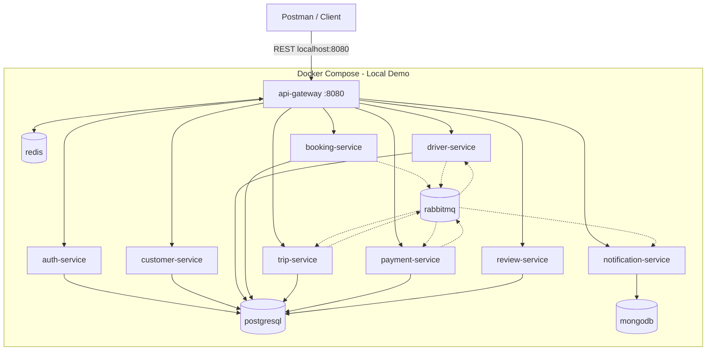

Chỉ Gateway publish host port business ra ngoài. Các business service nằm trong Docker network và được Gateway truy cập bằng service name/gRPC port.

## 10.6. Health/Readiness Model

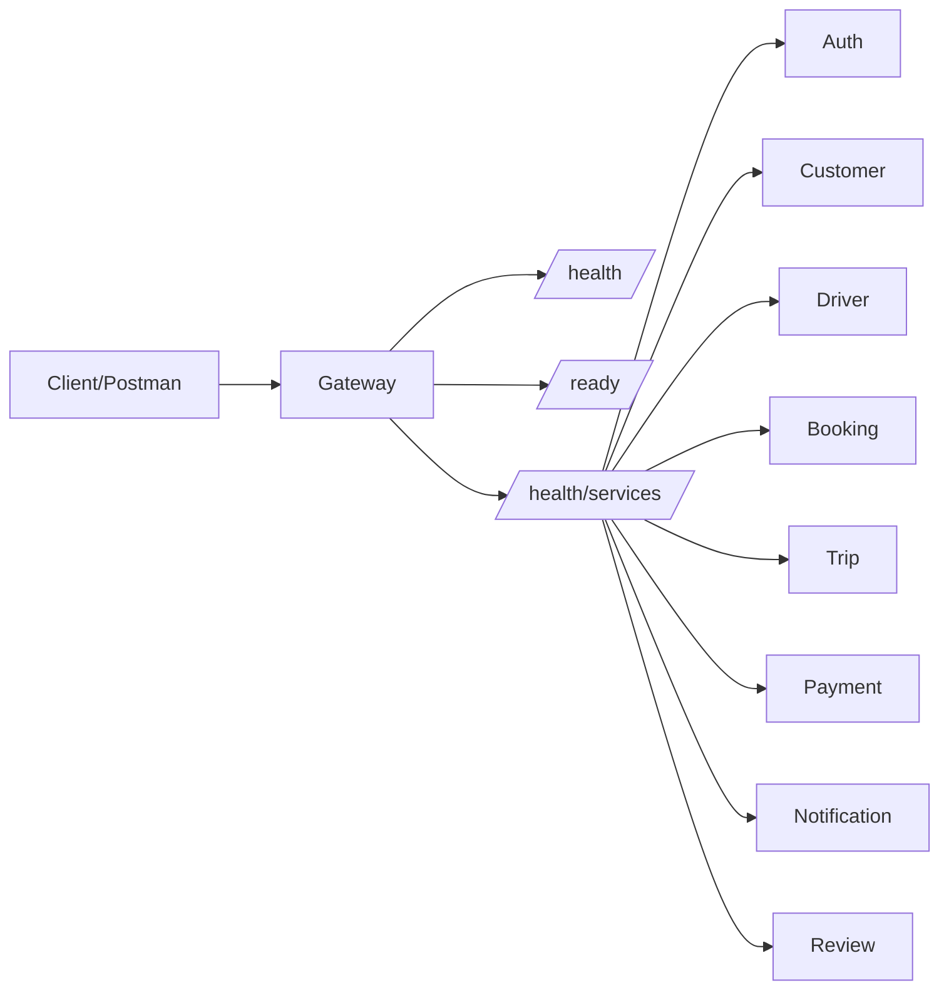

- `/health`: Gateway process sống.
- `/ready`: Gateway và dependency tối thiểu sẵn sàng phục vụ.
- `/health/services`: tổng hợp trạng thái service để phục vụ rubric #6.

## 10.7. IPC Decision Table

| Nhu cầu | IPC | Lý do |
|---|---|---|
| Client gọi hệ thống | REST/JSON → Gateway | Đúng entry point yêu cầu |
| Gateway gọi business service | gRPC | synchronous, cần response ngay |
| Booking kiểm tra Customer | gRPC Booking→Customer | cần validate trước khi tạo/matching |
| Booking tìm Driver | gRPC Booking→Driver | cần danh sách Driver ngay |
| Trip lấy Driver/location data | gRPC Trip→Driver | synchronous validation/query |
| Review kiểm tra Trip | gRPC Review→Trip | cần xác nhận completed/ownership |
| Booking vừa được tạo → khởi tạo Payment | RabbitMQ | `booking.created`; Payment tạo một record PENDING mà Booking không cần chờ |
| Booking báo Offer | RabbitMQ | notification side effect |
| Driver Accept tạo Trip | RabbitMQ | event `driver.accepted` |
| Trip status notification | RabbitMQ | async side effect |
| Trip completed mở eligibility cho Payment đã có | RabbitMQ | `trip.completed`; không tạo Payment mới |
| Payment completed cập nhật Trip/Notification | RabbitMQ | async projection/notification |

# 11. Use Cases

## 11.1. Actors

- Customer
- Driver
- Admin
- System
- Mock Payment Component

## 11.2. Use Case List

| UC | Tên | Actor chính | Rubric liên quan |
|---|---|---|---|
| UC01 | Đăng ký Customer | Customer | #9 |
| UC02 | Đăng nhập | Customer/Driver/Admin | #10 |
| UC03 | Xem Customer Profile | Customer/Admin | #11 |
| UC04 | Xem Driver Profile | Admin | #12, #28 |
| UC05 | Nearby Drivers | Admin/System | #13 |
| UC06 | List Customer Bookings | Customer | #14 |
| UC07 | Create Booking & Offer | Customer/System | #15 |
| UC08 | Driver Accept Offer | Driver | #16 |
| UC09 | Update Trip | Driver | #17 |
| UC10 | Cancel Trip | Customer | #18 |
| UC11 | Online Payment Mock | Customer/System | #19, #30 |
| UC12 | Review Trip | Customer | #20, #26 |
| UC13 | Driver Register + OTP | Driver | #21 |
| UC14 | Approve/Reject Driver | Admin | #22 |
| UC15 | Driver Online/Offline | Driver | #23 |

Security/platform criteria #1–#8, #24–#30 được kiểm tra bằng Acceptance Criteria/NFR và smoke test tương ứng, không cần tạo thêm business Use Case giả tạo.

## 11.2.1. Use Case Diagram

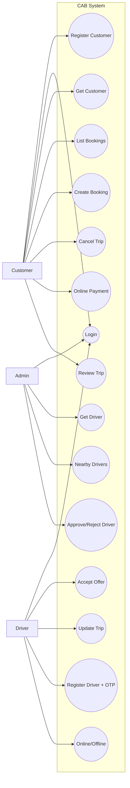

## 11.2.2. Use Case to Service Mapping

| Use Case | Gateway target chính | Service-to-service / Event liên quan |
|---|---|---|
| UC01 Register Customer | Auth + Customer | Gateway orchestration |
| UC02 Login | Auth | Redis/Gateway security |
| UC03 Get Customer | Customer | — |
| UC04 Get Driver | Driver | RBAC |
| UC05 Nearby Drivers | Driver | — |
| UC06 List Bookings | Booking | — |
| UC07 Create Booking | Booking | `booking.created` → Payment; gRPC Customer, gRPC Driver, `offer.created` |
| UC08 Accept Offer | Booking | `driver.accepted` → Trip |
| UC09 Update Trip | Trip | gRPC Driver, trip events |
| UC10 Cancel Trip | Trip | `trip.canceled` |
| UC11 Online Payment | Payment | Payment đã tồn tại từ `booking.created`; `trip.completed` eligibility; `payment.completed` |
| UC12 Review Trip | Review | gRPC Trip |
| UC13 Register Driver | Driver | OTP mock |
| UC14 Approve Driver | Driver | `driver.approval.changed` |
| UC15 Online/Offline | Driver | — |

## 11.3. Key Use Case Specifications

### UC07 – Create Booking & Offer

**Precondition:** Customer authenticated; seed có Driver phù hợp.  
**Main flow:**

1. Customer gửi pickup/destination/vehicle type ngắn.
2. Booking tạo Booking.
3. Booking validate Customer qua gRPC Customer link nếu cần.
4. Booking gọi Driver qua gRPC để lấy Driver phù hợp/gần nhất.
5. Booking tạo một Offer.
6. Booking publish `offer.created`.
7. Response cho Customer cho biết Booking đang tìm/đã gửi Offer.

**Exception:** Không có Driver → `NO_DRIVER_FOUND`.

### UC08 – Driver Accept Offer

**Precondition:** Offer tồn tại, Driver còn AVAILABLE.  
**Main flow:**

1. Driver gọi Accept.
2. Booking kiểm tra Offer/Driver.
3. Offer → `ACCEPTED`.
4. Booking publish `driver.accepted`.
5. Trip consume và tạo Trip `ASSIGNED`.
6. Customer có thể thấy Driver được gán.

### UC09 – Update Trip

**Precondition:** Trip `ASSIGNED`, Driver là Driver được gán.  
**Main flow bắt buộc:**

1. `ASSIGNED → ARRIVED`.
2. `ARRIVED → IN_PROGRESS`.
3. Cập nhật `lat/lng` khi đang `IN_PROGRESS`.
4. `IN_PROGRESS → COMPLETED`.
5. Trip publish status event; khi completed publish `trip.completed`.

Không cho phép bỏ qua state bắt buộc.

### UC10 – Cancel Trip

1. Customer gửi reason.
2. Trip kiểm tra ownership/state.
3. Trip → `CANCELED`.
4. Publish `trip.canceled`.
5. Driver/Notification consume theo topology.

### UC11 – Online Payment Mock

**Precondition:** Payment `PENDING` đã được tạo từ `booking.created`; Payment Service đã nhận `trip.completed` tương ứng nên `eligible=true`.  
**Main flow:**

1. Customer/System gửi yêu cầu thanh toán cho Payment hiện có (`pid` hoặc `bid`) với key `P1`.
2. Payment Service tìm Payment hiện có, xác nhận `PENDING + eligible=true` và ghi nhận/kiểm tra `Idempotency-Key`.
3. Gọi callback mock.
4. Payment → `COMPLETED`.
5. Publish `payment.completed`.
6. Trip ghi nhận paid; Notification lưu kết quả.
7. Gửi lại cùng key → trả đúng Payment cũ/cùng `pid`, không insert Payment mới và không double charge.

### UC12 – Review Trip

1. Customer gửi `tid`, `star=5`, comment `ok`.
2. Review Service gọi Trip Service qua gRPC để validate Trip `COMPLETED` và ownership.
3. Lưu Review.

### UC13 – Driver Register + OTP

1. Driver yêu cầu OTP.
2. Nhập OTP mock `123`.
3. Gửi thông tin tối thiểu của Driver/Vehicle.
4. Hồ sơ → `PENDING_APPROVAL`.

### UC14 – Approve/Reject Driver

1. Admin dùng Admin token.
2. Mở Driver pending.
3. Approve hoặc Reject.
4. Lưu trạng thái.
5. Publish `driver.approval.changed`.

### UC15 – Driver Online/Offline

- `APPROVED` Driver có thể Online → `AVAILABLE`.
- Offline → `OFFLINE`.
- `PENDING_APPROVAL`, `REJECTED`, `BUSY` không được coi là Driver nhận Booking mới.

---

## 11.4. Detailed Use Case Specifications

### UC01 – Register Customer

| Thuộc tính | Nội dung |
|---|---|
| Primary Actor | Customer |
| Preconditions | Email chưa tồn tại |
| Trigger | Customer gửi request đăng ký |
| Postconditions | Account + Customer Profile được tạo; có thể login |
| Rubric | #9 |

**Main Flow**

1. Customer nhập email, `pw`, name tối thiểu.
2. Gateway validate request format cơ bản.
3. Gateway gọi Auth Service tạo Account.
4. Auth Service hash password và lưu `auth_db`.
5. Gateway gọi Customer Service tạo profile bằng `uid` vừa tạo.
6. Customer Service lưu `customer_db`.
7. Gateway trả kết quả đăng ký thành công.
8. Customer có thể dùng credential đó cho UC02.

**Exception**

- Email trùng → `409` hoặc lỗi business tương đương.
- Request thiếu field bắt buộc → `400`.
- Không được lưu password plaintext.

### UC02 – Login

| Thuộc tính | Nội dung |
|---|---|
| Primary Actor | Customer / Driver / Admin |
| Preconditions | Account tồn tại và active |
| Trigger | Gửi credential |
| Postconditions | Trả JWT hợp lệ |
| Rubric | #10, #25, #27 |

**Main Flow**

1. Client gửi email + `pw` qua Gateway.
2. Gateway gọi Auth Service bằng gRPC.
3. Auth Service query account bằng parameterized query/ORM.
4. So sánh password với hash.
5. Nếu hợp lệ, tạo JWT chứa `sub`, `role`, expiry.
6. Gateway trả token.

**Exception/Security**

- Password sai → `401`.
- SQL injection input không được bypass.
- JWT bị sửa ở request sau → `401`.

### UC03 – Get Customer Profile

| Thuộc tính | Nội dung |
|---|---|
| Primary Actor | Customer / Admin phù hợp |
| Preconditions | JWT hợp lệ |
| Postconditions | Trả đúng Customer được phép xem |
| Rubric | #11 |

**Main Flow**

1. Client gửi token.
2. Gateway verify JWT.
3. Gateway gọi Customer Service.
4. Customer Service kiểm tra scope/ID cần thiết.
5. Trả Customer Profile không chứa dữ liệu nhạy cảm ngoài quyền.

### UC04 – Get Driver Profile

| Thuộc tính | Nội dung |
|---|---|
| Primary Actor | Admin |
| Preconditions | Admin token hợp lệ |
| Postconditions | Driver data được trả về |
| Rubric | #12 và dùng lại cho #28 |

**Main Flow**

1. Admin gửi GET Driver by ID qua Gateway.
2. Gateway xác thực role `ADMIN`.
3. Gateway gọi Driver Service.
4. Driver Service trả profile cần thiết.

**Authorization Negative Flow**

- Customer dùng cùng endpoint → Gateway/Service trả `403`, không trả dữ liệu.

### UC05 – Nearby Drivers

| Thuộc tính | Nội dung |
|---|---|
| Primary Actor | Admin/System |
| Preconditions | Có seed ≥5 Driver, nhiều trạng thái |
| Postconditions | Danh sách đúng radius/page/limit |
| Rubric | #13 |

**Main Flow**

1. Gửi `lat`, `lng`, `radius=1`, `page`, `limit`.
2. Driver Service query Driver location/status.
3. Tính khoảng cách bằng công thức local phù hợp; không gọi Map Provider.
4. Trả Driver theo điều kiện API.
5. Response có paging metadata tối thiểu.

### UC06 – List Customer Bookings

| Thuộc tính | Nội dung |
|---|---|
| Primary Actor | Customer |
| Preconditions | Seed ≥5 Booking của Customer |
| Postconditions | Danh sách Booking phân trang |
| Rubric | #14 |

**Main Flow**

1. Customer gửi token + `page/limit`.
2. Gateway gọi Booking Service.
3. Booking Service xác định `cid` hợp lệ.
4. Query `booking_db`.
5. Trả danh sách + paging metadata.

### UC07 – Create Booking & Offer

| Thuộc tính | Nội dung |
|---|---|
| Primary Actor | Customer |
| Preconditions | Customer hợp lệ; có Driver phù hợp cho smoke success |
| Postconditions | Booking + Offer được tạo; `booking.created` làm Payment Service khởi tạo Payment `PENDING` |
| Rubric | #15 |

**Main Flow**

1. Customer gửi pickup/destination/vehicle type ngắn.
2. Booking→Customer gRPC kiểm tra Customer khi cần.
3. Booking Service lưu Booking.
4. Publish `booking.created`.
5. Payment Service consume và tạo đúng một Payment `PENDING`, `amount=50000`, `eligible=false` cho `bid`.
6. Booking→Driver gRPC tìm Driver gần nhất phù hợp.
7. Booking lưu một DriverOffer.
8. Publish `offer.created`.
9. Trả `bid`, trạng thái đang tìm/offer sent.

**Exception**

- Không Driver → `NO_DRIVER_FOUND`.
- Không tự retry nhiều Driver trong demo MVP.

### UC08 – Driver Accept Offer

| Thuộc tính | Nội dung |
|---|---|
| Primary Actor | Driver |
| Preconditions | Offer OPEN, Driver đúng người nhận và AVAILABLE |
| Postconditions | Offer ACCEPTED; Trip ASSIGNED được tạo qua event |
| Rubric | #16 |

**Main Flow**

1. Driver gửi Accept.
2. Booking Service kiểm tra Offer.
3. Booking gọi Driver `MarkBusyForAssignment`: `APPROVED + AVAILABLE → BUSY`.
4. Booking lưu Offer `ACCEPTED` và DriverAssignment.
5. Publish `driver.accepted`.
6. Trip Service consume event và tạo Trip `ASSIGNED`.

### UC09 – Update Trip

| Thuộc tính | Nội dung |
|---|---|
| Primary Actor | Driver |
| Preconditions | Driver được gán cho Trip |
| Postconditions | Trip lifecycle hoàn tất đúng thứ tự |
| Rubric | #17 |

**Main Flow**

1. Update `ARRIVED`.
2. Update `IN_PROGRESS`.
3. Update `lat/lng` ít nhất một lần.
4. Update `COMPLETED`.
5. Lưu status history/location.
6. Publish `trip.completed`.

**Exception**

- Skip `ARRIVED` và chuyển thẳng `IN_PROGRESS` → từ chối.
- Driver khác cập nhật → `403`.

### UC10 – Cancel Trip

| Thuộc tính | Nội dung |
|---|---|
| Primary Actor | Customer |
| Preconditions | Customer sở hữu Trip; state cho phép cancel |
| Postconditions | CANCELED + reason + notification |
| Rubric | #18 |

**Main Flow**

1. Customer gửi `tid`, `r=x`.
2. Trip Service kiểm tra ownership/state.
3. Lưu reason và `CANCELED`.
4. Publish `trip.canceled`.
5. Driver Service consume và giải phóng Driver.
6. Notification Service consume và lưu notification.

### UC11 – Online Payment Mock

| Thuộc tính | Nội dung |
|---|---|
| Primary Actor | Customer/System |
| Preconditions | Payment PENDING đã được tạo từ Booking; Trip completed và Payment đã `eligible=true` |
| Postconditions | Payment hiện có → COMPLETED; replay an toàn, không tạo Payment thứ hai |
| Rubric | #19, #30 |

**Main Flow**

1. Customer/System gửi request thanh toán cho Payment đã tồn tại (`pid` hoặc `bid`) với key `P1`.
2. Payment Service tìm Payment theo `pid/bid`, kiểm tra `status=PENDING` và `eligible=true`.
3. Payment Service ghi nhận/kiểm tra `Idempotency-Key`; không insert Payment mới.
4. Callback mock nội bộ cập nhật `COMPLETED`.
5. Publish `payment.completed`.
6. Trip Service ghi nhận paid.
7. Notification Service lưu kết quả.

**Replay Flow**

1. Gửi lại cùng payment request với `P1`.
2. Payment Service phát hiện key đã gắn với Payment hiện có.
3. Không insert Payment/transaction mới và không double charge.
4. Trả kết quả Payment cũ/cùng `pid`.

### UC12 – Review Trip

| Thuộc tính | Nội dung |
|---|---|
| Primary Actor | Customer |
| Preconditions | Trip COMPLETED, Customer là owner |
| Postconditions | Review được lưu duy nhất |
| Rubric | #20, #26 |

**Main Flow**

1. Customer gửi `tid`, `star=5`, `c=ok`.
2. Review→Trip gRPC validate completed/ownership.
3. Validate score/comment.
4. Lưu Review.

**XSS Flow**

- Comment `<script>alert('hack')</script>` không được thực thi và phải được sanitize/encode theo thiết kế.

### UC13 – Driver Register + OTP

| Thuộc tính | Nội dung |
|---|---|
| Primary Actor | Driver |
| Preconditions | Phone/email phù hợp chưa dùng |
| Postconditions | Driver PENDING_APPROVAL |
| Rubric | #21 |

**Main Flow**

1. Driver yêu cầu OTP.
2. Hệ thống dùng OTP demo `123`.
3. Driver nhập OTP + thông tin tối thiểu.
4. Driver Service tạo Driver + Vehicle.
5. `ApprovalStatus=PENDING_APPROVAL`.

### UC14 – Approve/Reject Driver

| Thuộc tính | Nội dung |
|---|---|
| Primary Actor | Admin |
| Preconditions | Admin token; Driver pending |
| Postconditions | APPROVED/REJECTED + notification |
| Rubric | #22 |

**Main Flow**

1. Admin xem Driver pending.
2. Chọn Approve hoặc Reject.
3. Driver Service lưu trạng thái.
4. Publish `driver.approval.changed`.
5. Notification Service lưu kết quả.

### UC15 – Driver Online/Offline

| Thuộc tính | Nội dung |
|---|---|
| Primary Actor | Driver |
| Preconditions | Driver APPROVED |
| Postconditions | Availability thay đổi |
| Rubric | #23 |

**Main Flow**

1. Driver chuyển Online.
2. Nếu APPROVED và không BUSY → `AVAILABLE`.
3. Driver chuyển Offline → `OFFLINE`.
4. Driver Offline/BUSY không xuất hiện trong matching eligible set.

# 12. Acceptance Criteria

## 12.1. Business Acceptance

| ID | Acceptance Criteria |
|---|---|
| AC01 | Customer chưa tồn tại đăng ký thành công và sau đó login được |
| AC02 | Login hợp lệ trả Access Token |
| AC03 | Customer token lấy đúng Customer data được phép |
| AC04 | Admin token lấy Driver theo ID thành công |
| AC05 | Nearby radius 1 km trả đúng tập Driver, hỗ trợ page/limit, seed ≥5 Driver nhiều trạng thái |
| AC06 | Customer bookings hỗ trợ page/limit, seed ≥5 Booking |
| AC07 | Create Booking tạo Booking, publish `booking.created`, Payment Service tạo Payment `PENDING`, sau đó matching Driver và tạo Offer |
| AC08 | Driver Accept làm Offer accepted và Trip được tạo qua `driver.accepted` event |
| AC09 | Trip chỉ đi `ASSIGNED→ARRIVED→IN_PROGRESS→COMPLETED` |
| AC10 | Smoke Trip có cập nhật `lat/lng` sau IN_PROGRESS trước COMPLETED |
| AC11 | Cancel hợp lệ → `CANCELED`, lưu reason, có notification |
| AC12 | Booking vừa tạo → Payment `PENDING`; sau `trip.completed`, callback mock → `COMPLETED`; Trip ghi nhận paid |
| AC13 | Replay cùng payment request/key trả cùng Payment, không tạo Payment mới/double charge |
| AC14 | Review Trip completed được lưu đúng liên kết |
| AC15 | Driver OTP `123` → hồ sơ `PENDING_APPROVAL` |
| AC16 | Admin Approve/Reject cập nhật trạng thái và có notification |
| AC17 | Driver APPROVED có thể Online/Offline; Driver không đủ điều kiện không được matching |

## 12.2. Platform Acceptance

| ID | Acceptance Criteria |
|---|---|
| AC-P01 | Source tree thể hiện Gateway + đúng 8 business services |
| AC-P02 | `.env` thật không có trên Git; có `.gitignore`, `.env.example` |
| AC-P03 | Gateway là external entry point |
| AC-P04 | gRPC topology đúng ARC04; không đọc DB chéo service |
| AC-P05 | Docker Compose chạy đủ component scope |
| AC-P06 | `/health`, `/ready`, `/health/services` trả đúng trạng thái |
| AC-P07 | RabbitMQ có exchange/queue/binding và event được publish/consume |
| AC-P08 | Business services không expose trực tiếp ra client host |
| AC-P09 | Redis được Gateway sử dụng, tối thiểu chứng minh rate limit state |
| AC-P10 | Notification Service lưu document trong MongoDB; 7 service còn lại sở hữu PostgreSQL logical DB riêng |

## 12.3. Security Acceptance

| ID | Acceptance Criteria |
|---|---|
| AC-S01 | Password DB không plaintext; DriverLicense/sensitive reversible value encrypted; key từ ENV |
| AC-S02 | `' OR 1=1 --` không bypass login, trả 400/401 |
| AC-S03 | `<script>alert('hack')</script>` không execute; output/input được xử lý an toàn |
| AC-S04 | JWT sửa payload/signature → 401 |
| AC-S05 | Customer token gọi Driver Admin endpoint → 403, không trả Driver data |
| AC-S06 | Rate-limit demo threshold thấp, ví dụ 3 request/10s; request vượt ngưỡng → 429 |
| AC-S07 | Payment replay cùng Idempotency-Key → response cũ/cùng Payment, không double charge |

### Quy ước rõ cho Rubric #12 và #28

Dùng **cùng một endpoint Driver** để demo nhanh:

```text
#12: Admin token    + GET Driver by ID → 200
#28: Customer token + GET Driver by ID → 403
```

Như vậy quyền truy cập được chứng minh rõ mà không cần tạo thêm endpoint.

---

## 12.4. Acceptance Criteria theo từng nhóm demo

### Nhóm Account / Profile

- **AC-A01:** Register Customer tạo Account và Customer Profile thành công.
- **AC-A02:** Password trong `auth_db` là hash.
- **AC-A03:** Login đúng credential trả JWT.
- **AC-A04:** Login sai credential không trả JWT.
- **AC-A05:** Customer GET dùng token hợp lệ trả đúng Customer.
- **AC-A06:** Admin GET Driver trả 200.
- **AC-A07:** Customer gọi cùng Driver endpoint trả 403.

### Nhóm Driver

- **AC-D01:** OTP demo `123` được chấp nhận.
- **AC-D02:** Driver mới có `PENDING_APPROVAL`.
- **AC-D03:** Admin Approve → `APPROVED`.
- **AC-D04:** Admin Reject → `REJECTED`.
- **AC-D05:** Chỉ APPROVED Driver được chuyển AVAILABLE.
- **AC-D06:** Nearby radius 1km trả tập kết quả đúng.
- **AC-D07:** Nearby có `page` và `limit`.
- **AC-D08:** Seed có ít nhất 5 Driver nhiều trạng thái.

### Nhóm Booking / Offer

- **AC-B01:** Customer có ít nhất 5 Booking seed cho paging smoke.
- **AC-B02:** List Booking chỉ trả Booking của Customer hợp lệ.
- **AC-B03:** Create Booking tạo `bid` duy nhất.
- **AC-B04:** Booking gọi Driver qua gRPC để matching.
- **AC-B05:** Booking tạo Offer cho Driver phù hợp.
- **AC-B06:** `offer.created` được publish và consume bởi Notification.
- **AC-B07:** Không Driver phù hợp → `NO_DRIVER_FOUND`.

### Nhóm Trip

- **AC-T01:** Accept Offer phát `driver.accepted`.
- **AC-T02:** Trip Service consume và tạo Trip `ASSIGNED` duy nhất.
- **AC-T03:** State đúng: ASSIGNED→ARRIVED→IN_PROGRESS→COMPLETED.
- **AC-T04:** State sai bị từ chối.
- **AC-T05:** Có ít nhất một TripLocation giữa IN_PROGRESS và COMPLETED.
- **AC-T06:** Cancel hợp lệ lưu reason và CANCELED.
- **AC-T07:** Cancel phát `trip.canceled`.
- **AC-T08:** Completed phát `trip.completed`.

### Nhóm Payment / Review / Notification

- **AC-PY01:** `booking.created` làm Payment Service tạo đúng một Payment `PENDING`, amount 50000, `eligible=false`.
- **AC-PY02:** Payment có `bookingId` duy nhất; delivery lại `booking.created` không tạo record thứ hai.
- **AC-PY03:** `trip.completed` gắn `tripId` và chuyển Payment hiện có sang `eligible=true`, không tạo Payment mới.
- **AC-PY04:** Callback mock chỉ khi eligible và chuyển Payment `COMPLETED`.
- **AC-PY05:** Replay cùng key trả Payment cũ/cùng `pid`, không insert mới và không double charge.
- **AC-PY06:** `payment.completed` cập nhật Trip paid.
- **AC-N01:** Notification Service consume event và lưu MongoDB.
- **AC-R01:** Review chỉ tạo khi Trip completed và ownership đúng.
- **AC-R02:** Một Customer không review cùng Trip nhiều lần.

### Nhóm Platform / Security

- **AC-PL01:** Client chỉ truy cập Gateway business port.
- **AC-PL02:** Gateway dùng Redis cho rate-limit state.
- **AC-PL03:** `docker compose ps` hiển thị đủ component scope.
- **AC-PL04:** RabbitMQ có exchange/queue/binding cần thiết.
- **AC-PL05:** SQL injection không bypass.
- **AC-PL06:** JWT tamper trả 401.
- **AC-PL07:** Sai role trả 403.
- **AC-PL08:** Rate limit vượt ngưỡng trả 429.
- **AC-PL09:** `.env` thật không commit.
- **AC-PL10:** Secret/key không hard-code.

# 13. Requirements Traceability Matrix
14. Kiến trúc và phạm vi khóa

## 13.1. Business Traceability

| Goal | Requirement | Use Case | Acceptance |
|---|---|---|---|
| BG01/BG02 | BR04 | UC07 | AC07 |
| BG03 | BR05/BR06 | UC08–UC10 | AC08–AC11 |
| BG04 | BR03 | UC13–UC15 | AC15–AC17 |
| BG05 | BR07 | UC11 | AC12–AC13 |
| BG06 | BR08 | UC07–UC11/UC14 | AC11–AC12/AC16 |
| BG07 | BR09 | UC12 | AC14 |
| BG08 | BR10 | Security Smoke | AC-S01–AC-S07 |
| BG09 | BR11 | Platform Smoke | AC-P01–AC-P10 |
| BG10 | BR12 | Demo Pack | Mỗi rubric ≤30 giây mục tiêu |

## 13.2. Rubric Traceability – 30 tiêu chí

| # | Nội dung cần chứng minh | SRS Mapping | Smoke/Evidence tối giản |
|---|---|---|---|
| 1 | Kiến trúc source code | BR11, AC-P01 | Mở tree: Gateway + 8 services + infrastructure |
| 2 | `.gitignore` / `.env` | NFR15, AC-P02 | GitHub không có `.env`; có `.env.example` |
| 3 | Gateway nhiệm vụ | ARC01–ARC03 | REST entry, JWT/RBAC, Redis rate limit, routing |
| 4 | IPC microservices | ARC03–ARC05 | gRPC Booking→Driver + Rabbit `driver.accepted` là ví dụ chính |
| 5 | Compose/container | NFR14, AC-P05 | `docker compose ps` |
| 6 | Health | FR11.08, AC-P06 | `/health`, `/ready`, `/health/services` |
| 7 | RabbitMQ | ARC05, AC-P07 | Queue/exchange + log publish/consume |
| 8 | Mọi request qua Gateway | FR11.01, AC-P08 | Gateway `:8080`; service không public host port |
| 9 | Register Customer | UC01, AC01 | Request ngắn → account/profile → login được |
| 10 | Login Customer | UC02, AC02 | `c@c.com` / `123` → token |
| 11 | Get Customer by ID | UC03, AC03 | Customer token → 200 |
| 12 | Get Driver by ID | UC04, AC04 | **Admin token** → 200 |
| 13 | Nearby Driver | UC05, AC05 | radius=1km, page/limit, seed ≥5 Driver |
| 14 | Customer Bookings | UC06, AC06 | seed ≥5 Booking, page/limit |
| 15 | Đặt xe | UC07, AC07 | Booking → `booking.created` → Payment PENDING; gRPC Driver matching → Offer + event |
| 16 | Driver nhận chuyến | UC08, AC08 | Accept → `driver.accepted` → Trip `ASSIGNED` |
| 17 | Trip status + location | UC09, AC09–AC10 | `ARRIVED → IN_PROGRESS → lat/lng → COMPLETED` |
| 18 | Hủy chuyến | UC10, AC11 | `{"r":"x"}` → CANCELED + event/notification |
| 19 | Payment online | UC11, AC12 | Payment PENDING đã có từ Booking → trip.completed eligibility → callback mock → COMPLETED + Trip paid |
| 20 | Review | UC12, AC14 | `star=5`, `c="ok"` |
| 21 | Register Driver | UC13, AC15 | OTP `123` → `PENDING_APPROVAL` |
| 22 | Duyệt Driver | UC14, AC16 | Admin Approve/Reject |
| 23 | Online/Offline | UC15, AC17 | Toggle availability |
| 24 | Encryption at rest | NFR05–NFR06, AC-S01 | Query DB: password hash + encrypted DriverLicense |
| 25 | SQL Injection | NFR07, AC-S02 | `' OR 1=1 --` + `x` → 400/401 |
| 26 | XSS | NFR08, AC-S03 | script input không execute |
| 27 | JWT tampering | NFR09, AC-S04 | sửa token → 401 |
| 28 | Unauthorized API | NFR10, AC-S05 | **Customer token** + cùng Driver endpoint #12 → 403 |
| 29 | Rate limit | ARC02, NFR11, AC-S06 | Redis-backed threshold demo → 429 |
| 30 | Replay/idempotency | FR07.05, FR07.09, AC-S07 | cùng payment request + key `P1` gửi 2 lần → cùng `pid`, không tạo Payment mới/double charge |

---

## 13.3. Traceability Diagram

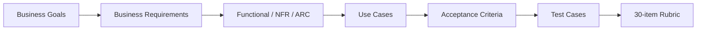

Mọi Test Case trong bước tiếp theo phải có đường truy vết ngược tới requirement và ít nhất một rubric item/core-flow objective.

## 13.4. Coverage Check theo 30 mục

- Rubric #1–#8: Platform/Architecture.
- Rubric #9–#23: Functional business smoke.
- Rubric #24–#30: Security/Resilience/Idempotency smoke.
- Không có requirement mới chỉ để “trông giống production”.
- Nếu một API/event/table không map được vào core flow hoặc rubric thì mặc định xem là ngoài phạm vi.

# 14. Kiến trúc và phạm vi được khóa cho các bước tiếp theo


## 14.1. Sơ đồ khóa phạm vi

```mermaid
flowchart TD
    X[Ý tưởng / chức năng / API / event mới]
    Q{Có phục vụ core flow hoặc 1/30 rubric?}
    Y[Giữ và trace vào SRS]
    N[Bỏ khỏi MVP]
    T{Có làm demo phức tạp hơn không cần thiết?}
    S[Đơn giản hóa request/data/flow]
    I[Triển khai]

    X --> Q
    Q -->|Không| N
    Q -->|Có| T
    T -->|Có| S --> I
    T -->|Không| I
```


1. **8 business services + API Gateway**, không Report/Audit Service.
2. Client chỉ dùng REST/JSON qua Gateway.
3. Gateway dùng Redis.
4. Gateway → service dùng gRPC.
5. Service-to-service gRPC chỉ giữ các cặp: **Customer–Booking, Booking–Driver, Driver–Trip, Trip–Review**; nội dung/method phải theo SRS, không lấy từ ảnh tham chiếu.
6. Async dùng RabbitMQ theo event table ARC05.
7. Mỗi service sở hữu DB riêng về logic; **7 PostgreSQL DB + 1 MongoDB DB**.
8. Redis không phải domain database.
9. Không external provider thật.
10. Matching demo chỉ cần Driver phù hợp/gần nhất + một Offer; không timeout/retry orchestration phức tạp.
11. Không Pricing Engine; amount demo `50000`.
12. **Payment được khởi tạo ngay khi Booking được tạo** qua `booking.created`: một Booking đúng một Payment `PENDING`, `eligible=false`.
13. `trip.completed` chỉ gắn Trip/mở `eligible=true` cho Payment đã có; không tạo Payment mới.
14. Trip smoke #17 bắt buộc có location update.
15. Rubric #12 dùng Admin token; #28 dùng Customer token trên cùng Driver endpoint.
16. Mọi bước thiết kế/code tiếp theo phải truy được về SRS này và 30-item rubric.
17. Definition of Done cho một mục thực hành: **đúng kết quả + deterministic + mục tiêu thao tác ≤30 giây từ đầu**.
